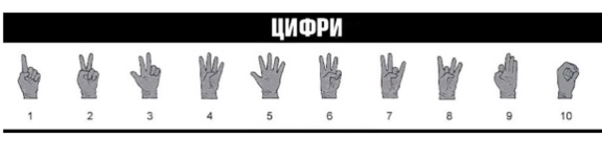
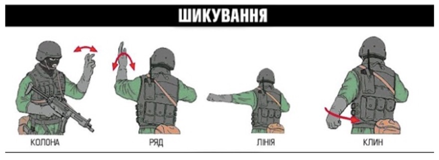
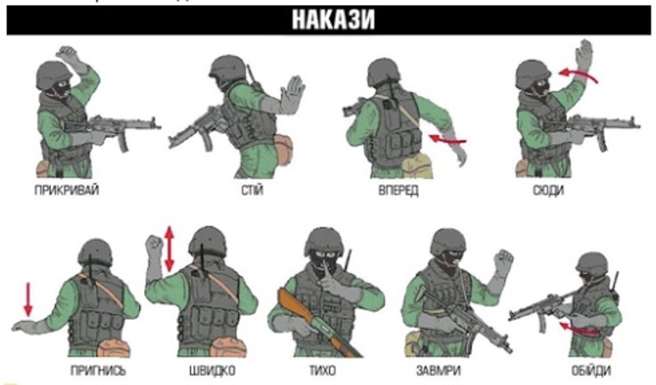
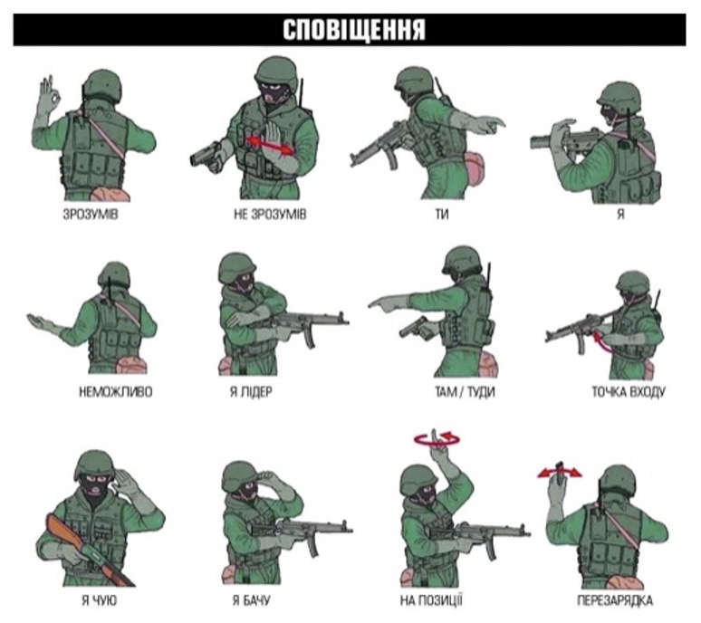

# Комунікація

Перемагає той, хто може захопити й  утримувати ініціативу. Дуже важливою навичкою є вміння бути комунікабельним в підрозділу - швидко передавати важливу інформацію та координувати дії.
Спілкування та довіра важливі на полі бою. Необхідно розуміти і виконувати накази командира, працювати в групі під час оборони чи нападу, працювати в парах і трійках, швидко передавати й обробляти тактичну інформацію.

Зазвичай боєць є частиною підрозділу і діє в його складі разом з іншими. Бойовий підрозділ у  своїй суті є типовою  командою, потенціал якої значно вищий, ніж потенціал її складових частин.
Бійці мають бути в контакті не тільки голосом, а й тактильні: відчувати спину, плече товариша; зорово, тобто бути комунікабельними один з одним. Вміти с першого  погляду або жесту понімати один одного.

Тобто ефективність дій підрозділу залежить не тільки від рівня тактичної підготовки кожного конкретного бійця.

Також важливі:

* згуртованість підрозділу;
* високий рівень довіри та взаємо-підтримки бійців усередині підрозділу; 
* вміння бути комунікабельними;
* здатність зосереджувати спільні зусилля на виконанні головних завдань, 
* вміння членів підрозділу швидко визначати можливі загрози та сприятливі чинники і оперативно діяти разом відповідно до ситуації.
 
Бойове залагодження підрозділів — це не лише відточування тактичних прийомів. Це й підготовка особового складу до спільних дій та зміцнення взаємодовіри між бійцями.

Вміти діяти злагоджено й чітко в складі підрозділу, не розгубитися в хаосі бою та виконати поставлене завдання — базові принципи виживання та запорука успіху на війні.

## Вербальна комунікація 

На полі бою все вирішується за секунди та миті. Тому треба вміти за мінімум часу передати максимум інформації. Використовується особливий алгоритми доповіді.

Прикладом сленгу можуть бути команди, що використовуються бойовою групою під час штурму:

* Вихід – попередження для групи прикриття.
* Підйом – рух в верх; сходи, гора.
* Спуск – рух вниз; сходи, гора.
* Чисто – огляд закінчено.
* Вогонь – обстріл.
* Контакт – бій.
* Торнадо – напад.
* Колесо – переслідую.
* Рогатка – озброєна особа.
* Пішак – неозброєна особа.
* Пустий – закінчились набої.
* Готово – готовність до бойових дій (вести вогонь)
* Прикрий – під час затримки та перебіжки.
* Тримаю (крию) – підтримка вогнем.
* Сюрприз – вибуховий пристрій.
* Граната (ліворуч, праворуч, попереду, позаду.) – ворог кинув гранату.
* Осколки – боєць кинув гранату.
* Лягай – спалах і траса гранати РПГ.
* 300 – поранення.
* Пов’язка – виклик санітара.
* Карета 33 – евакуація пораненого.
* Двійка – робота в парах:
* Йду – рух
* Тримаю – прикриття.
* Трійка – робота групи у складі трьох бійців. 

## Доповідь події на полі бою.

Протоколи рапортів — це і є  алгоритми доповіді: усталена форма передачі критично важливої інформації в бою.

Навіщо потрібні протоколи? Вони дають розуміння, яку саме інформацію і в якій ситуації передавати:

* звідки з’явилася загроза; 
* що потрібно зробити; 
* до чого підготуватися. 

1. Рапорт: повідомляємо про контакт чи рух.
    
    **Застосовуємо:**
    
    *	у разі ймовірного контакту з ворогом 
    * коли помітили рух ворога, а він вас ні.

    **Передаємо:**
    
    * Напрямок – задається за помітними орієнтирами чи за принципом годинника.
    * Дистанція – дистанція від ваших позицій до ворожих.
    * Опис – кількість ворога, озброєння. 

1. Рапорт: використовуємо для передачі розвідданих про ворога. 
    * Розмір – кількість людей, техніки ворога (відділення, взвод, рота).
    * Активність – атакує, пересувається, стоїть, засада.
    * Розташування – координати або розташування відповідно до схеми орієнтирів.
    * Підрозділ (уніформа, шеврони) – індексація ворога:
        * тип підрозділу;
        * форма;
        * маркування на техніці.
    * Час – час спостереження (коли помітили та зафіксували інформацію).
    * Спорядження – обладнання ворога, кількість.

Протоколами доповіді користуються також при радіозв’язку, що складає зараз основу зв’язку на полі бою.

Головне знати й розуміти принцип передачі інформації в різних ситуаціях: коли, що і як говорити.

## Невербальна комунікація

На полі бою не завжди є умови для того, щоби передавати інформацію звичайним способом — словами.

Дуже важливо вміти подавати зрозумілі невербальні знаки, а також розпізнавати їх. 

Мова жестів. Це лаконічний і безшумний спосіб спілкування.  

* Жести застосовують у ситуаціях безпосереднього контакту з ворогом, тоді як інші засоби зв’язку використовувати недоцільно, оскільки вони є де маскувальними.
* В обставинах, коли потрібне суворе дотримання акустичної та радіо-тиші: у патрулі, рухомому дозорі, засідках, тактичному пошуку по ворожих тилах невеликими бойовими підрозділами тощо.

> Важливо, що ці сигнали можна розрізнити на відстанях до кількасот метрів, і вони ефективні в  гуркоті бою, коли голосових команд не чутно.

**Цифри.** Набір жестів із цифрами від 1 до 10 для позначення кількості ворогів, своїх людей, пострілів, гранат тощо.

 
**Шикування.** Бойовий порядок підрозділу – колона, ряд, лінія, клин.

 
**Накази.** Набір жестів: прикривай, стій, вперед, сюди, пригнись, швидко, тихо, замри , обійди.

 
**Сповіщення.** Набір жестів: зрозумів, не зрозумів, ти, я, неможливо, я лідер, там/туди, точка входу, слухай/я чую, дивись/я бачу, на позиції, перезарядка.

 
### Сигнали:

* У кожного підрозділу свої;
* при необхідності дублюються голосом;
* спілкування, довіра важливі, підрозділ повинен діяти як єдиний організм;
* треба вміти за мінімум часу передати максимум інформації;
* засоби комунікації можуть бути вербальними та невербальними;