# Особливості оборонного бою

На початку розділу ми згадували, що оборона — це один із видів загальновійськового бою. Із назви зрозуміло, що цей вид бою призначений для того, щоби протистояти наступу ворога, захищатися.
Коли застосовують оборону:

1. наступ  вести неможливо або недоцільно; 
2. треба шляхом економії сил і засобів на одних напрямках  створити умови для наступу на інших, більш важливих.  

Мета оборонного бою:

* зірвати або відбити наступ ворога; 
* нанести максимальні втрати; 
* утримати важливі райони (рубожів, об’єктів);
* створити сприятливі умови для переходу в наступ або інших дій. 
 
## 1. Перехід до оборони при безпосередньому зіткненні із противником чи без нього. 

Коли безпосереднє зіткнення з противником відсутнє, тоді є більше часу для вивчення місцевості, вибору вигідних оборонних позицій, побудови бойового порядку, організації системи вогню, маскування тощо. 

Приклади: 

* прикриття державного кордону; 
* забезпечення висування,
* розгортання та переходу в наступ головних сил;
* оборона морського узбережжя, де очікується висадка морського десанту;
* укріплення напрямків, де наступ не передбачається тощо.

При безпосередньому зіткненні з ворогом. Тоді підрозділам треба не лише  закріплюватися на досягнутому районі, а й відбивати контратаки противника, організовувати систему вогню у вкрай обмежений час і, переважно, під безперервним вогнем ворога. 

Приклади: 

* відбиття контратаки переважаючих сил противника під час наступу; 
* закріплення й  утримання захоплених зони;
* прикриття флангів на загрозливому напрямку тощо

## 2. Заплановано чи вимушено

Перехід до оборони здійснюють навмисно, заплановано, коли інші активні дії недоцільні, або вимушено, якщо склалася несприятлива обстановка.

## 3. Завчасно до початку бойових дій, або у ході бою.

Залежно від бойового завдання, наявності сил і засобів, а також від характеру місцевості оборона може бути позиційною та маневреною. 
Позиційна оборона — це основний вид оборони, утримання підготовлених районів місцевості, утримання прориву ворога в глибину своєї оборони із завданням йому максимальних втрат. 

Мета позиційної оборони: міцно й тривало утримувати заздалегідь підготовлені райони, втрата яких неприпустима. 

**Маневрена оборона** — це тимчасове залишення окремих районів території для зниження наступальних можливостей ворога, примушення його до відмови від подальшого наступу,  завдання значних втрат у ході послідовних оборонних боїв на декількох позиціях. 
Мета маневреної оборони: зберегти свої сили, виграти час і нанести ворогу втрат.

Може використовуватися:

* коли немає достатніх сил для ведення позиційної оборони; 
* треба змусити ворога наступати в невигідному для нього напрямку, де підготовлена стійка позиційна оборона або створені вигідні умови для його розгрому контратаками (втягнути ударні угруповання ворога в підготовлені вогневі зони (райони). 

## Розташування на місцевості

Коли війська не ведуть активні бойові дії, вони можуть розташовуватися у відведених їм районах до отримання бойового завдання або, маючи бойове завдання, готуватися до його виконання. 
Розташування на місцевості — це перебування в районах зосередження, районах відпочинку, районах очікування і районах збору на великій відстані від зони бойового зіткнення сторін.

### 1. Місце розташування.

Перш за все, розташування має бути непомітним для ворога, адже він використовує повітряну розвідку, може застосувати зброю масового ураження та  розвідувальні-ударні комплекси. 

Використовуємо засоби маскування, щоб стати максимально непомітними для ворога.

Місцевості які мають природні укриття —найкраще підходять району розташування. Найкраще укриття: лісовий масив, гаї, чагарник, вирубка, посадка тощо.

Окрім прихованості, район розташування також повинен забезпечувати: 

* необхідне розосередження військ — відстань між підрозділами;
* можливості для проведення маневру в потрібному напрямі; 
* зручність розташування та відпочинку особового складу; 
* сприятливі санітарно-гігієнічні й протиепідемічні умови.
 
### 2. Польова фортифікація: види укриття

Розташовуючись на місцевості, підрозділи повинні забезпечити собі укриття від ворожого вогню та спостереження. 

Види укриття: наземні та підземні.

* Наземне укриття — дзоти для кулеметів, 
* Підземне укриття — окопи, траншеї, бліндажі.

Питаннями зведення споруд для захисту від ураження різними видами зброї займається військова фортифікація. 

Оскільки зростає роль мобільних тактичних груп, які відносно автономні, нас зараз цікавить саме польова фортифікація — така, яку бійці обладнують власними силами, без залучення спеціальних засобів та підрозділів. Зазвичай це окоп, траншея, бліндаж.

**Окоп** — відкрита земляна споруда для ведення вогню стрільцем.

**Траншея.** Її іноді називають різновидом окопу, але вона відрізняється від нього розмірами (глибока та більш протяжна) і тривалістю використання — тижнями і навіть місяцями.

**Бліндаж** — укриття, влаштоване на бойових позиціях для захисту групи бійців від артилерійського та іншого вогню. Це більш ґрунтовне, якщо порівняти з окопом, укриття. 

Траншея, окопи та хід сполучення допомагають:

* з’єднувати вогневі позиції; 
* вести фланговий і перехресний вогонь; 
* створити кругову оборону; 
* евакуювати поранених, доставити боєприпаси, продовольство (їжу).

Через наявність у ворога аеро-розвідки та важкої  артилерії, яку він активно використовує, класичний повноцінний бліндаж зараз втрачає своє значення на передових позиціях.

Тому однією з важливих навичок тактичної підготовки є вміння зробити собі укриття швидко та власними силами.

Коротко кажучи, якщо піхота переміщується кудись, перше, що вона має зробити, — рити окопи.

## Підготовка окопів.

Добре, коли у вас є досить часу та спеціальні засоби, за допомогою яких ви, не поспішаючи, зробите собі масштабне якісне укриття.
Проте часто рити окопи доводиться в ситуації, коли ви знаходитеся недалеко від лінії розташування противника, раптове вогневе ураження вашого підрозділу можливе в будь-який момент. 

### Окоп для стрільби лежачи

Перше, про що треба подбати, — швидко зробити собі окоп для стрільби лежачи.

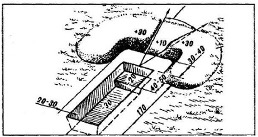

Алгоритм дій:  

* розійтися на відстань 10 метрів;
* лягти на лівий бік (якщо шульга, то на правий);
* автомат покласти праворуч на відстані витягнутої руки, спрямувавши його стволом убік супротивника, щоби не засипати ґрунтом, але швидко дістати.
* починати копати окоп;

Ваша мета — спочатку сформувати такий простір, щоби якнайшвидше сховати груди та живіт.

Як копати: 

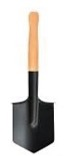

* вийняти малу піхотну лопатку;
* тримаючи її за держак обома руками, почати копати ударами від себе;
* лопату врізати в землю не прямовисно, а під кутом, залежно від щільності ґрунту;
* тонкі корені перерубувати гострим краєм лопати;
* землю кидати в бік можливого обстрілу, щоби сформувати захисний земляний вал (бруствер); 
* бруствер треба робити довшим із того боку, де знаходиться ворог;
* підрізати дерен і складати його збоку, щоби після риття окопу використати для маскування бруствера;
* голову під час роботи треба тримати якомога ближче до землі, щоби не стати мішенню, але так, щоби можна було спостерігати за ворогом. 
  
Викопавши передню частину окопу на глибину 20 см (місце під лікті), треба пересунутися трохи назад і продовжити рити його далі. Надалі, коли окоп буде викопаний на всю довжину (це 170 см для середнього зросту людини), його можна поглибити. 

Отже, ви сформували окоп для стрільби лежачи. Його параметри: довжина приблизно 170 см, ширина – 70 см, глибина – 30 см. Від цих параметрів можна відхилятися залежно від вашої статури.
  
### Як у польових умовах вирахувати розмір окопу

Солдат може зробити це, знаючи розміри своєї піхотної лопатки: 

* довжина лопатки — 50 см,
* ширина штика — 15 см,
* довжина штикової частини — 5 см.

Якщо супротивник не проявляє активності, продовжуйте роботу з удосконалення окопу: поглиблюйте його та робіть придатним для стрільби з коліна або для стрільби стоячи. Вириту землю вкладаємо тепер не тільки перед собою, а й убік, щоби додатково захистити себе від куль, осколків снарядів, мін.

Коли окоп сягне глибини 60 см, це окоп для стрільби з коліна:

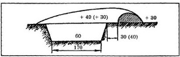
  
Коли ви викопали окоп глибиною 150 см - це вже окоп для стрільби стоячи:

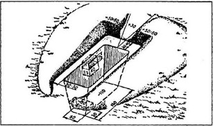
  
### Підготовка окопів.

Окоп для стрільби лежачи — 20-30 хв, окоп для стрільби з коліна — 1 год., окоп для стрільби стоячи —1,5 год. Але час може варіюватися залежно від типу ґрунту, вашого досвіду та інструментів, які ви використовуєте.

Додаткові дії: 

* Зробіть у бруствері жолобок для автомата, щоби покладений у нього автомат був наведений точно у вказаному командиром напрямку. 
* Утрамбуйте викопану землю ударами лопатою плазом, щоби зміцнити бруствер (краще робити це вже під час копання).
* Укріпіть додатково круті стінки окопу, якщо ґрунт не є стійким. 
* Замаскуйте окоп обов’язково: відмінності ґрунту дуже добре видно з повітря засобами аеро-розвідки: влітку – маскувальною сіткою, листям і  гілками, добре, якщо у вас буде можливість підтримувати зелень зеленою (поливати), взимку  - снігом.
* У місцевості з кам’янистим ґрунтом, у якому важко копати лопатою, використовуйте наявні на місцевості велике каміння (валуни) та воронки від снарядів як захисну загорожу, тоді глибина окопу буде 10-15 см.
* Якщо ґрунт із дрібним камінням, бруствер обов’язково укріпить землею, щоби не було розльоту каменів при потраплянні в нього куль.

### Траншеї та ходи сполучення

За сприятливих умов, коли ворог пасивний і є достатньо часу, починайте з’єднувати окремі окопи траншеями та ходами сполучення. Для цього, не виходячи з окопу, починайте відривати сполучний хід до свого сусіда зліва. Послідовність роботи така ж, як і під час риття одиночного окопу.

Лінія має бути ламаною, зигзагоподібною, з довжиною прямих ділянок не більше 20-30 м.  

Вигини між ділянками мають розташовуватися під кутом 120°-160°.

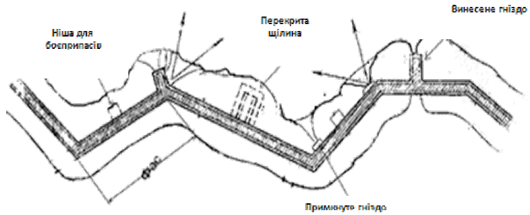
  
Злами зменшують ураження особового складу від наскрізного обстрілу й ураження бійців осколками при прямому влученні в неї мін (снарядів, авіабомб) та ударної хвилі.

Отже, якщо ви зробили окопи для стрільби лежачи, з’єднані траншеями,  — це вже 70% вашого захисту.

Додаткові поради:

* рийте в окопах бокові ніші,
* з цією ж метою рийте окопи не на всю довжину тіла, із заглибленнями у землі для ніг та голови,
* робіть запасні окопи (рийте їх заздалегідь),
* краще багато малих вузьких окопів, індивідуальних окопів, ніж один великий широкий ґрунтовний  окоп.

**Бліндаж** — це також укриття для особового складу, але воно має відмінності порівняно з окопом:

* спорудження повністю заглиблене; 
* має більші розміри (місткість 8-10 осіб: 4-6 лежачи, 2 сидячи); 
* перекрите, отже, має більші захисні властивості (від ворожого вогню, поганих природних  умов тощо);
* не призначений для ведення вогню зі стрілецької зброї або артилерійських гармат.

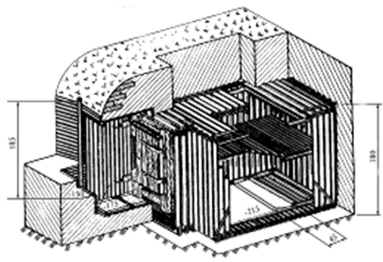

Крім захисту, бліндаж використовується для відпочинку особового складу: обладнується нішами, опалювальними пристроями, підводиться електрика, якщо є змога.

Класичний бліндаж має міцне покриття з балок (дерев'яних чи залізобетонних), прикритих шаром ґрунту, та міцні двері. 
  
Бліндажі бувають різних конструкцій залежно від наявності матеріалів, сил і засобів, навченості особового складу. Зараз з’явилася альтернатива класичному дерев’яному бліндажу: модульні бліндажі та бліндажі з морських контейнерів, вони комфортніші та надійніші.

Облаштування бліндажів:

* краще робити два вузьких, ніж один великий;
* чим більше накатів (перекритій), тим краще; 
* обов'язково має бути вентиляція;
* вхід під кутом 90 градусів від землі;
двері робити не треба,  щоби не гаяти час на відчинення.

# Оборона

Для ведення оборони батальйону призначають район оборони, роті та взводу — опорні пункти.

Фронт оборони, залежно від бойових можливостей, становить: 

* батальйону — до 5 км; 
* роти — до 1,5 км; 
* взводу — до 400 м. 

Більшим фронт оборони може бути при обороні морського узбережжя, прикритті державного кордону, у горах та лісі, болотистій місцевості.

Вужчими ділянки оборони можуть бути на напрямку можливого головного удару противника.

Глибина оборони може бути:

* у батальйону — до 2,5 км; 
* роти — до 1 км; 
* взводу — до 300 м.

Глибина оборони має забезпечити:

* протидію противнику при його вклиненні,
* тактичний взаємозв’язок між ешелонами бойового порядку,
* свободу маневру,
* розосередження підрозділів для захисту від зброї масового ураження й високоточної зброї. 

Розглянемо побудову оборонного бою для взводу.

**Взвод** — це військове формування, тактичний підрозділ, що складається з 3-4 відділень та входить до складу роти або батареї. 
Чисельність взводу 15 до 45 воїнів, залежно від роду військ і функціонального призначення.

При побудові оборонного бою важливо:

* бойовий порядок;
* опорний пункт;
* система вогню.

Їх ми і будемо розглядати далі.

## 1. Бойовий порядок взводу

Бойовий порядок — це спосіб шикування підрозділів, те, як вони розташовуються. 

### Як будується бойовий порядок 

Залежно від поставленого завдання, дій ворога, умов місцевості та складу взводу його бойовий порядок може будуватися різноманітними способами.
 
1. Бойовий порядок в одну лінію. Коли всі три відділення взводу розташовані в одній траншеї в одну лінію з інтервалом
до 50 м між ними.
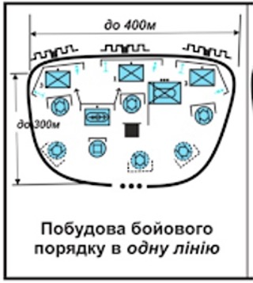

    Він застосовується:
    
    *	на важкодоступній для дій ворога місцевості;
    * при обороні взводу в другому ешелоні роти; 
    *	при нестачі сил і засобів; 
    *	при обороні взводу на другорядному напрямку.
2. Бойовий порядок в дві лінії — це коли на найбільш імовірному напрямку наступу противника позиція одного з відділень взводу обладнується в глибині опорного пункту (на другій лінії), у 100-200 м за траншеєю, щоб посилити стійкість оборони.
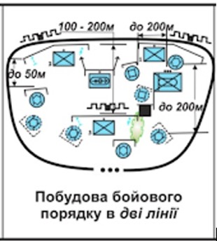
 
3. Уступом вправо або вліво — це бойовий порядок, удержуючи фланги. 
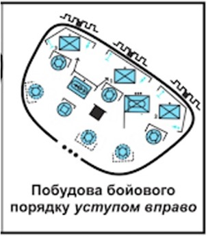

## 2. Опорний пункт взводу 

**Опорний пункт** — це ділянка місцевості, підготовлена до ведення оборонного бою, обладнана в інженерному відношенні та зайнята взводом для виконання бойового завдання. Взвод обороняє опорний пункт вздовж фронту до 400 м і у глибину до 300 м. Проміжки між опорними пунктами взводів можуть бути до 300 м, між позиціями механізованих відділень — до 50 м. 

Вибір місця для розташування залежить, від активності противника та бойового завдання підрозділу. 

Опорний пункт взводу складається з: 

* бойових позицій відділень і доданих підрозділів; 
* вогневих позицій бойових машин; 
* позиції групи управління і вогневої підтримки;
* місця розташування групи бойових машин;
* місця розміщення запасу боєприпасів;
* місця збору поранених;
* траншеї;
* ходів сполучення.

На опорному пункті командир одразу призначає спостерігачів, патрульних і виставляє секрети, яким вказує порядок спостереження за наземним і повітряним противником, а також за сигналами управління.

Передбачаються елементи анти-снайперської та анти-мінометної боротьби на найбільш імовірних напрямках дій ворога.

### Спостережний пост (СП)

На опорному пункті обов'язково має бути організоване спостереження — за полем бою, ворога, місцевістю, щоб отримати важливі відомості про характер дій противника та його плани. Для цього на позиціях в обороні (а також під час підготовки до наступу) обов'язково створюється спостережний пост.

Спостережний пост — це 2-3 спостерігачі, яких командир призначає для спостереження за наземним і повітряним супротивником. Один із спостерігачів призначається старшим.

Задачі спостереження:

* знати розвідувальні та де-маскувальні ознаки об'єктів (цілей), ознаки того, що противник готується до застосування зброї масового ураження, наступу, відходу тощо;
* користуватися приборами спостереження, готувати їх до роботи та тримати в належному стані;
* знати орієнтири, умовні позначення місцевих предметів, вміти швидко знаходити їх на місцевості;
* вести безперервне спостереження, відшукувати цілі, визначати відстань до них та їхнє положення стосовно орієнтирів;
* своєчасно доповідати командиру про результати спостереження;
* дотримуватися суворої дисципліни та виконувати вимоги маскування;
* знати сигнали керування й оповіщення.
місце для СП

СП, повинно мати:

* кращий у таких умовах огляд противника і своїх підрозділів, 
* зручне розташування для роботи спостерігачів і зв'язківців,
* достатньо простору для приладів спостереження, засобів зв'язку та  сигналізації, 
* прихованість від спостереження та вогню противника. 

### Які місця підходять 

Окопи, канави, вирви від снарядів тощо.  Краще, щоби позаду був насип, горбок чи пустир, тоді постать спостерігача не буде вирізнятися на тлі неба.

**У населеному пункті:** стіни зруйнованих будинків, горища, верхні поверхи та руїни, за парканами. Однак противник буде прагнути артилерійським вогнем зруйнувати об’єкти й місцеві предмети, які можуть бути використані для спостереження. Це теж варто мати на увазі.

**У лісі й чагарнику:** трохи в глибині від узлісся, у тіні дерев.

**Які місця не підходять:** гребні висот, вершини пагорбів і курганів, місця поблизу окремо розміщених предметів (дерево, кущ, будова, міст, перехрестя доріг тощо):  вони можуть бути орієнтирами ворога та привернути його увагу.

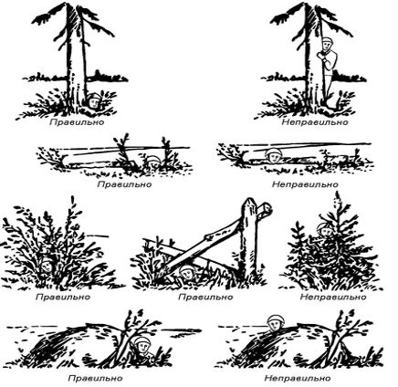

Проте якщо все ж таки окремий предмет дуже зручний для спостереження, то розміщуватися біля нього краще з тіньового боку і лежачи.
 
Часто спостерігачі розташовуються в підбитих танках противника, місцях, замаскованих під стіг, камінь, пень та ін. Однак спостерігачі ворога також ведуть облік кожного помітного місцевого предмета, тому поява нового „стогу” або „пня” може викликати в них підозру й підсилення спостереження.

Місце для спостереження займається приховано. Старший спостережного поста доповідає про місце командирові. Під час облаштування місця особовий склад спостережного посту не припиняє спостереження за противником (один здійснює спостереження, 1-2 інші - виконують роботи). Також місце спостереження треба ретельно замаскувати. 

**Що має бути на спостережному посту:**

* прилади спостереження (бінокль, прилад нічного бачення тощо); 
* масштабна карта або схема місцевості; 
* журнал спостереження; 
* компас; 
* годинник; 
* ліхтар; 
* засоби зв'язку й подачі сигналів оповіщення.

**Спостерігачі:**  ведуть спостереження, складають схему орієнтирів, ведуть журнал розвідки й обслуговування стрільби, доповідають про результати спостереження. 

**Схема орієнтирів** потрібна, щоби полегшити пошук орієнтирів на місцевості, швидко та надійно передати ціле-вказання, визначити положення розвіданих цілей на місцевості відносно орієнтирів, а також для прийому та передачі доповідей про розвідані цілі.
Орієнтири визначаються справа наліво по межі від себе вглиб.

   
**У журналі спостереження записують:**

* номер об’єкта (цілі); 
* час виявлення;
* положення відносно командно-спостережного пункту (дані місця, де засікли);
* назва об’єкта й  результати спостереження; 
* прямокутні координати об’єкта; 
* характеристику точності місця, де засікли; 
* коли й  кому доповіли про ціль (висновок про вірогідність цілі).

### Зони спостереження:

Для зручності спостереження та детального огляду місцевості призначений сектор умовно розбивається на три зони спостереження:

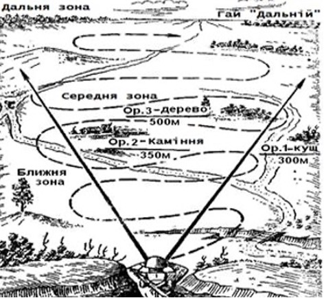
 
1.	близька: найдоступніша для спостереження неозброєним оком, на відстані 400-500 м; 
2.	середня: до 1000 м; 
3.	далека: до межі видимості.

Спостерігач оглядає у наступі - від себе до противника, в обороні - від противника до себе. Ближча зона оглядається справа наліво за умовно визначеними орієнтирами від себе вдалину.  Відкриті ділянки оглядаються швидше, закриті — детальніше. 

### Доповідь 

Про все помічене спостерігач доповідає командирові, не припиняючи спостереження. 

У доповіді спостерігач вказує:

* орієнтир; 
* відстань від нього (вправо, вліво, далі, ближче); 
* те, що помічено.

Приклад: «Орієнтир два — вліво 50, ближче — 100, біля пожовклого куща — кулемет противника».

Задачі сторожової охорони: 

* не допустити проникнення розвідки противника
до підрозділів, що вона охороняє;
* завчасно виявити появу наземного противника; 
* попередити про противника; 
* обороняти зайняту позицію в разі нападу противника.

Командир підрозділу виставляє сторожові пости й секрети, встановлює порядок відпочинку особового складу, забезпечує постійну бойову готовність сторожової застави.

Сторожовий пост виставляється на найбільш імовірному напрямку дій противника.

Дозорні — можуть висилатися для огляду місцевості, перевірки несення служби сторожовими постами, для зв’язку із сусідніми підрозділами сторожової охорони.

Дозорне відділення висилається від підрозділів (розвідувальних дозорів, розвідувальних загонів), що ведуть розвідку, від органу похідної охорони (головного дозору, ГПЗ), або від підрозділів, що виконують бойові завдання у відриві від своїх головних сил, з метою своєчасного виявлення противника і розвідки місцевості.

Дозорне відділення в залежності від характеру місцевості і часу доби веде розвідку на відстані, що забезпечує спостереження за його діями і підтримку вогнем у разі вступу його в бій з ворогом. При неможливості використовувати штатну техніку особовий склад дозорного відділення виконує завдання в пішому порядку.

Дозорне відділення добуває відомості спостереженням з місця, з ходу, з коротких зупинок, підслуховуванням і опитуванням місцевих жителів, інколи воно може облаштовувати розвідувальну засідку. Командир відділення повинен вести розвідку з темпом, що забезпечує просування підрозділу, від якого виділено дозорне відділення.
З отриманням бойового завдання командир відділення повинен: зрозуміти його, провести бойовий розрахунок відділення, визначити завдання підлеглим і порядок дій, віддати бойовий наказ. При необхідності командиру дозорного відділення визначаються: порядок дій при зустрічі з ворогом, порядок підтримання зв’язку, сигнали оповіщення, управління, взаємодії та порядок дій по них, а також відомості про сусідніх і що діють попереду, підрозділах або органах розвідки і способи взаємного впізнання.

Під час постановки бойових завдань мобільному розрахунку  командир дозорного відділення вказує:

* Водію – маршрут і швидкість руху, порядок подолання небезпечних ділянок;
* кулеметнику, черговому вогневому засобу – порядок спостереження, відкриття і ведення вогню;
* пішим дозорним – порядок огляду місцевості, дії при зустрічі з противником;
* решті особового складу – сектори спостереження і порядок доповіді; дії під час руху, на привалах, при зустрічі з ворогом.

Приклад:

«Ворог дрібними групами відходить в напрямку вис. «Фігурна», Дубове. Наше відділення призначено дозорним, веде розвідку в напрямку вис. «Фігурна», яр Довгий і далі на Дубове із завданням встановити наявність противника на маршруті руху.
Водій солдат Кривоніс, бойову машину вести в напрямку вис. «Фігурна», міст через р. Біла і далі на Дубове зі швидкістю до 30 км / год. Солдат Пешавара, спостерігати вперед і вправо, бути готовим до відкриття вогню по моїй команді. Солдат Лисак, спостерігати вліво і назад за командиром розвідувального дозору . Про все помічене доповідати мені голосом. Мій заступник — солдат Пешавара».

Перевіривши, як особовий склад засвоїв отримане завдання, командир відділення командує: «По машинам. У напрямку вис. “Фігурна” – вперед. Приступити до ведення розвідки».

Дозорне відділення діє, як правило, поза доріг, просуваючись стрибками від одного зручного для спостереження укриття до іншого. При цьому темп ведення розвідки повинен бути таким, щоб не затримувати підрозділ, якій висувається за ним. На шляху руху дозорної машини ретельно оглядаються місцевість і місцеві предмети, особливо місця, де можливе приховане розташування противника і його раптові дії із засідок.

Спостереження за місцевістю та огляд місцевих предметів дозорне відділення здійснює з бойової машини на ходу або з коротких зупинок. При ускладненні ведення розвідки з техніки, командир відділення висилає піших дозорних (двох-трьох стрільців), призначивши одного з них старшим. Бойова машина при цьому розташовується в укритті. Решта особового складу веде спостереження за місцевістю і діями дозорних у готовності підтримати їх вогнем. Під час огляду місцевості дозорні діють на відстані 20-30 м один від одного в готовності до взаємної підтримки вогнем своєї зброї.
Особлива увага приділяється місцям, де можливі приховане розташування ворога і його раптовий напад із засідки – висоти, ділянки лісу, населені пункти, перевали, і дефіле. Прийоми і способи огляду цих місць в залежності від обстановки можуть бути різноманітними.

Закриті ділянки місцевості, окремі будівлі, узлісся, входи в ущелини і тунелі, де можливі приховане розташування ворога і раптовий його напад із засідок, а також вузькі проходи, мости та інші об’єкти ретельно оглядаються, у разі потреби командир відділення висилає піших дозорних або проводить огляд усім відділенням, діючи бойовими групами під прикриттям бойової машини.
Для проведення огляду об’єкту піші дозорні приховано наближаються до нього під прикриттям відділення, старший дозорний пересувається, як правило, за дозорним у готовності підтримати його вогнем. При діях у складі відділення або бойової групи, особовий склад, прикриваючи один одного і використовуючи складки місцевості, почергово просувається до об’єкту і здійснює його огляд.
Якщо ворога не виявлено, командир дозорного відділення бойової машини доповідає про це (подає встановлений сигнал) і продовжує рух. Виявивши ворога він доповідає про нього і продовжує спостереження, діючи приховано. У разі раптової зустрічі з ворогом відділення БМ відкриває вогонь і знищує його або обходить і продовжує виконання завдання. При наближенні невеликої групи ворога за наказом командира взводу дозорне відділення БМ може влаштувати засідку.

У разі виявлення засідки противника дозорне відділення вступає в бій (займає позицію) і забезпечує висування і вступ у бій основних сил ГПЗ, розвідувального органу.

У разі блокування ділянок маршруту руху вороже налаштованим місцевим населенням дозорне відділення, не входячи з ними в контакт, обходить цю ділянку і проводить колону, яка охороняється, обхідним маршрутом. У разі блокування колони похідна охорона сковує дії вороже налаштованого цивільного населення, не допускаючи зовнішнього контакту, вживає заходи щодо просування встановленим маршрутом або у зворотному напрямку.

Коли зустріч з ворогом малоймовірна, дозорне відділення рухається у вказаному йому напрямку на максимально можливій або встановленій швидкості попереду розвідувального дозору. При необхідності зробити коротку зупинку для спостереження командир дозорного відділення вибирає на напрямку руху пункт з найширшим оглядом місцевості попереду. Для зупинки машини найдоцільніше використовувати тіньові сторони дерев, будов і інших місцевих предметів, що полегшує маскування і ускладнює її виявлення противником. Не можна зупинятися для спостереження на відкритих гребнях висот і пагорбів. Екіпаж швидко оглядає місцевість попереду, і переконавшись, що ворога немає, по команді свого командира на як можна більшій швидкості продовжує рух у вказаному напрямку.

У районі можливої зустрічі з ворогом дозорне відділення веде розвідку шляхом послідовного заняття вигідних для спостереження пунктів, пересуваючись приховано, скачками, на максимальній швидкості від одного укриття до іншого. Для скритності руху використовуються лощини, балки, кущі та інші природні укриття і складки місцевості. 

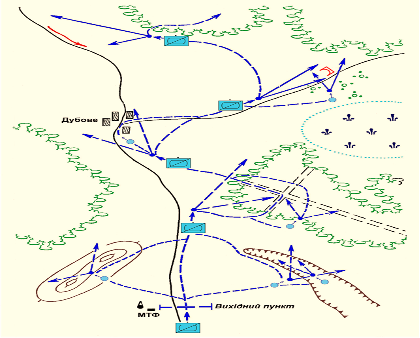

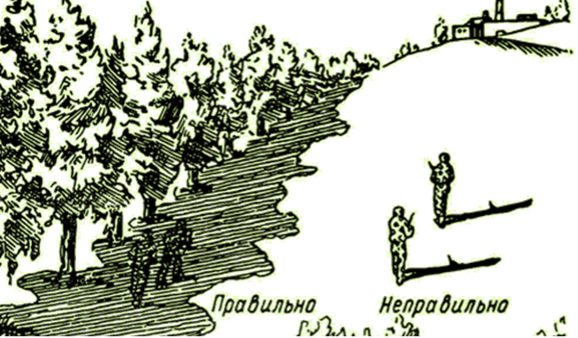

Найбільш зручними місцями для спостереження є височини з кущами і узлісся гаїв, а також інші височини, що мають природні укриття. Місце для спостереження не повинно різко виділятися на загальному фоні місцевості. При виборі місця для спостереження необхідно пам’ятати, що окремі дерева, кущі і інші місцеві предмети, що різко виділяються, завжди привертають увагу спостерігачів противника.
При неможливості скрито вести спостереження з БМ, командир відділення висилає двох – трьох піших дозорних, вказуючи їм порядок дій і пункт для спостереження. При цьому дозорне відділення розташовується в укритті, а бойовій розрахунок, що залишився, веде спостереження за навколишньою місцевістю і діями розвідників, що спішилися, в готовності підтримати їх дії вогнем.

Якщо при огляді місцевості і місцевих предметів ворог не виявлений, командир дозорного відділення подає сигнал «Шлях вільний» і продовжує виконувати завдання. Виявивши противника, він встановленим сигналом негайно доповідає командиру розвідувального дозору і продовжує вести спостереження за ворогом.

### Правило огляду місцевості та належних предметів.

Розвідка місцевості і місцевих предметів здійснюється спостереженням з бойових машин в русі або з місця і оглядом. Для безпосереднього огляду закритих ділянок, підозрілих місць, місцевих предметів, перешкод, загороджень, окремих об’єктів призначаються піші дозорні. Зазвичай дозорні діють парами, але можуть призначатися і три-чотири воїна та призначається старший.

На відкритій середньо-пересічній місцевості дозорні пересуваються один за іншим на відстані 20-30м вночі та лісо-полосі 8-15м, при цьому старший дозорний знаходиться позаду в готовності прийти на допомогу дозорним. Рух здійснюється приховано, від одного наміченого для спостереження пункту до іншого. Пункти вибираються з хорошим оглядом місцевості і необхідними умовами для маскування. Досягнувши наміченого місця, дозорні ретельно оглядають його і навколишнє місцевість. Не виявивши противника, старший дозорний подає сигнал «Шлях вільний». Після подачі сигналу дозорні висуваються до наступного пункту або очікують підходу основної групи (згідно з наказом командира). Дозорне відділення (основна група) розташовується приховано, постійно спостерігає за дозорними в готовності прикрити їх вогнем.

При спостереженні з місця дозорні розташовуються приховано лежачи у пагорба, дерева, за будівлею, в чагарнику. Спостереження слід вести збоку з тіньового боку укриття, не піднімаючи високо голови, слідкуючи за своєю тінню. При спостереженні з канави, яру потрібно прагнути, щоб їх край, звернений до противника, був нижче краю, розташованого за спиною. Не можна виглядати з-за паркану (огорожі), краще відшукати для спостереження щілину. З вікна слід спостерігати збоку з глибини кімнати.

Дозорні повинні швидко і обережно розвідувати будь-який місцевий предмет або укриття, звертаючи особливу увагу на розвідувальні ознаки, за якими можна виявити ворога і його сліди. Виявити ворога дозорні можуть не тільки спостереженням, а й підслуховуванням.
Огляд місцевості та місцевих предметів слід починати з граничною дальності за допомогою бінокля, оптичного прицілу а ближче 300 м – неозброєним оком. Встановивши відсутність підозрілих ознак, дозорні приступають до безпосереднього огляду. Про все помічене вони негайно доповідають (подають умовний сигнал) командиру дозорного відділення.

Умовні сигнали встановлюються заздалегідь; їх повинен твердо знати весь особовий склад дозору. Всі сигнали повинні подаватися приховано від противника, але чітко і помітно для приймаючих їх. Під час подачі сигналів спостереження в бік противника не припиняється. Старший дозорний що подає сигнал повинен переконатися, що його сигнал зрозумілий.
Призначаючи сигнали, необхідно враховувати, що сигнали, що подаються рукою або автоматом, видно вдень на дальності 300-1000 м, сигнальними прапорцями – на 800-1500 м, ліхтарем вночі – на 1000-1500 м, ракетою вдень – до 5000 м, вночі – до 15 000 м. Траса 7 , 62-мм кулі спостерігається вночі на відстані до 1000 м.

Приклад:

* УВАГА – (день) підняти руку в гору, (ніч) мигання білим світлом.
* ШЛЯХ ВІЛЬНИЙ – (день) круговий рух правою рукою з гвинтівкою, (ніч) мигання зеленим світлом.
* БАЧУ ВОРОГА – (день) піднять гвинтівку стволом вгору і опустити до рівня грудей, вказати напрямок на противника, (ніч) мигання червоним світлом.
* НЕ ЗРОЗУМІВ – (день) підняти гвинтівку прикладом вгору, (ніч) горизонтально рух ліхтаря з білим світлом.
* ПРИЄДНАТИСЯ ДО ОСНОВИ – (день) круговий рух лівою рукою, (ніч) круговий рух ліхтарем з білим світлом.
* ПРОДОВЖУВАТИ РУХ – (день) підняти ліву руку вгору і опустивши до рівня грудей, вказати напрямок руху, (ніч) вертикальний рух ліхтарем з зеленим світлом. 
* ПЕРЕШКОДА – (день) підняти і опустити через сторони обидві руки, (ніч) круговий рух ліхтарем з червоним світлом.

Розвідники повинні розуміти встановлені сигнали та діяти за ним.
За сигналом “Бачу противника” потрібно негайно зупинитися і зайняти найближче укриття (при діях маскування, зупинити двигун бойовій машині), уважно спостерігати за дозорними, які подали сигнал, підсилити спостереження в сторону виявлення ворога і бути в готовності до відкриття вогню. Командир дозорного відділення заздалегідь визначає порядок дій кожного бійця за сигналами.
Огляд висоти ведеться шляхом спостереження здалеку. При відсутності противника на висоті проводиться огляд її зворотних схилів. Висоту рекомендується оглядати двома парами  або трійкою дозорних, які обходять її по протилежних схилах, просування повинно бути по її схилах або в обхід біля підніжжя. Тільки після їх сигналу командир дозорного відділення висувається для особистого огляду попереду лежачої місцевості. Наявні на висоті балки, яри, гаї, чагарники, будови, руїни оглядаються особливо ретельно, так як в таких місцях ворог найчастіше влаштовує укриття і засідки. На височинах і гребнях висот з’являтися і затримуватися не слід.

Приклад:

“Солдати Титаренко і Соколенко — дозорні. Оглянути висоту і доповісти! Іншим спостерігати за діями дозорних в готовності підтримати їх вогнем”.

Після огляду висоти намічається наступне укриття для спостереження, і дозорне відділення висувається до нього, обходячи висоту у її підошви або по одному з схилів.

### Розвідка лощини, яру, балки.

Розвідуючи яр, лощину, балку потрібно оглянути прилеглі висоти і місця, зручні для розташування ворога, а потім обстежити балку декількома парами дозорних. Одна пара йде з низу, інші – по сторонам або найближчим бічним дорогам. Якщо огляд всього яру неможливий, необхідно оглянути найбільш важливі ділянки, які можуть бути використані ворогом в якості укриття, при цьому особлива увага приділяється входам і виходам. При огляді невеликого яру старший дозорний рухається по краю яру, а другий боєць – по його низу.

Приклад:

«Бійці Петрусенко і Титаренко – дозорні. Старший – Петрусенко. Рухатися в напрямку окремого куща, оглянути яр, звернувши особливу увагу на східний схил. Водієві бійцю Іванченко вести машину по східному схилу в напрямку двох дерев, бійцю Зінченко спостерігати за діями дозорних в готовності підтримати їх вогнем”.
Основа до закінчення огляду яру дозорними залишається біля його входу або рухається уздовж схилу. Дозорні, пройшовши яр і не виявивши противника, займають у його виходу зручні для спостереження і ведення вогню місця, а потім подають сигнал «Шлях вільний». Після цього основа розвідувального органу швидко проходить яр».

### Огляд мосту.

Виходячи до мосту з’ясовуємо, чи не обороняється він ворогом. При виявленні ворога необхідно визначити його сили, розташування вогневих засобів і негайно доповісти командиру; в подальшому діяти за його наказом.

Якщо міст не обороняється, встановлюються його вантажопідйомність, розміри основних елементів (довжина і ширина) і матеріал, з якого він виготовлений. Залізобетонні, бетонні, кам’яні та металеві мости забезпечують, як правило, пропуск гусеничних машин масою 60-80 т. При огляді необхідно встановити, чи не підготовлений він противником до знищення. Якщо міст зруйнований або замінований, то відшукуються зручні місця для подолання річки. При цьому виявляється характер берегів, глибину і швидкість течії річки. Для виконання цих завдань висилаються дозорні, які ведуть розвідку під прикриттям відділення.

Приклад наказу: «Бійці Скрипаль і Русин – дозорні. Старший – солдат Скрипаль. Оглянути міст. Вперед. Іншим вести спостереження за підступами до мосту і бути в готовності підтримати дії дозорних вогнем».

### Розвідка лісу.

Огляд починаємо при підході до лісу. Спочатку оглядається опушка лісу здалеку, по можливості з більш високих місць, і по ознакам визначається наявність ворога в ньому. Ознаки: крики птахів, поламані гілки, погнуті дерева, дим, вогні багать, шум моторів, блиск стекла і металевих частин машин і бойової техніки. Не виявивши противника, дозорні доповідають своєму командиру і висуваються до опушки, а потім в глиб лісу. Невеликий гай оглядають, проходячи по його опушці і в глибині. Великий, але рідкісний ліс проглядається ланцюгом піших дозорних, дозорні не втрачаючи з виду один одного. Дерева на галявині і в глибині лісу оглядаються знизу вгору з метою виявлення спостерігачів і снайперів противника та пасток, мін. Видалення дозорних один від одного і від основи дозорного відділення в лісі скорочується. Бойова машина просуваються уздовж дороги по її краю, а якщо можливо, то лісом і по просіках. Ретельному огляду піддаються не тільки опушки, вершини дерев, а й густі зарості, завали, входи і виходи у вузьких місцях (мости, гаті, яри, долини) і інші місця, зручні для влаштування засідок противником.

Виявлені перешкоди і загородження дозорні позначають покажчиками або зарубками на деревах, відшукують і показують шляхи обходу. Завали в першу чергу необхідно розвідати на наявність мін.
При веденні розвідки в лісі слід періодично зупинятися і прислухатися. При цьому слід враховувати, що в лісі хороша чутність, але звук найчастіше поширюється у вигляді відлуння, тому може створюватися викривлене уявлення про напрям і кількості джерел звуку.

Ведучи спостереження в лісі, не слід зосереджувати увагу на деревах і чагарниках, що знаходяться поблизу. Дивитися потрібно за межі того, що оточує дозорного, через просвіти в деревах, чагарниках, листві. У великому лісовому масиві для огляду місцевості дозорні вилазять на високі дерева. Ворога при цьому можна виявити по диму, що піднімається пилу, встановленим антенам та іншими ознаками, видимим над вершинами дерев.

При діях в пішому порядку рухатися в лісі потрібно безшумно, не ламаючи гілля, обходити або переступати сушняк, так як хрест гілок в безвітряну погоду чути в лісі на відстані 100 м і більше.
Пересуваючись по лісу прикриваємося стовбурами дерев, обходимо лісові галявини; просіки і відкриті простори долаємо швидко, кидком або повзком. У тиху погоду потрібно бути обачним, щоб коливаннями рослинності не видати свою присутність.

Перш ніж виходити з лісу, слід уважно оглянути виходи і прилеглу місцевість з опушки лісу або з дерева. При цьому дерево потрібно вибирати не саме крайнє до узлісся, а прикрите гілками інших дерев і за ним не повинно бути просвіту. Якщо опушка і виходи з лісу проглядаються ворогом, слід пошукати інший шлях в стороні від дороги, просіки або стежки.

### Огляд населеного пункту.

Розвідку населеного пункту дозорні проводять здалеку, з відстані, що дозволяє за характерними ознаками визначити, чи є в ньому ворог.
Особлива увага звертається на дахи високих будинків, дзвіниці, сади, городи, яри, зарослі, окремі будівлі, де можуть знаходитися спостерігачі, засідки ворога або його охорона.

Наявність військ ворога в населеному пункті можна виявити по посиленому гавкоту собак, диму похідної кухні, топці печей в незвичайний час, відсутності людей на полях і городах, особливо в період польових робіт. Сліди танків, бойових машин при в’їзді (виїзді), звуки роботи двигунів видають присутність механізованих частин і підрозділів.

Після огляду здалеку дозорні, прикриваючись деревами, кущами, каналами з боку городів, садів, виноградників, надвірних будівель і тильної частини житлових будинків, проникають в населений пункт і оглядають будови на околиці, якщо в них є жителі, опитують їх.

Приклад:

Розпорядження – «Рядові Сидоренко і Косенко — дозорні. Старший — Сидоренко. Оглянути населений пункт. Вперед. Іншим продовжувати вести спостереження за населеним пунктом і дозорними в готовності підтримати їх вогнем».

У населеному пункті сільського типу дозорні просуваються по земельним ділянкам, садах, дворах. Не слід рухатися впритул до споруд і по ділянках, що проглядаються з вікон і дверей.
При огляді будівель зсередини старший дозорний залишається зовні, перебуваючи в готовності надати допомогу дозорним і підтримуючи зоровий зв’язок з командиром. Дозорні, оглядаючи зсередини будову, вхідні двері залишають відкритими. Увійшовши в житловий будинок, потрібно в першу чергу опитати господаря і не відпускати його до тих пір, поки не буде закінчено огляд. Особливу увагу при огляді треба звертати на горища і підвали. У порожньому приміщенні, на вулиці і у дворі чіпати речі, предмети не рекомендується, так як вони можуть бути заміновані.

При підготовці до відходу і при відході ворог часто встановлює міни-пастки, мінує входи в будівлі, споруди, двори і тощо. У цих випадках рекомендується двері відкривати за допомогою мотузки з-за укриття або проникати всередину через вікна. Якщо дозволяє обстановка, для проникнення в будівлю з наглухо закритими дверима можна застосовувати заряди вибухової речовини, постріл з гранатомета або знаряддя бойової машини, ручну гранату.
Входити в приміщення потрібно обережно в готовності до відкриття вогню або негайно слідом за вибухом кинутої туди гранати.

За діями дозорних, що оглядають населений пункт, повинен спостерігати командир. Після закінчення огляду він висуває в населений пункт дозорне відділення. Якщо похідна охорона діє на бойових машинах, то дозорне відділення проскакує населений пункт після огляду дозорними на підвищеній швидкості і лише потім його проходить основа.

Виявлені в населеному пункті міновані будівлі і загородження позначаються покажчиками або написами на стінах. Зроблені ворогом написи, умовні знаки, покажчики доріг зарисовуються (фотографуються) і разом зі знайденими (захопленими) документами направляються старшому начальнику.

При виході з населеного пункту місцевість, що лежить попереду, ретельно проглядається і подальший рух організовується так, щоб місцеві жителі не змогли визначити дійсний напрямок дій похідної охорони.

### Виявлення вибухових пристроїв на маршруті руху.

В разі виявлення загрози, на маршруті руху, командир відділення зупиняє бойову машину та дає команду дозорним на її перевірку на наявність мін (фугасів) на дорозі, в кюветі, і по боках дороги.
Перед спішуванням дозорних з машини вони повинні перевірити з середини машини методом огляду місцевість навколо машини в радіусі 5 м на наявність вибухонебезпечних предметів та їх ознак, після спішування з машини здійснюється перевірка на наявність вибухонебезпечних предметів під днищем машини після чого розпочинається огляд місцевості в радіусі 25 м. В разі виявлення фугасу або мін дозорні встановленим сигналом доповідають командиру, позначають місце встановлення вибуховому небезпечному предмету (ВНП). За командою командира розвідують обхідний шлях замінованої ділянки дороги.

### Виявлення ворога.

У всіх випадках, якщо в ході розвідки дозорне відділення виявить ворога, командир відділення встановленим порядком доповідає про це командиру і продовжує спостерігати за ворогом до отримання вказівки від командира.

Якщо ворог виявив відділення і уникнути зіткнення з ним неможливо, відділення атакує ворога, прагнучі захопити полоненого, і потім швидко відходить.

При раптовій зустрічі з поодинокими солдатами ворога відділення повинно захопити їх в полон, а при неможливості знищити.
При раптовій зустрічі з ворогом дозорне відділення відкриває по ньому вогонь, обходить його і продовжує виконувати поставлене завдання.

Виявивши прохід дрібної групи ворога, дозорне відділення за вказівкою командира взводу може влаштувати засідку.
Патрульні — піші дозорні, висилаються для огляду місцевості між позиціями відділень, на відкриті фланги взводу. Виявивши сторонніх осіб, займають приховану позицію, підпускають їх на близьку відстань і вимагають назвати пароль. Осіб, які не знають паролю, затримують і супроводжують до командира взводу. Солдатів ворога патрульні захоплюють у полон або знищують.

**Секрет** — додатковий замаскований сторожовий пост з 2-3-х осіб, що приховано виставляється на найбільш небезпечних підступах із боку противника, на відстані до 400 м від позиції сторожової застави.

Секрет несе службу беззмінно протягом дня або ночі, нічим себе не виявляючи. Він нікого не затримує та не опитує. Про появу поодиноких солдатів (цивільних осіб) і груп ворога старший секрету доповідає командиру. У разі нападу противника на секрет, він відкриває вогонь і відходить, продовжуючи вести спостереження. Після закінчення несення служби або за командою (сигналом) командира, який виставив секрет, особовий склад повертається на сторожову заставу.