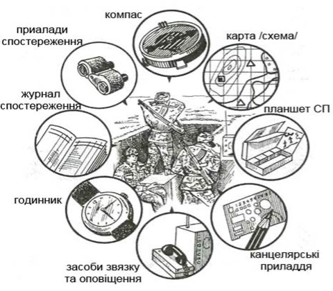

# Охорона та оборона важливих об'єктів та комунікацій.

Під час охорони та оборони важливих об’єктів і комунікацій основними завданнями підрозділу є недопущення проникнення до об’єктів ворога, та відбиття нападу. В залежності від завдання, умов обстановки, а також характеру функціонування об’єктів (комунікацій) підрозділи ведуть охоронні, оборонні, сторожові, загороджувальні, патрульні дії.

Охорона організовується і здійснюється відповідно до положень статуту щодо ведення сторожової охорони, оборона – відповідно до положень щодо оборонного бою з урахуванням особливостей ведення стабілізаційних дій.

За розмірами об’єкти поділяються на:
 
* малі об’єкти (з довжиною периметру до 1 км) – склади, невеликі мости тощо; 
* середні об’єкти (з довжиною периметру до 3 км) – заводи, великі мости тощо; 
* великі об’єкти (з довжиною периметру 9-27 км)  – аеродроми, базові райони тощо.

Залежно від розмірів та місця розташування об’єктів (всередині населеного пункту, на його околиці або поза населеним пунктом) на взвод може покладатися охорона та оборона до трьох малих об’єктів або одного середнього, на відділення – одного малого об’єкту.
Взвод (відділення), що призначений для охорони та оборони важливого об’єкту, може входити до складу основних сил, підрозділу посилення охорони і оборони, проти-диверсійного резерву, підрозділу для ліквідації наслідків нападу.

З прибуттям взводу (відділення) і зайняттям визначеного об’єкту командир організовує спостереження і безпосередню охорону та готує підрозділ і об’єкт до оборони. Територія об’єкту і підступи до нього обладнуються в інженерному відношенні. Для бойової техніки і вогневих засобів готуються вогневі позиції, для особового складу, боєприпасів та інших матеріальних засобів облаштовуються укриття. На прихованих підступах виставляються секрети і сторожові пости, висилаються дозори і патрулі. На закритих від спостереження ділянках встановлюються мінні поля і сигнальні засоби. За необхідності організовується кругова оборона.

Виявлений ворог на підступах до об’єкта блокуються, сковуються вогнем та знищуються. У разі раптового нападу ворога на об’єкт, що охороняється, чергова зміна охорони, а також особовий склад, що перебуває поблизу об’єкта, відбиває напад вогнем усіх засобів з метою недопущення проникнення ворога до об’єкту.

Охорона організовується і здійснюється з метою недопущення раптового нападу наземного ворога, проникнення його розвідки і забезпечення часу і вигідних умов для розгортання підрозділів у бойовий порядок і введення в бій.

У всіх умовах обстановки у взводі здійснюється безпосередня охорона. За розпорядженням старшого командира взвод може виконувати завдання в інших органах охорони: в бою – у бойовій, на марші – у похідній, при розташуванні на місці – у сторожовій охороні.

Безпосередня охорона організовується командиром взводу на основі отриманого завдання, умов обстановки і вказівок старшого командира та здійснюється спеціально призначеними спостерігачами; в обороні і при розташуванні на місці, крім того, –черговими вогневими засобами і часовими біля бойових машин та місць відпочинку особового складу; а при розташуванні взводу на місці окремо від роти також парними патрулями.

Під час організації охорони командир взводу вказує порядок ведення спостереження за місцевістю, повітрям і сигналами командира роти (взводу), призначає спостерігача, вказує його місце і завдання, а також встановлює порядок дій особового складу у разі раптового нападу диверсійної групи. В обороні і при розташуванні на місці, крім цього, командир взводу визначає необхідну кількість чергових вогневих засобів і чатових, їхні місця і завдання, а при розташуванні взводу на місці окремо від роти – склад патрульних і маршрути їх руху.

На кожну добу для розпізнавання своїх військовослужбовців встановлюються пропуск і відгук. Пропуском служить найменування озброєння або бойової техніки, наприклад «покемон», а відгуком – назва населеного пункту, що починається з тієї ж літери, що і пропуск, наприклад, «Полтава».

Пропуск повідомляється усно усьому особовому складу підрозділів, які призначені в охорону, розвідку і особам, які висилаються за межі підрозділу, а вночі і в межах розташування свого підрозділу; відгук – командирам цих підрозділів, а також особам, що посилаються для передачі усних наказів.

Пропуск запитується у всіх осіб, які проходять через рубіж охорони і переміщуються по розташуванню підрозділу вночі, а відгук – у осіб, які передають наказ командира, і командирів підрозділів, що ведуть розвідку.

Пропуск і відгук вимовляються тихо. Усі особи, які не знають пропуску, а прибулі з наказом – відгуку, затримуються. Затриманих командир взводу опитує особисто, і залежно від обставин дозволяє їм прямувати далі або направляє під конвоєм до командира, що вислав охорону.

Особовий склад, який призначений в охорону, повинен знаходитися у постійній готовності до дій; дотримуватись встановленого порядку чергування, відпочинку; виконувати заходи маскування і виявляти високу пильність, рішучість і стійкість.

**Спостережний пост (СП)** – це укомплектована особовим складом позиція створена для контролю та спостереження за певною територією, об’єктом або подіями. СП може бути постійним або тимчасовим.

**Спостереження** проводиться з метою нагляду та вчасного повідомлення про будь-яку ситуацію або інциденти, що можуть мати місце в районі відповідальності. Спостережний пост РХБ (радіаційної і хімічної розвідки об’єктів і місцевості)призначається для ведення розвідки наземного і повітряного ворога.

В обороні і при розташуванні на місці за рішенням старшого командира від взводу може виділятися СП. Пост розташовується у місці, яке забезпечує найкращий огляд місцевості перед фронтом, на флангах, а за можливості і в тилу підрозділу. Він повинен мати скриті підходи та бути ретельно замаскованим.

СП складається з двох-трьох спостерігачів, один з яких призначається старшим. На СП мають бути прилади спостереження, великомасштабна карта або схема місцевості, журнал спостереження, компас, годинник, засоби зв’язку і подачі сигналів, а у спостерігача – прилади спостереження. Для спостереження вночі та в інших умовах обмеженої видимості виділяються ліхтарі, прилади нічного бачення і засоби освітлення місцевості. На посту РХБ спостереження, крім цього, мають бути прилади радіаційної і хімічної розвідки та засоби для подачі сигналів оповіщення про зараження.

Під час постановки завдання СП або РХБ командир взводу вказує:

* склад, старшого поста;
* орієнтири та умовні найменування місцевих предметів;
* відомості про противника (де знаходиться, що робить, звідки очікується його поява);
* відомості про свої підрозділи;
* місце поста;
* сектор (смуга, об’єкт) спостереження;
* за чим спостерігати, що установити, на що звертати особливу увагу;
* порядок ведення РХБ розвідки, сигнали оповіщення;
* порядок доповідей результатів розвідки;
* час готовності.

З отриманням завдання старший СП організовує його зайняття, обладнання, маскування і ведення розвідки. Він зобов’язаний: 

* вивчити противника і місцевість у зазначеному секторі спостереження;
* скласти схему орієнтирів;
* встановити порядок спостереження і визначити черговість зміни спостерігачів;
* перевірити справність приладів спостереження, засобів зв’язку і оповіщення;
* доповідати командиру про готовність до виконання завдання і результати спостереження.

Старший посту РХБ спостереження, крім того, повинен встановити порядок вмикання приладів РХБ розвідки, знати сигнали оповіщення про зараження та порядок їх передачі.

Перед початком розвідки спостерігач повинен

* детально вивчити місцевість у секторі спостереження;
* визначити відстані до орієнтирів і характерних місцевих предметів і де, ймовірніше всього, ворог може розташувати живу силу, бойову техніку і вогневі засоби, інженерні споруди і загородження;
* запам’ятати кількість, форму, розміри і місця розташування місцевих предметів.

Розвідка ведеться безперервно і в залежності від обстановки здійснюється позмінно або всім складом СП одночасно. Спостереження починається, як правило, з ближньої зони і ведеться справа наліво, від себе в глибину послідовним оглядом місцевості і місцевих предметів за зонами спостереження. Виявивши ціль, спостерігач визначає її положення відносно орієнтирів і доповідає старшому СП.
Старший СП встановленим порядком доповідає про виявлену ціль командиру, який виставив пост, наносить її на карту і робить запис у журналі спостереження.

Розвідка повітряного противника ведеться з метою своєчасного виявлення засобів повітряного нападу та оповіщення підрозділів. Спостереження за повітрям ведеться безперервно усім особовим складом, окремо можуть призначатися спостерігачі та обладнуватися пост повітряного спостереження. Спостереження ведеться за допомогою оптичних приладів послідовним переглядом повітряного простору, починаючи від обрію. Виявивши повітряну ціль, спостерігач негайно подає сигнал оповіщення, визначає характер цілі, напрямок польоту і доповідає командиру (старшому СП). Пост РХБ спостереження безперервно веде спостереження у визначеному районі. У встановлений час і при кожному артилерійському та авіаційному нальоті противника вмикає прилади РХБ розвідки і стежить за їхніми показниками.
У разі виявлення дози випромінювання 0,5 рад/рентген і більше старший поста доповідає командиру, який його виставив, і за його вказівкою подає сигнал «Радіаційна небезпека».

У разі виявлення хімічного або біологічного зараження старший поста негайно подає сигнал «Хімічна тривога» і доповідає командиру, який виставив пост. Результати спостереження заносяться у журнал спостереження.

Для ведення спостереження в призначених районах, секторах розгортаються постійні і тимчасові спостережні пости.
У залежності від умов обстановки й обсягу завдань до складу спостережного посту може бути включено від одного військовослужбовця до 2 мобільних груп швидкого реагування на штатній техніці з необхідним запасом боєприпасів, засобами зв’язку, радіолокаційного огляду, нічного бачення і освітлення місцевості. Склад спостережного посту під час охорони важливого об’єкту зазвичай нараховує 2 бійців.

## Встановлення та організації служби на СП:

* визначити точне місце знаходження СП на місцевості;
* створити систему зв’язку;
* визначити захисні позиції СП та сектори стрільби.

### Спорудження СП:

* побудова СП;
* обнесення території колючим дротом на відстані 40-50 метрів від СП якщо це можливо «це межа ураження ручними гранатами»;
* будівництво сховищ та захисних позицій, фортифікація місця (для стрільби з різних видів зброї), підготовка укриття для особового складу та техніки;
* підключення електропостачання. Встановлення пристроїв для безперебійного та постійного забезпечення засобів зв’язку електроенергією;
* встановлення системи сигналізації навколо СП;
* розроблення та введення в дію інструкції для несення служби, панорамної схеми місцевості з нанесеними секторами спостереження;
* розбудова інфраструктури СП.

Місце розташування СП обирається з максимальним урахуванням завдання покладеного на підрозділ.

### Врахування місця встановлення СП:

* що необхідно бачити для виконання поставленого завдання;
* розташування конфронтуючих сторін;
* які райони і напрямки необхідно тримати під спостереженням;
* наявність між сусідніми СП прихованого від спостереження «мертвого» простору;
* умови взаємодії із сусідніми СП;
* висоту розташування самого СП;
* географічні особливості місцевості.

### Особовий склад СП.

СП як правило комплектується особовим складом з розрахунку цілодобового спостереження та забезпечення мінімальної безпеки. Особовий склад повинен бути поділений на три зміни:

* чергова;
* пильнуюча;
* відпочіваюча зміна.

На спостережному посту повинно знаходитись що найменш дві особи. Один спостерігає а інший відпочиває. 
Потрібно мати на увазі, що при веденні спостереження в нічний час, кількість спостерігачів збільшується.
Якщо ситуація в зоні відповідальності є напружена, кількість особового складу збільшується.

### Обладнання спостережного посту:

* біноклі, прилади нічного бачення, спеціальне освітлення для читання карти, або документів, камера або відеокамера, прожектор на спостережній вежі, комплект для обслуговування оптичних приладів;
 

* документація витяг (SОР), правила застосування зброї, карта району спостереження з позначеними на ній районами особливої уваги;
* панорамні фотографії або схеми із позначенням характерних місцевих предметів та відстаней до них, довідник з малюнками літаків, вертольотів, танків, БМП (БТР), що використовуються сторонами, які беруть участь у конфлікті, а також типове обмундирування і знаки розпізнавання, журнал реєстрації спостережень, план охорони та оборони СП, зразки подачі рапортів, графік чергування, перелік ступенів бойової готовності, переговорні і кодові таблиці, інструкції про порядок оповіщення і підйому по тривозі, дій при пожежі, затриманні порушників і їх конвоюванні, по застосуванню і обслуговуванню наявної техніки та обладнання;
* приладів зв’язку, зокрема керівництво зі зв’язку, в якому вказані позивні, частоти, та час доповідей;
* озброєння СПмає бути здатним захистити себе протягом часу необхідного для прибуття групи швидкого реагування.

Крім особистої зброї на СП повинен бути створений запас боєприпасів на випадок ведення оборони, включаючи гранати та сльозоточивий газ, сигнальні пістолети, освітлювальні ракети та трасуючі боєприпаси.
Підступи до посту повинні бути розчищенні для створення широкого сектору обстрілу. 
Поруч або на території важливого об’єкту

* повинна бути обладнана площадка для прийому гелікоптера, обладнання для приземлення і зльоту гелікоптера, особовий склад повинен бути навченим приймати гелікоптер як в день так і вночі;
* додаткові запаси продовольства та питної води що знаходяться в  укриттях;
* засоби надання першої медичної допомоги;
* ліки від простуди та іншої хвороби, що притаманні місцевості;
* запасні акумулятори, батареї;
* інструменти для простого ремонту;
* засоби пожежогасіння;
* генератор для електропостачання;
* місце заряджання та розряджання зброї;
* біля СП повинен стояти плакат, який повинен вказувати на приналежність цього СП, а також на дії місцевого населення.
Приклад: «Ви наблизились до зони охорони об’єкту, подальший рух заборонено».
 
## Секрет

Секрет має ті ж функції що й СП але його виставлення та несення служби на ньому має бути прихованим.

Секрет розгортається за вказівкою командира, на обмежений час, за межами периметру важливого об’єкту, на найбільш загрозливих підступах до нього. Кількість обладнання визначається можливістю особового складу взяти з собою необхідні засоби та обладнання.
Мінімальне устаткування для секрету – засоби спостереження та зв’язку та журнал реєстрації спостереження.

Секрети зазвичай застосовуються для спостереження за зонами та подіями тимчасового характеру які не можуть спостерігатися зі стаціонарного спостережного посту.

Секрет виставляється від сторожової застави на віддаленні до 300-400 м у складі 2-3 бійців, один з них призначається старшим. Секрет потай займає і обладнує вказане місце і веде безперервне спостереження за противником та місцевістю. Старший секрету встановлює порядок спостереження, підтримує постійну бойову готовність секрету і зв’язок з командиром, який його виставив. Секрет несе службу беззмінно протягом дня або ночі, потай, нічим себе не виявляючи. **Він нікого не затримує і не опитує.** Про появу одиночних солдатів, цивільних осіб та груп противника старший секрету доповідає командиру, що вислав секрет. Під час нападу противника на секрет він відкриває вогонь і відходить, продовжуючи вести спостереження. Із закінченням часу несення служби або за командою командира, який вислав секрет, особовий склад повертається на сторожову заставу.

**Рухомий патруль** - це група бійців на штатній техніці або в пішому порядку, яка виконує завдання щодо спостереження за місцевістю на підступах до важливого об’єкту з метою виявлення порушень особливого режиму, а також затримання, огляду осіб, які порушують правила особливого режиму, і доставки їх до поліції, вилучення зброї і боєприпасів, інші завдання.

### Склад рухомого патруля:

* піший рухомий патруль в межах периметру важливого об’єкту – 2 бійця;
* рухомий патруль в межах периметру важливого об’єкту на техніці 3 бійця;
* рухомий патруль за межами зовнішнього периметру важливого об’єкту на техніці 5 бійців.

В залежності від розміру важливого об’єкту, для патрулювання периметру може призначатись декілька піших або рухомих патрулів, для кожного патруля призначається маршрут патрулювання, при чому патруль який рухається вздовж визначеного маршруту має мати зв’язок зі спостережними постами вздовж яких здійснює патрулювання та взаємодіяти з зазначеними СП.
 
### Контрольно-пропускний пункт стратегічного об’єкту.

**КПП** (блок-пост) – це укомплектована особовим складом військова позиція створена для перевірки, огляду та контролю руху транспорту та людей в або з певної території чи об’єкту. В залежності від специфіки операції та завдання створюється стаціонарний або тимчасовий КПП.

КПП на в’їзді або виїзді до важливого об’єкту призначене для контролю за пересуванням людей і транспортних засобів на території та з території важливого об’єкту. В залежності від розмірів стратегічного об’єкту може обладнуватися декількома КПП, контрольно-основне та допоміжне.

В склад КПП яке являється одним із об’єктів системи охорони та оборони стратегічного об’єкту може входити від 1 відділення до взводу. Службу на КПП несуть три зміни, тривалість чергування кожної зміни 4 години а в загрозливій обстановці посилюється додатковими силами та засобами і триває 8 годин.

Кількість особового складу КПП залежить перш за все від загальної ситуації в зоні стратегічного об’єкту.
Частіше КПП укомплектовується одним відділенням. Якщо є навчанні собаки то їх використовують для перевірки людей та багажу.
При спокійній обстановці де населення з повагою ставиться до військових, на КПП  застосовується мінімальна кількість особового складу.

Якщо обстановка в зоні стратегічного об’єкту є напруженою, на КПП призначається більша кількість особового складу з відповідним озброєнням, це дозволить належним чином реагувати на загрозу.

### Обороні та патрульні дій СП

Все обладнання, яке встановлене на СП повинно функціонувати, карти, книги та інші документи повинні бути готовими до роботи. Особисті предмети радіоприймачі, мобільні телефони і журнали заборонені, так як відволікають від несення служби. Боєць, що заступає на чергування повинен прибути за 20-30 хвилин до початку несення служби, це робиться з метою введення спостерігача в обстановку та надати можливість адоптуватися на місцевості.

Систематичне спостереження на СП проводиться планово, відповідно інструкції. Боєць оглядає всю місцевість та прилягаючі дороги. Застосовує оптичні засоби спостереження у разі потреби. Для швидких доповідей і якісного спостереження, місцевість поділяється на сектори. Огляд місцевості ведеться зліва на право від себе в одаль. Помічені інциденти заносяться в книгу спостереження.

Вночі спостерігач використовує прилади нічного бачення, не більше як 3-5 хвилин, після чого повинен дати очам відпочити на протязі 10-15 хвилин.

Служба на СП триває 4 години, в екстремальних  умовах посилюються додатковим особовим складом і триває 8 годин.

При небезпечних ситуаціях, таких як стрільба поблизу розташування СП та ін., боєць негайно доповідає командиру або черговому КСП підрозділу та може здійснювати попереджувальні постріли, подавати встановлені сигнали за допомогою сигнальних ракет.

Принцип спостереження та доповідь:

* шукати та бачити;
* слухати та чути;
* оцінювати, те за чим спостерігали;
* доповідати про те, що спостерігали.

### Зв’язок

На СП повинен бути зв’язок з командиром підрозділу (черговим КСП підрозділу який розгорнутий на території важливого об’єкту), з резервом, та сусідніми спостережними постами. Це може бути телефонна лінія або радіо мережа. При цьому для зв’язку з командиром підрозділу бажано мати обидві лінії. Перевірка зв’язку проводиться під час кожної зміни, бажано мати резервну радіостанцію та додаткову батарею.

Для переговорів розробляється спеціальна переговорна таблиця. В таблиці передбачаються кодовані слова та сигнали управління (оповіщення). Це захистить інформацію від ворожого прослуховування.
Індивідуальне спорядження бійців СП, включає в себе: відповідну форму одягу, особисту зброю, захисне спорядження та індивідуальну медичну аптечку.

### Несення служби на контрольно-пропускному пункту стратегічного об’єкту (КПП-СО)

Завдання КПП-СО є повне або часткове блокування в’їзду (виїзду), попередження ввозу (вивозу) боєприпасів та інших заборонних засобів, що можуть бути використані для протиправної діяльності та знищення об’єкту.

Крім того на КПП-СО покладається наступні завдання:

* огляд і перевірка людей, транспорту і вантажів, що перетинають зону роз’єднання (буферну, контрольовану, демілітаризовану зону);
* запобігання проникнення порушників і незаконної доставки зброї, боєприпасів, вибухових речовин;
* блокування руху транспорту і людей (часткового чи повного);
* затримання громадян і транспортних засобів, що порушують встановлений режим поводження; спостереження за місцевістю;
* контроль комунікацій.

Особовий склад КПП-СО може застосовувати силу і зброю для:

* особистого захисту від збройного нападу;
* забезпечення власної безпеки або безпеки іншого персоналу, якому загрожує небезпека;
* при спробі захоплення, пошкодження або викрадення цивільного чи військового персоналу;
* при перешкоді персоналу в виконанні завдань;
* при намаганні вкрасти або знищити обладнання КПП-СО.

**Зупинка транспортного засобу у комендантську годину** який має орієнтири на затримання та не виконує вказівки особового складу КПП-СО:

* дається попередження голосом і сигнал рукою, щоб зупинитися, при цьому зброя знімається з запобіжника та досилається патрон у патронник;
* якщо час дозволяє, розгортається смуга з цвяхами;
* особовий склад займає захисні позиції;
* викликається група швидкого реагування;
* якщо автомобіль не зупиняється, робиться попереджувальний постріл в землю перед автомобілем, наступний постріл в водія (так як даний випадок може нести пряму загрозу всьому особовому складу КПП-СО, автомобіль може бути начинений вибухівкою, стрільба по колесам та в двигун не зупинить вчасно транспортний засіб). 

Використовуємо трасуючі набої. Дбаємо про безпеку сторонніх людей.
Зупинений автотранспорт тримаймо на прицілі та за наявності живої сили ворога подаємо команду покинути автівку, стати на коліна, руки підняти у верх, долоні щепити  за головою.

Коли порушники намагаються ігнорувати команду здійснюється попереджувальний постріл в землю перед порушниками,  якщо і це не допомагає здійснюється постріл по ногах. Припиняємо застосування сили, як тільки попередження виконано або ситуація нормалізувалася. Наказуємо прийняти положення лежачи та очікуємо групу швидкого реагування.

Варіант застосування сили проти однієї людини яка не виконує вказівки особового складу, аналогічний попередньому: «Стій, на коліна, руки верх, долоні щепити  за головою інакше буде застосовано зброю».

### Якщо особовому складу КПП-СО загрожує натовп: 

* використовуємо сльозоточивий газ;
* рух повинен бути блокований всіма доступними засобами;
* особовий склад КПП-СО перекриває дорогу до об’єкту і займає захисні позиції;
* здійснюється доповідь і виклик групи швидкого реагування;
* якщо хтось намагається розблокувати дорогу, можуть робитись попереджувальні постріли;
* коли спроби не припиняються, застосовується сльозоточивий газ або дими;
* при прориві полоси перешкод натовпом, особовий склад КПП-СО відкриває вогонь в землю перед порушниками, якщо і це не діє та відсутні інші засоби впливу, а дії порушників несуть пряму загрозу життю та здоров’ю бійцям КПП-СО, застосовуємо зброя на враження.