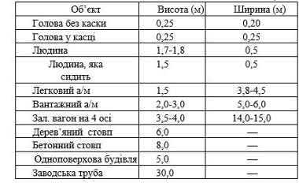
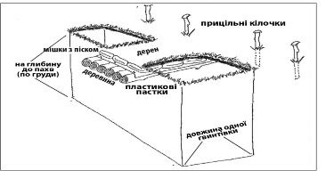

# Бойова оборона

## Розвідка цілей

Розвідка цілей ведеться з метою своєчасного виявлення розташування і дій ворога. Крім того, в бою необхідно спостерігати за сигналами та знаками командира і результатами свого вогню.
Якщо немає особливих вказівок командира, солдати ведуть спостереження у вказаному їм секторі обстрілу.

Спостереження ведеться неозброєним оком. Особливу увагу під час спостереження потрібно звертати на приховані підходи. Місцевість оглядати справа наліво, від ближчих предметів до дальніх. 

Огляд необхідно здійснювати уважно, оскільки виявленню ворога сприяють незначні ознаки. 

**Ознаки:** блиск, шум, качання гілок, дерев і кущів, поява нових місцевих предметів, зміни в положенні та формі місцевих предметів і т.ін.

За наявності бінокля його використовують тільки для більш старанного виявлення окремих предметів або ділянок місцевості; при цьому вживати заходів для того, щоб блиском скла бінокля не виявити місця свого розташування.

Вночі місце розташування і дій противника можуть бути встановлені за звуками і джерела світла та при наявності спец-засобів теплові-зорів, приборів нічного бачення . Якщо в потрібному напрямку місцевість освітлена освітлювальним патроном або другим джерелом освітлення, треба швидко оглянути освітлену ділянку. Воїн готує своє місце таким чином, щоб бачити все і всіх, а самому бути  скритним, непомітним.

### Особливості виявлення деяких об’єктів під час спостереження.

**Виявити ворожого снайпера найважче**, оскільки в його розташуванні і маскуванні немає шаблону.

Розташування ворожого снайпера можливо очікувати повсюди. Для виявлення його позиції слід уважно оглядати місцевість на відстані до 600 м, це ідеальна відстань для снайпера, і особливо звертати увагу  на лісо-полосу, пні та самотні кущі. 

**Спостережний пункт ворога.** Зазвичай, спостережні пункти розташовуються на висотах і місцевих предметах: окремі будівлі, верхні поверхи і дахи великих будинків, каплиці, фабричні труби, купи каміння на схилах гір тощо. Слід звернути увагу на домівки, які є поруч з місцем розташування військового підрозділу. Як свідчить досвід, місцеві жителі які симпатизують ворогам, можуть самостійно вести нагляд за армійським підрозділом, як правило, з дахів своїх домівок. Слід звернути увагу на появу автомобілів, які зупиняються поблизу блокпосту або військових таборів, людей, які прийшли чомусь працювати поблизу місця знаходження бійців тощо.

## Вогневі позиції ворога. 

Вогневі позиції ворог обладнує, зазвичай, в складках місцевості,  або на підготовлених ділянках, також необхідно звертати увагу на  зеленку, яка знаходиться поблизу.

Вогневі позиції на місцевості мають вигляд пагорбів. Серед природних пагорбів вони можуть іноді виділятися забарвленням або наявністю на них темних плям. У населених пунктах ворог може розташовувати вогневі позиції в нижній частині будівель, і треба їх уважно оглядати.

Ретельним, тривалим спостереженням і порівнянням різних де-маскувальних ознак можна виявити ворога. Слід звернути увагу на все, що відрізняється від природного, звичайного виду місцевості, і зрозуміти причини цих відмінностей – це основне в мистецтві спостереження.

## Ведення спостереження вночі.

Потрібно пам’ятати, що в темряві видимість зверху до низу гірше, ніж знизу доверху. Тому вночі місце для позиції слід вибирати в низьких місцях, звідки можна швидше виявити ворога, які проектуються на тлі неба.

За орієнтири вибираються предмети з контурними обрисами, які чітко вимальовуються на місцевості і добре видимі в нічний час.
Спостереження в нічних умовах ведеться, зазвичай, за допомогою приладів нічного бачення. 

Під час спостереження вночі, щоб уникнути засліплення, не можна дивитися на яскраво освітлені предмети і на джерела світла.
Інфрачервоний прожектор, якщо ворог їм користується, демаскує місце його застосування. Тому, приступаючи до спостереження, потрібно увімкнути живлення електронно оптичного приладу, ретельно оглянути місцевість в секторі спостереження і переконатися у відсутності у противника інфрачервоних прожекторів. При цьому потрібно пам’ятати, що джерело випромінювання ворога буде проектуватися у вигляді світло-зеленої плями з яскраво-білим центром. Його напрямок визначається за формою плями. Якщо вона має форму кола, то промінь спрямований на спостерігача, якщо видно еліпс, витягнутий по вертикалі, промінь направлений до спостерігача під кутом 45-60 градусів.

Не можна розташовуватися біля дерев, поблизу річок з бурхливою течією, в районах водоспадів тощо, бо э зайва шумова поміха
Точність визначення відстаней на слух залежить від досвідченості спостерігача, гостроти і натренованості його слуху та вміння враховувати природні фактори, що впливають на поширення та силу звуку.

До основних факторів відносяться: напрямок і сила вітру, температура і вологість повітря, характері розташування складок рельєфу, рослинність.

Найбільш сильно змінюються звуки за силою та напрямком поблизу великих водойм і на закритій місцевості – у лісі, горах, в глибоких складках рельєфу.

Чутність посилюється, коли вітер іде з боку джерела звуку, а також вночі і в ранкові години, в похмуру погоду, особливо після дощу, біля водної поверхні, в горах, взимку та в інших випадках, коли поліпшується звукопровідність повітря. 

При посиленні чутності, спричиненої цими факторами, джерела звуку здаються ближче, ніж є насправді.

Звук поглинається, тобто стає слабкішим, в спекотну сонячну погоду, під час снігопаду, дощу, в лісі, чагарнику, на місцевості з піщаним ґрунтом. 

При послабленні чутності відстань до джерел звуку здається збільшеною.

Як правило, постійне, тривале спостереження може призвести до втоми спостерігача і міражу. Результати спостереження доповідаються командиру. У доповіді спостерігач, використовуючи місцеві предмети, орієнтири поблизу яких виявлена ціль, вказує місце розташування цілі та її характер.

**Обчислювання дальності до цілі** — важливий фактор спостереження. Дальність до цілі визначається за допомогою приладів, які є у спостерігача, або окомірним способом.

**Окомірний спосіб** – основний, найпростіший і швидкий, найбільш доступний спостерігачу в будь-яких умовах бойової обстановки. Однак досить точний окомір виробляється шляхом систематичного тренування, що проводиться в різноманітних умовах місцевості, в різний час року і доби.

Щоб розвинути свій окомір, необхідно частіше тренуватися, оцінювати відстані з обов’язковою перевіркою їх кроками та іншими способами. Починати тренування слід з коротких відстаней 10, 50, 100 м, потім перейти послідовно до великих 200, 400, 800 м.

У процесі такого тренування основну увагу слід звертати на побічні явища, які впливають на точність окомірного способу:

*	більші предмети здаються ближче дрібних, що знаходяться на тій же відстані;
* більш близько розташованими здаються предмети, видимі різкіше і чіткіше, тому:
* яскраві предмети білі, жовті, червоні здаються ближче, ніж темні предмети чорні, коричневі, сині;
* освітлені предмети здаються ближчими слабко освітлених, що знаходяться на тій же відстані;
* під час туману, дощу, в сутінки, похмурі дні, при насиченості повітря пилом спостережувані предмети здаються дальшими, ніж в ясні сонячні дні;
* чим різкіше різниця в забарвленні предметів і фону, на якому їх можна побачити, тим більше зменшеними здаються відстані до цих предметів, наприклад, взимку снігове поле наближає більш темні предмети;
* чим менше проміжних предметів знаходиться між оком і предметом, який знаходиться під наглядом, тим цей предмет здається ближче, зокрема;
* предмети на рівній місцевості здаються ближче, особливо скороченими здаються відстані, які визначаються через великі відкриті водні простори, протилежний берег завжди здається ближче, ніж насправді;
* складки місцевості яри, лощини, що перетинають вимірювану лінію, зменшують відстань;
* при спостереженні лежачи предмети здаються ближче, ніж при спостереженні стоячи.

При спостереженні “знизу – вгору”, від підошви гори до вершини, предмети здаються ближче, а при спостереженні зверху — вниз-далі.
Для наближеного визначення відстані спостерігач може застосовувати такі дані, наведені у таблиці.

### Визначення відстані до цілі за кутовими розмірами.

Визначення відстані до цілі за кутовими розмірами можливе, якщо відома спостережувана лінійна величина, висота, ширина або довжина предмета, до якого визначається відстань. Спосіб полягає у вимірюванні кута в тисячних, під яким видно цей предмет.
**Тисячна є 1/6000** частиною кругового горизонту, що збільшується в ширину прямо пропорційну збільшену дистанції до точки відліку, якою є центр кола.  

Пам’ятаємо, що **тисячна на відстані**: 
100 м = 10см; 200 м = 20 см; 300 м = 30 см; 400 м = 40 см і т.д.
Знаючи зразкові лінійні габарити цілі, або орієнтира в метрах і кутову величину цього об’єкта, можна визначити відстань, використовуючи формулу тисячної: 

**Д = (В х 1000 ) : У,**

> де Д – дистанція до цілі;
1000 – постійна незмінна математична величина, присутня завжди в цій формулі;
У – кутова величина цілі, тобто, скільки однотисячних поділок за шкалою оптичного прицілу або іншого приладу займає ціль;
В — метрична (метри) відома ширина або висота цілі.

Навчання воїна-спостерігача такому методу доцільно проводити безпосередньо на місцевості.

Метричні параметри деяких об’єктів наведені в таблиці.

Шкали наявних на озброєнні відкритих прицілів, оптичних прицілів і оптичних приладів налаштовані в тисячних і мають ціну поділки:

Таким чином, для визначення відстані до об’єкта за допомогою оптики необхідно розмістити його між поділками шкали прицілу і дізнавшись його кутову величину, підрахувати відстань, використовуючи наведену вище формулу.

Приклад: Потрібно визначити відстань до цілі: грудна або ростова мішень, яка помістилася в один маленький бічний відрізок шкали оптичного прицілу ПСО-1.

Рішення: ширина грудної або ростової мішені піхотинця в повний зріст дорівнює 0,5 м. За замірами за допомогою ПСО-1 ціль закривається одним поділом шкали бічних виправлень, тобто кутом в одну тисячну отже:

**Д = (0,5 х 1000) : 1 = 500 м.**

### Вимірювання кутів підручними засобами

Для вимірювання кутів за допомогою лінійки необхідно тримати її перед собою, на відстані 50 см від ока, тоді один її розподіл 1 мм  відповідатиме 0-02 тис, таблиці.

Точність вимірювання кутів цим способом залежить від навички у винесенні лінійки точно на 50 см від ока. У цьому можна натренуватися за допомогою мотузки такої довжини.

Для вимірювання кутів підручними предметами можна використовувати палець, долоню або будь-який підручний невеликий предмет, наприклад сірникову коробку, розміри якої в міліметрах, а отже, і в тисячних.
Для вимірювання кута така мірка також виноситься на відстань 50 см від ока, і за нею шляхом порівняння визначається невідома величина.

Здобувши навички у вимірюванні кутів, слід переходити безпосередньо до визначення відстаней за виміряними кутовими розмірами предметів.
Визначення відстаней за кутовими розмірами предметів дає точні результати лише за умови, якщо добре відомі дійсні розміри спостережуваних предметів, і кутові вимірювання проводяться ретельно за допомогою вимірювальних приладів.

Підготовка навиків спостерігача ̶ це кропітка праця, потрібно постійно навчати. Спостереження ̶ це основний спосіб отримання необхідних даних про ворога та місцевість у ланці — підрозділу «ГАРТ».

## Постановка вогневих завдань.

Управління вогнем під час ведення бою є одним із важливих обов’язків командира підрозділу «ГАРТ». 

Воно включає: 
розвідку наземних і повітряних цілей ворога, оцінку їх важливості, визначення черговості ураження; вибір виду зброї та боєприпасів, виду і способу ведення вогню; подачу команд на відкриття вогню; спостереження за результатами вогню і коректування стрільби; маневр вогнем; контроль за витратою боєприпасів.

Розвідка цілей противника ведеться особисто спостерігачами і докладається командиру. 

Сектори спостереження забезпечує виявлення противника перед фронтом, на флангах і в тилу, вони залежать від розташування прицілів, приладів спостереження, бійниць і розміщення бійців. З бойових машин ведеться кругове спостереження.

При наявності цілі на полі бою необхідно доповісти командиру і вказати їх розташування. Ціль вказується усною доповіддю або жестами та трасуючими кулями. Доповідати коротко, зрозуміло та точно.

Наприклад:
„Прямо — БМП, зліва – БТР”, „Орієнтир другий, праворуч 0-05 під кущем  ̶  снайпер”.

Оцінка, визначення цілей:

* безпечних-вогневі засоби, які знаходяться на відстанях, більших від дальності їх дійсного вогню;
* важливих-цілі, які за своїми вогневими можливостями здатні завдати значних втрат або ураження яких полегшить виконання бойового завдання;
* небезпечних-вогневі засоби, які знаходяться на відстані свого дійсного вогню та ведуть вогонь;
* особливо важливих-елементи ЗМУ і ВТЗ. 

Першими знищуються протитанкові засоби, броньовані машини на передньому краї і в найближчій глибині, обслуги кулеметів і мінометів, снайпери, артилерійські коректувальники, авіаційні навідники і командири підрозділів ворога. 

Особливо важливі цілі знищуються негайно у міру їх виявлення. 
В наявності двох важливих цілей вибирають ближчу і найбільш уразливу. Вогонь може переноситися при появі під час стрільби нової, більш важливої цілі.

Вибір зброї і боєприпасів, виду і способу ведення вогню, якій повинен забезпечити надійне знищення розвіданих цілей.
Командир подає команди на відкриття вогню зі стрілецької зброї та вказує: 

* кому: (кожній групі, який вогневий засіб);
* указує цілі (положення цілі);
* за необхідності установку прицілу, точку прицілювання, величину виносу точки прицілювання;
* довжину черги, (одиночні, короткі, дилинні); — „ВОГОНЬ” – момент відкриття вогню.

Приклад: 
> «Кулеметнику та стрільцю, Ор. 1., праворуч 0-05, далі 100 –     кулемет противника, 6, під обріз, короткими, ВОГОНЬ». Для ведення вогню з бойової машини командир групи вказує:
̶  тип зарядів для стрільби кулемета; 
̶  указує ціль, дальність до цілі в метрах; 
̶  спосіб стрільби, з місця, з короткої зупинки, з ходу; ̶  „ВОГОНЬ” – момент відкриття вогню.

Для стрілецької зброї найбільше характерними є живі цілі: розрахунки кулеметів, групи стрільців або окремі фігури, які ведуть вогонь з різних положень, а також жива сила на автомобілях, мотоциклах також повітряні цілі.

Коли указуємо ціль включає положення і назву цілі. 
Воно може здійснюватися: від орієнтирів місцевих предметів і від напрямку руху атаки, за азимутальним покажчиком, трасуючими кулями і снарядами, розривами снарядів, сигнальними засобами, а також наведенням приладів прицілювання і зброї в ціль.

Спостереження за результатами вогню ведеться з метою фіксування ураження ворога або визначення величини відхилення кулі від цілі. 
Коректування стрільби полягає у внесенні необхідних змін до вихідних установок стрільби для подальшого виконання вогневого завдання. Воно здійснюється визначенням величини відхилення за дальністю і напрямком одночасно **зміною установки прицілу, виносом точки прицілювання**.

Способи указу цілі:

* у військовому транспорту — наведенням зброї в напрямку цілі, від орієнтирів місцевих предметів;
* від напрямку руху;
* мобільна група – від орієнтирів місцевих предметів, трасуючими кулями і сигнальними патронами, розривами снарядів.

Цілі  та напрямок указує командир мобільної групи за допомогою системи командного наказу. Одночасно з наведенням зброї на ціль командир тактичної групи ставить вогневе завдання або подає команду на відкриття вогню.

> Приклад: кулемет «Бронебійним, з ходу, ВОГОНЬ».
У разі зміни зони ведення вогню командир здійснює наведення зброї на ціль командами «кулемет праворуч (ліворуч)», а при суміщенні ствола кулемета з напрямком на ціль – «фронтально», після чого уточнює положення цілі за місцевими предметами.

При наказі ведення вогню  скільком екіпажам бойових машин по одній  цілі, проводиться прицільний постріл довгою чергою трасуючими кулями, швидко указуючи напрямок ведення вогню.

Про майбутній наказ ведення вогню по цілі, напрямок і дальність стрільби командир підрозділу «ГАРТ» попереджає по радіо, сигналами (світла, жестами).

## Вибір та обладнання вогневих позицій.

### Позиції для стрільби.  

Боєць повинен правильно вибирати місце для ведення вогню і спостереження за ворогом.

На місцевості боєць відшукує природне укриття-канава, вирва, колода тощо, потім оглядає все довкола і непомітно переміщується до нього. Місце для вогневої позиції повинне забезпечувати достатній огляд, маскування, укриття від вогню ворога і мати зручні підходи. 
Не доцільно обладнувати вогневу позицію на вершинах, горбах, біля одинокого дерева чи будинку, в невеликому гаю, тобто поблизу тих об’єктів місцевості, які привертають увагу ворога і допоможуть йому орієнтуватися.

Перед обладнання позиції, необхідно вивчити місцевість, звернувши увагу на низини, канави, борозни та інші укриття, які ворогом можуть використатися для непомітного наближення.
Вивчивши місцевість, воїни починають обладнувати вогневу позицію. Обладнання проводиться послідовно, що забезпечує готовність до відбиття раптової атаки противника. 

Влаштування оборонних споруджень є одним з видів обладнання позицій та районів розташування, які виконують бойові групи в усіх видах тактичних дій бою.

Оборонні спорудження обладнуються для забезпечення ведення вогню, спостереження, управління боєм, захисту особового складу та бойової техніки від засобів ураження.

В залежності від місцевості, наявності часу, сил і засобів позиції можуть бути обладнані спочатку окремими окопами й укриттями, потім траншеями, спорудженнями для вогневих засобів і спостереження та укриттями для особового складу і матеріальних запасів.

Під час бою, для закріплення на даній точці, кожним бійцем для ведення вогню, спостереження та захисту від засобів ураження противника здійснюється самообкопування, підготовки особистого укриття.

При самообкопуванні обладнують одиночні окопи спочатку для стрільби лежачи; в подальшому за наявності часу їх заглиблюють до профілю для стрільби з коліна і далі для стрільби стоячи.

Якщо перед окопом є чагарник або висока трава, то з метою поліпшення огляду й обстрілу потрібно розчистити їх непомітно для противника. 

Крім того, слід підготувати автомати і кулемети для ведення вогню вночі. Для автомата робиться у бруствері жолобок з таким розрахунком, щоб покладений в нього автомат був наведений точно у вказаному командиром напрямку. Краї жолобка утрамбовують і укріпляють.

Дещо інші вимоги висуваються до вибору і зайняття місця бійця, якого призначено спостерігачем. Він мусить усе бачити й чути і при цьому залишатися непоміченим для противника. Тобто влаштовується секрет. 

У навчальному посібнику «ГАРТ» «Тактичних груп швидкого реагування» визначаються способи інженерного обладнання окопів для вогневих засобів. Бойові позиції, дають певний захист від куль і снарядів, які постійно літають над полем бою. Очевидно, що поки боєць знаходиться в окопі, він захищений від вогню противника.

Важливим винятком є важкий кулемет – який може пробити до 4,5 метрів ґрунту, і реактивні протитанкові гранати. Інші зразки зброї механізованих підрозділів не можуть завдати шкоди бійцям в укриттях. 

Ворог у наступі змушений підставляти під вогонь усе своє тіло, тоді як ви показуєте лише незначну частину вашого. Простіше кажучи, наступ у повний зріст, який робить вас відкритим для спостереження і вогню ворога – найгірше положення воїна на полі бою. З іншого боку, сидіти в ямі і стріляти по ворогам, що атакують є найкращим варіантом.

**Барикада.** Найпростіший варіант бойової позиції, який захищає бійця тільки з фронту. Найчастіше її обладнують з мішків з піском, але в хід можуть йти каміння, колоди від 20 см завтовшки, які слід потім укріпити землею. Мінімальна товщина барикади біля вершини – 50 і 60 см.

 
Маскуємо барикаду, так щоб її не було видно на відстані 40 метрів. Цього можна досягти, помістивши 15 – 20 см шматків дерну на фронтальну і флангові частини барикади. Якщо дерну немає, можливе використання необхідної кількості листя, гілок, піску або снігу. Зазвичай, збирати матеріал для маскування доцільно позаду позиції.

**Імпровізована позиція.** Цей тип позиції призначено для тимчасового використання. Ця позиція створюється з метою прикрити бійця від спостереження з відстані 30 метрів.

 
Обладнання позиції для двох бійців за перешкодою (наприклад деревом). Розміри позиції – приблизно 70 см завширшки і 30 см вглибину, довжину слід визначати залежно від зросту бійця. Позиція повинна мати форму літери „V” при погляді згори, так щоб ноги бійців були разом. Це дозволить їм подавати сигнали поштовхом ноги.

**Горизонтальна рівна позиція.** Без парапетів, великих земляних валів, ця позиція знаходиться на рівні ґрунту. Це дозволяє отримати позицію, яку не лише важко помітити, але і дуже важко уразити вогнем РПГ, оскільки реактивний снаряд потребує стінки, в яку може детонувати, тому снаряди пройдуть над вами.

Для цього необхідно обрати місце, яке знаходиться на одному рівні з фронтом очікуваної атаки. Розміри позиції – довжина до 90 см, до 300 см в ширину, і до рівня пахв для кожного бійця. Це означає, що один край позиції може бути глибшим за інший, залежно від зросту бійців. Землю, викопану в місці розташування позиції, слід виносити за позицію, щоб свіжовикопана земля не вказувала на розташування позиції.

Перед центром позиції і позаду неї обладнати платформу довжиною до 100 см і до 50 см глибиною. Ця платформа буде основою для перекриття. Для обладнання перекриття, необхідно використовувати щонайменше 150 см. свіже спиляних колод, брезенту і мішків з піском. Крім того, необхідно не менше 25 см дерну чи іншого матеріалу, щоб замаскувати перекриття.

 
Позицію обладнуємо парапетами з флангів і тилу. Така модифікація створить додатковий захист для стрільців, які ведуть вогонь з неї. З цієї причини позиція з парапетами є більш ефективною для довготермінової оборони.