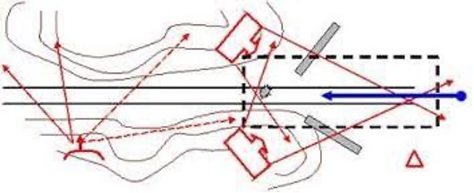
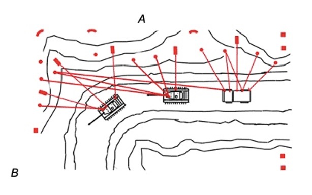
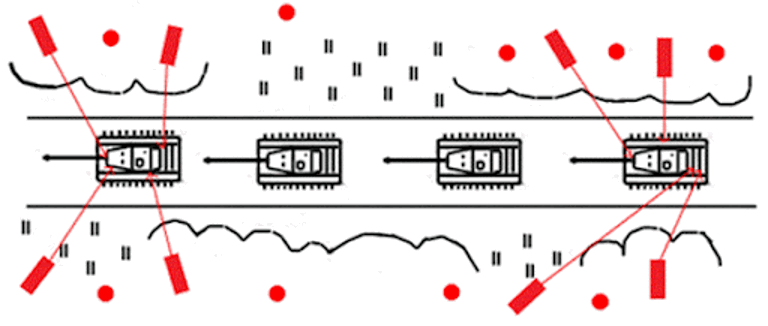
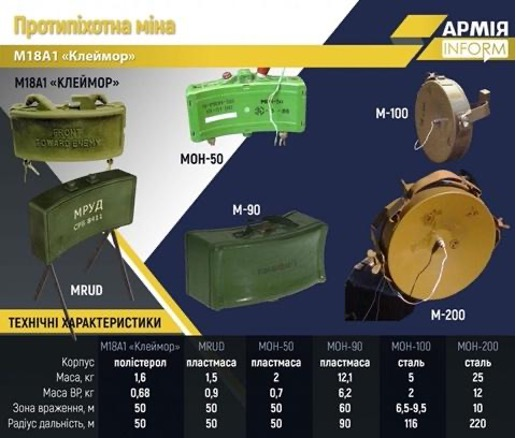
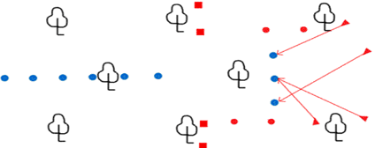
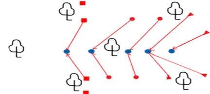

### Тактична засідка.
Влаштування засідки є одним із видів наступу.

**Засідка** — це дії групи яка завчасно і приховано розташовується на шляху руху ворога та напавши на нього знищує, захоплює полонених, документи, зразки озброєння і техніки.

> **важливо**: 
> На першій секунді бою нанести максимальне ураження перш ніж ворог зможе надати організовану вогневу протидію, не дати ворогу вийти із зони ураження, перегрупуватися та провести контр маневр.

Засідка найкращий спосіб невеликими силами завдавати втрат ворогу в його тилу.

**Підготовлена засідка** — спеціально запланована на заздалегідь відомому чи передбачуваному маршруті руху ворога. Вона потребує ретельного планування та всебічного забезпечення та розвідки маршрутів пересування ворога.

**Миттєва засідка** — коли в районі дій розвідувальної групи різко змінюється обстановка або надходить «гаряча» інформація про ворога.

####Організація засідки
* вибір місця;
* розміщення групи;
* склад групи; 
* тип засідки;
* вимоги до перебування в засідці;
* основні етапи: вогневе ураження, відхід, обшук.

#####Місце засідки.
* можливість маскування групи; 
* гарний огляд місцевості й секторів ведення вогню для бійців;
* можливість швидкого прихованого відходу; 
* обмеження руху ворога: звуження чи поворот дороги, природні чи штучно розміщені перешкоди;
* прихованість від пильного обстеження ворога, зокрема при застосуванні повітряної розвідки. 

**Місцевість повинна бути:** зі складним природним рельєфом, із природним укриттям та перешкодами (скелі, завали дерев, ущелини), густою рослинністю (чагарник, очерет, висока трава, окремі скупчення кущів і невисоких дерев).

**Місця появи ворога:**

* маршрути руху, які ворог  регулярно використовує;
* джерела водопостачання, особливо в посушливий час року;
* шляхи підходу до населених пунктів і дороги між населеними пунктами, що не контролюються нашими воїнами;
* підходи до позицій та об'єктів нашого підрозділу;
* маршрути до районів зосередження ворожих підрозділів;
* місця, де транспортні засоби змушені будуть знижувати швидкість чи робити зупинку. 

#####Розміщення групи.
Група має бути розміщена з одного боку, щоби не допустити вогню по своїх. 
Розміщення по обидва боки можливе в  разі проведення засідки в ущелинах чи подібних місцях, де бійці будуть знаходитися над колоною ворога й вогонь буде вестися зверху вниз, щоби не допустити вогню по своїх.

#####Склад порядку засідки.
* Група спостереження має вести розвідку, своєчасно виявити ворога, оповістити основну групу про його появу. Виставляється на флангах засідки або на ймовірних маршрутах висування ворога. У складі групи обов’язково повинні бути сапери для мінування можливих шляхів підходу (відходу) ворога.
* Група нападу повинна раптово уразити супротивника, знищити його живу силу й  техніку. Вона озброєна звичайною стрілецькою зброєю та легкими кулеметами. Розміщується так, щоби вести вогонь по флангу ворожої колони. Між бійцями чітко розподіляються сектори обстрілу: це дозволяє запобігти вогню по своїх і досягти необхідної щільності вогню. 
* Група прикриття повинна прикрити головні сили засідки під час зіткнення з ворогом або відходу після виконання завдання, якщо ворог спробує нанести удар з тилу і організує контр-удар та погоню. Це два бійці розташовані за 50-80 метрів перед місцем засідки та за нею. Функції групи прикриття можуть дублюватися з групою спостереження. Вона контролює всі підходи до місця засідки у своєму секторі та прикриває вразливі місця загону.

Щоби виключити можливість ворога раптово вийти до позиції засідки, на ймовірних маршрутах його висування виставляють спостерігачів, а за наявності необхідних сил і засобів  виставляють спостережний пост і висилають дозорних.

#####Типи засідок.

######Лінійна засідка.
Використовується проти ворожих колон, що пересуваються по прямих ділянках дороги, залізниці, річці або стежці. Її елементи розташовуються паралельно шляху руху ворога.

Червоні точки – бійці групи нападу, квадрати – бійці групи спостереження.

######Засідка клин.
Підрозділ ділиться на дві частини (необов'язково рівні), які розташовуються по обидва боки дороги. 
Ворог, що потрапив у  таку засідку, опиняється під перехресним вогнем із двох протилежних напрямів і не має можливості організувати ефективний опір, оскільки ховатися йому ніде.

Недоліки засідки:

* не виконується на рівній місцевості, тому що дві частини засадної групи змушені будуть стріляти в напрямку один одного;
* потребує багато особового складу – це не завжди можливо в умовах невеликого диверсійного підрозділу;
* у такому типі засідки ускладнена координація спільних дій, зокрема відхід із позицій.

######Засідка дуга.
Влаштовується на повороті, звуженнях дороги, ділянках дороги з великими канавами або з непрохідною перешкодою по один бік (скелі, яри, урвища), де загін має змогу обстрілювати ворога по всій площині.

Група нападу і флангова група прикриття *(А)* розташовуються уздовж довгого відрізка, що веде до вигину шляху. Це буде зона ураження. 
Інша група прикриття *(В)* розташовується під прямим кутом до групи нападу вздовж короткої ділянки дороги відразу за вигином. Як тільки напад починається, група *В* встановлює межу, до якої противник може відступити під натиском групи нападу, використовуючи сильний перехресний вогонь.

######Засідка проти бронетанкової техніки.
Це засідка на транспортні колони, що пересуваються по обмеженій для маневру місцевості (шосейних та ґрунтових дорогах, мостах). 
Вражаємо головну та замикаючу машину: їхнє знищення дозволить зупинити рух усієї колони:

  
На кожний танк зосереджуємо три протитанкові засоби (ручних протитанкових гранатометів, протитанкових ракетних комплексів тощо).
Стріляємо в основні вразливі місця танка: стик башти та корпусу, прилади спостереження, ходову частину, борт і корму.
Для того щоб ворожі підрозділи не могли залишити техніку, один боєць засідки веде вогонь по техніці, інший стріляє по тих, хто намагається покинути небезпечну зону.
> Важливо: не можна починати атаку, доки ворог не ввійде в зону ураження. Якщо розпочати її надто рано, коли в зоні ураження знаходиться тільки головна частина колони, то решта колони може зробити обхід групи нападу, який група охорони може не стримати.

######Точкова засідка. 
Це зосередження вогню на малій ділянці.  Організовується невеликим підрозділом проти малої рухомої групи ворога або проти частини колони. Часто застосовується проти дозорів і груп ворожої охорони.
> Важливо: необхідно здійснити одноразовий шквал вогню, щоби  вразити необхідну ціль за одну хвилину. Якщо бій затягнеться, засадну групу обійдуть із флангів і знищать, оскільки вона вразлива з боків і ззаду. 

#####Озброєння засідки

Озброєння засідки також залежить від завдання підрозділу: 

* на пішу колону застосовуються автомати, кулемети і гранати; 
* на колонну транспорту чи бронетанкової техніки — ручні протитанкові гранатомети та протитанкові міни;
* на піший підрозділ ворога з метою захоплення полоненого — безшумна зброя.

Ефективним засобом знищення живої сили та техніки ворога є міни. 
При засідці на піхотний підрозділ ворога варто використовувати саме міни направленої дії:

* радянську протипіхотну міну МОН-50 (її більш потужний аналог МОН-90) 
* американську "Клеймор" М-18.

Піхотний підрозділ можна повністю знищити за допомогою мін, навіть без застосування стрілецької зброї.

#####Правила в засідці.
Засідка повинна бути прихованою, створюючи для ворога ефект несподіванки. Очікуючи ворога бійці підрозділу мають дотримуватися цілковитої тиші та нерухомості. 

Не можна:

* рухатися по території організації засідки; 
* розмовляти та шепотіти; 
* користуватися мобільним телефоном;
* палити; 
* залишати ознаки перебування (упаковки від їжі, папір тощо), їх треба забирати із собою або закопувати.

Щоб уникнути радіоперехоплення та пеленгації, встановлюється режим радіомовчання: радіостанція підрозділу працює тільки на прийом, вихід в ефір дозволяється виключно при виникненні непередбачуваних обставин.
**База** може бути обладнана осторонь від засідки, коли час перебування у вичікуванні ворога затягується.

Облаштування днювання:

* воно не повинне привертати увагу до засідки; 
* коли частина особового складу відпочиває, інша веде спостереження;
* група повинна бути готова залишити днювання в будь-який час; 
* у ньому складаються речі, які будуть заважати при проведенні засідки (рюкзаки, спальні мішки і килимки тощо);
* воно може призначатися «проміжним» пунктом збору після проведення засідки.

Якщо місцеві жителі вас помітили, краще змінити місце засідки: ворог може використовувати місцеве населення для ведення розвідки або діяти під їхнім виглядом. 

Якщо у районі проведення засідки з'явилися ваші військові підрозділи:

* не намагайтеся вступити з ними в контакт або попередити їх про свою присутність. 
* негайно доложить керівництву про всі випадки виявлення своїх військ, можливо, під виглядом наших військ діє ворог.

У випадку, коли ворог виділяє розвідку, яка рухаючись попереду, в разі небезпеки попереджає основну частину. Ми чикаємо, коли між розвідкою і групою порушиться візуальний контакт. Потім за допомогою безшумної зброї винищуємо розвідку. 
Як що контакт не порушився, розвідку пропускаємо далі і атакуємо лише основну частину ворожого загону. Розвідку знищуємо окремою групою.

  
На чолі піхотного підрозділу ворога прямує розвідка. Її знищують бійці, озброєні безшумною зброєю (позначені трикутниками). Трупи прибираються, маскуються в гущавині. Після цього вся група очікує підходу основних сил ворога та раптовим вогнем знищує його.

