# Бойові порядки малих груп.

Найчастіше бійці пересуваються саме в складі груп, тому важливим є також порядок пересування - те, у який спосіб організовано рух групи (як розташовуються бійці стосовно один одного в бойовій групі під час пересування, хто починає рух першим тощо).

Це шикування (побудова) підрозділу для ведення бою або виконання бойового завдання називається бойовим порядком. Вибір порядку пересування здійснює командир бойової групи після оцінки обстановки.

## Бойові порядки малих груп.

Активні дії бойових «двійок» і «трійок» при загрозі вогневого контакту з ворогом будуть такими ж, як ми щойно розглянули: час на переміщення групи від укриття до укриття залежить від щільності вогню противника та відстані до нього. Чим ефективніший по вас вогонь, тим коротшою повинна бути перебіжка.
Однак є певний порядок переміщення. Особливості тактики пересування у двійках та трійках такі:

* один боєць прикриває напарника/напарників вогнем;
* бійці пересуваються зиґзаґами.

### Перша фаза:

Боєць 1 прикриває, боєць 2 пересувається: 

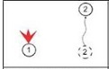
 
Боєць, який відкриває вогонь, вигуком **«Тримаю»**, **«Прикриваю»** чи іншим способом повідомляє про готовність прикрити вогнем напарника. Це необхідно, оскільки не завжди навіть усередині «двійки» може підтримуватися візуальний контакт, а в гуркоті бою не завжди можливо відрізнити вогонь свого напарника від вогню іншого бійця.

### Друга фаза:

Боєць 2 прийняв позицію лежачи, зробив прицільний постріл або чергу та сповістив 1 про готовність прикривати його пересування:

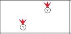
 
> Важливо! 
Треба повідомляти напарникові про те, що готовий його прикривати, не відразу після того, як закінчив переміщення, а після того, як встиг зайняти стрілецьку позицію. Інакше напарник припинить свій вогонь до того, як другий член «двійки» почне його вести - йому потрібен якийсь час, щоби зайняти зручну для ведення вогню позицію.    

### Третя фаза:

Боєць 2 прикриває, боєць 1 пересувається:

 
           
## Пересування у трійках.

Трійка розбивається на дві підгрупи -  з двох та одного бійця. Вони працюють так само, як у двійці: одна група біжить - інша прикриває.  При фронтальній атаки попереду завжди повинен бути один боєць, щоби не перекривати сектор обстрілу.

Можливі варіанти пересування в трійках: 

## Варіант пересування 1 «фронтальне»

«Трійка» просто розбивається на дві підгрупи, що складаються з двох і одного бійця. Вони працюють так само, як працюють у «двійці» - одна група біжить, інша прикриває. 

### Перша фаза: 
Бійці 1 та 3 прикривають,  2 переміщується:

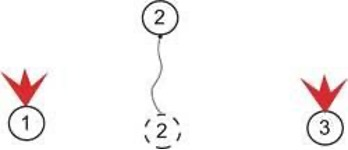
  
### Друга фаза: 
Боєць 2 заліг, зробив прицільний постріл або чергу та крикнув напарникам про готовність прикривати їхнє переміщення:

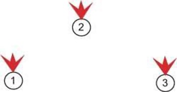
 
### Третя фаза:
Боєць 2 прикриває, бійці 1 та 3 переміщуються:

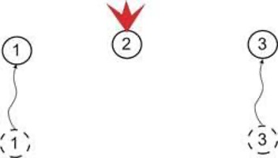
 
> Важливо!
При позиції лежачи: перед завжди висувається один солдат, а двоє підтягуються до нього. Це робиться для того, щоби двоє, що біжать попереду одного, не перекривали йому сектор обстрілу. При переміщанні 1 та 3 стоячи переміщення робиться на 15 кроків, той хто прикриває робить 5 кроків не залишаючись на місті.

## Варіант пересування 2 «Два — один»

Застосовується послідовне пересування: двоє стріляють — один біжить. 

Якщо переміщатися без суворої послідовності, противник може не вгадати, хто з членів трійки буде переміщатися наступним, але тоді існує ймовірність виникнення плутанини. Тому найкраще застосовувати почерговий спосіб, але зі зміною першого, що переміщається. 

### Перший етап: 
* Біжить боєць 1, бійці 2 та 3 прикривають:

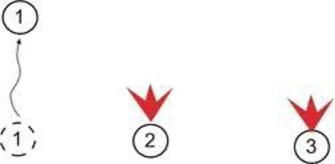

* Наступний переміщається боєць 2, а бійці 1 та 3  робить перекат та прикриття:

* Нарешті вперед йде боєць 3 під прикриттям бійців 1 робить перекат та 2.

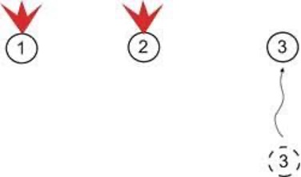

* Перший етап закінчився, уся група перемістилася вперед. 

### Другий етап:
* У другому етапі рух вперед починається вже з бійця 2, потім 1, закінчується переміщенням 3. 

### Третій етап:
* Третій етап починає боєць 3, потім 1, завершує 2 і т.д. 

У кожному підрозділі бажано напрацювати щось своє.

## Варіант пересування 3 «ривок»

Це складніший варіант організації переміщення в трійках. Він може підійти групам, які працюють спільно багато місяців, тому що вимагає великої злагодженості всередині «трійки». 

* Боєць 1 схоплюється та починає переміщення, проробляє половину шляху. У цей момент боєць 2 схоплюється та починає переміщення, 1 уже заліг і відкриває вогонь, а №3 все ще веде вогонь зі своєї первісної позиції:

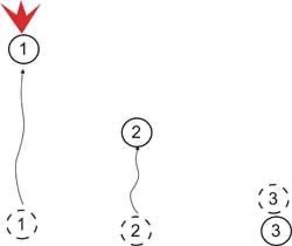

* Боєць 1 заліг, відкрив вогонь, як тільки 2 проробляє половину шляху, схоплюється 3:

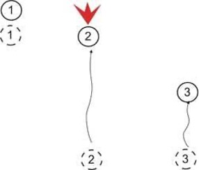

* Після того, як 2 досягає наміченої ним точки й залягає, схоплюється 1 і так далі.

При цьому способі двоє біжать, а один стріляє, причому між бійцями, що пересуваються, зберігається половина шляху. 

В яких умовах краще використовувати «трійки»:

* удвох легше витягувати пораненого, а якщо це відбувається під вогнем, то один зможе здійснювати прикриття, а інший перетягувати пораненого;
* в одній групі можна об'єднати ветеранів, бійців середнього терміну служби та новачків.

## Бойові порядки підрозділів з більшою кількістю бійців 

А зараз ми розглянемо приклади побудови бойових порядків підрозділів, що налічують більше, ніж 2-3 бійці (це може бути невеличкий пошуковий загін, розвідувальна  або тактична група швидкого реагування). 

Вони прості, зрозумілі та можуть комбінуватися залежно від зміни бойової обстановки. Кожен боєць підрозділу надійно перекриватиме свій сектор вогню, тому що буде завчасно знати місце серед побратимів і взаємодію з ними.

### 1. Класична колона

Бійці йдуть один за одним позаду дозорного, його сектор вогню — 120 градусів прямо. Наступний боєць відповідає за 90-градусний сектор обстрілу вліво від нього. Третій перекриває такий же сектор праворуч і так далі — у шаховому порядку. Замикаючий відповідає за 120-градусний сектор обстрілу в тил колони.

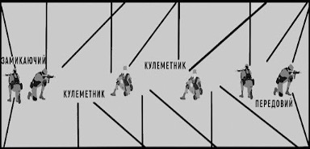
  
Переваги колони:

* спрощує передачу сигналів і повідомлень  від бійця до бійця,
* полегшує пересування «слід у слід», підвищує його потаємність і мінну безпеку,
* розриви в такому строю виникають зрідка, їх не важко помітити та від коректувати.

Недолік: 
* неможливо вести вогонь з усіх видів зброї вперед при вогневому контакті, тому він прийнятний лише для прихованих маршу або кидка, а з флангів колону за можливості повинні страхувати бокові дозорні.

### Дві колони.

Це підвид колонного порядку. Побудова строю така ж, але двома паралельними колонами - так підрозділ буде важче атакувати з флангів, а дві короткі низки бійців рухатимуться швидше, ніж одна довга. 

Бійці колон повинні постійно підтримувати візуальний контакт між собою.

### 2. Лінія (Ланцюг) 

Це порядок, при якому особовий склад відділення розгортається в бойову лінію праворуч і ліворуч  від командира та рухається, підтримуючи рівняння по напрямному.

Залежно від завдання бойові групи можуть діяти:

* у лінію;
* уступом вправо або вліво;
* у дві лінії (одна за другою).

### 3. Клин

Цей порядок утворюють для атаки при ймовірній зустрічі з противником.

Бійців розставляють зі зсувом уліво і вправо від передового солдата, з тим, аби утворити «клин» – подібну формацію, яка щонайкраще підходить для удару та захисту флангів:

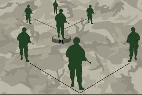
  
Сектор вогню передового бійця — 120 градусів прямо. Наступні два бійці справа і зліва від передового закривають 90-градусні сектори вогню лівого й правого флангів відповідно. Цей же принцип застосовують і для останніх бійців порядку, зсунутих вправо й уліво від бійців перед ними.

Стрій атаки клином необхідно використовувати у взаємодії з групами супроводу: він здійснюватиме контроль тилу основного підрозділу.

Переваги просування клином:

* візуально контролюється максимально можливий простір та фланги;
* цю формацію важче атакувати із засідки завдяки взаємодії клинів;
* по противнику, який перебуває попереду, можуть стріляти всі бійці одночасно.

Недоліки:

* виснажує бійців, якщо його застосовують довго на пересіченій місцевості;
* коли необхідно змінити напрямок атаки, клин може на деякий час розірватися, що різко погіршить взаємодію та зв`язок груп.

### 4. Ромб

Це альтернатива клину. 

Якщо в групі четверо бійців, замикаючий стає точно за передовим. Якщо п’ятеро — командир займає позицію в центрі за передовим і перед тим, що замикає.

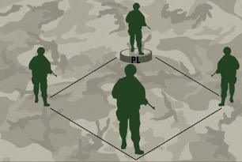
  
Переваги:

* швидкість руху групи; 
* можливість миттю змінювати його напрямок або займати кругову оборону, перешиковуватися в клин для атаки.

Недолік:

* такий порядок перешкоджає використанню одразу всієї зброї по ворогу попереду