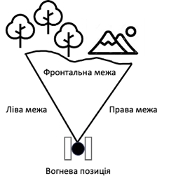

# Загальні визначення

**Тактична перемога:**

- перевага в ресурсах над ворогом;
- певну стратегія;
- застосування військової хитрості.

Проте успіх у війні залежить від того, як стратегічні задуми реалізуються на полі бою та дії кожного окремого воїна.
«ТАКТИКА» грецьке слово - мистецтво побудови військ.
Військові стратеги почали здогадуватися, що перемога у війні не завжди залежить від сприятливого збігу обставин чи переваги в силі над противником:

**Тактика** — найбільша і найстаріша складова частина воєнного мистецтва. Це теорія й практика підготовки та ведення бою бойовими підрозділами.

 
Тактика вивчає сучасний бій, принципи, за якими він ведеться, розробляє способи підготовки й ведення бою. Тобто, якщо **стратегія** - це **план дій**, що веде до мети (перемоги), то **тактика** — це **окремі кроки та дії**, за допомогою яких цей план можна виконати.
Тактична підготовка об’єднує знання, вміння та навички: вогневої, технічної, інженерної, стройової і фізичної підготовки тощо.

Тактичні прийоми допомагають:

- успішно виконати бойове завдання, 
- мінімізувати власні втрати, 
- збільшити втрати ворога за рахунок взяття ініціативи.

**Головний критерій тактичної підготовки - перемога в бою.**

У сучасних збройних конфліктах з’явився ознак:

- використання нетрадиційних елементів бойового порядку;
- відсутність традиційного контакту з противником; 
- невизначеність тилу, флангів, переднього краю; 
- підвищення ролі тактичної самостійності підрозділів.

Військова тактика має бути гнучкою: необхідно знаходити рішення, які допоможуть набути переваги на полі бою. Через це ВПЦ «ГАРТ» розробив програму підготовки **тактичних груп швидкого реагування**.

**Бій** - це дії всіх підрозділів, узгоджені за метою, завданнями, місцем і часом, що ведуться за планом для виконання тактично-бойових завдань.

Загальновійськовий бій це форма бою, у якій об'єднуються зусилля всіх підрозділів і інших військових формувань, правоохоронних органів.

Сучасний бій має свої особливості тому потрібно у кожному батальйоні комплектувати тактичні групи швидкого реагування, вони впливають на тактичні дії військових підрозділів.

**Види бою групи:**

- оборона,
- наступ,
- зустрічний бій (як різновид наступу).
 
**Удар** — це одночасне ураження живої сили ворога і його об’єктів потужною дією групи швидкого реагування. 

1. Удар буває на:
    - знищення; 
    - по давлення;
    - виснаження;
    - руйнування;
    - задимлення/засліплення/освітлення.
1. За джерелами реалізації з допомогою засобів:  
    - стрілецької зброї, кулеметів; 
    - гранатомет-ного;
    - мінометного.

**Вогонь** - це ураження противника стрільбою з різних видів зброї.

- Початково бій виглядав як рукопашна сутичка воїнів, що мали холодну зброю. Однак із розвитком вогнепальної зброї найважливішим елементом бою став саме вогонь, адже з його допомогою противники воюють на відстані, не вступаючи в безпосередній контакт.
- Зараз вогонь — основний спосіб знищення ворога в загальновійськовому бою. 
- Він може вестися окремим вогневим засобом або зосередженим вогнем підрозділу та групами швидкого реагування.
- Класифікація вогню 
    1. За тактичними завданнями: вогонь на знищення, придушення, виснаження, руйнування, задимлення, освітлення.
    1. За видами зброї: зі стрілецької зброї, гранатометів, бойових машин, гармат, мінометів.
    1. За способами ведення: пряме ведення, напівпряме наведенням, із закритих вогневих позицій.
    1. За напруженістю: короткочасний, безперервний, кинджальний, швидкий, методичний, залповий.
    1. За способами стрільби: з місця, з короткої зупинки, з ходу, з борта, з розсіюванням по фронту, з розсіюванням у глибину, по площині тощо. 
    1. За видами: по окремій цілі, зосереджений, загороджувальний, багатоярусний тощо.
    1. За напрямком стрільби: фронтальний, фланговий,перехресний. 

 
**Вогневий контакт** - це зіткнення з ворогом, що супроводжується застосуванням вогнепальної зброї.

**Сектор вогню** - це ділянка місцевості, на якій вогневий засіб може вразити ворога прямим наведенням вогню.

 
**Маневр** — це організоване пересування груп швидкого реагування у ході бою для того, щоби:

- зайняти вигідне положення стосовно ворога;
- зосередити необхідні сили й засоби на новому напрямку;
- відвести групи з-під ударів ворога;
- перенести, зосередити вогонь для найбільш ефективного ураження ворога.
 
Маневр може здійснюватися групою або вогнем.
Маневр групою має такі види: охоплення, обхід, відхід.

**Охоплення** — здійснюється групами для виходу у фланг ворога.

**Обхід** — більш глибокий маневр, його здійснюють групи для виходу в тил ворога.

**Охоплення та обхід** здійснюють у тактичній і вогневій взаємодії з групами, які наступають із фронту, а інколи іншими тактичними підрозділами.

**Відхід** здійснюють групи, коли хочуть:

- вийти з-під ударів сил противника, що переважають;
- не допустити оточення; 
- зайняти вигідніше положення для наступних дій.

**Відхід проводять лише з дозволу або за наказом командира.**

**Маневр вогнем** — це зосередження, розподілення або перенесення вогню.

- Зосередження вогню: ураження однієї цілі вогнем високої щільності в короткий проміжок часу.
- Розподілення вогню: одночасне ураження групою декількох цілей.
- Перенесення вогню: послідовне ураження цілей або пере-націлювання і ведення вогню по нових цілях при їх виявленні.

**Універсальність бою.**

1. Нападайте першим, робіть засідки – це дасть перевагу на полі бою.
1. Дійте швидко й на випередження. Якщо не можливості нападати першим, відкрийте вогонь ухиляючись.
1. Маневруйте. Рухливість і швидкість важливий фактор. Виходьте на ворога із флангу або зі спини.
1. Хитруйте. Введіть ворога в оману.

## Види носіння зброї
**Вогонь** - це основний спосіб знищення ворога в бою. Отже, важливо, якою зброєю володіє боєць, наскільки вміє використовувати її.

Від правильно обраного виду носіння зброї залежить швидкість готовності її до бою.

Розрізняють таке носіння зброї: 

- вільне;
- тактичне;

### Вільне носіння зброї на двох точках.

Цей спосіб ще називають «по-мисливськи»:на плечі. Ремінь вимірюються  так щоб автомат не сповзав з плеча. 
**Перевага:** дає змогу швидко підготуватися до ведення вогню.
**Недолік:** при близькому контакті супротивник може легко зірвати автомат із плеча.   

### Тактичне носіння зброї на одній та двох точках
1. **Одна точка:** ремінь перекинутий через спину, автомат на грудях стволом униз.

    **Переваги:**
    
    - дозволяє швидко підготуватися до ведення вогню;
    - перекладати зброю з одного плеча на інше; 
    - використовувати зброю в рукопашній сутичці.

    **Недолік:** за тривалого носіння автомата втомлюється шия.

1. **Дві точки:** ремінь перекинутий через спину, автомат на грудях стволом униз.

    **Переваги:**
    
    -	можна швидко підготувати автомат до стрільби; 
    -	швидко перевести його в положення перекинутого через шию;
    -	основне навантаження на спину, а не на шию.

    **Недолік:** неможливо швидко перекласти автомат з одного плеча на інше та складніше застосовувати його в рукопашній сутичці.