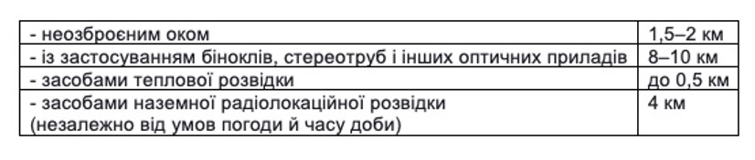
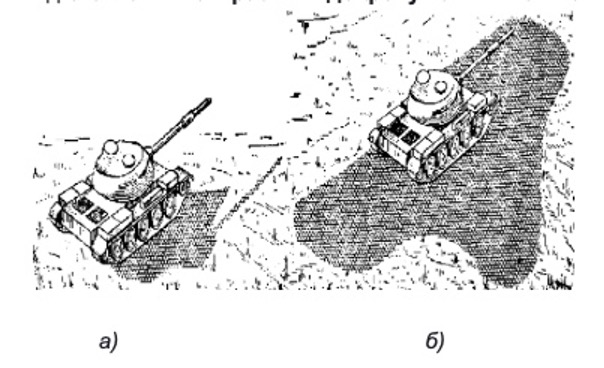
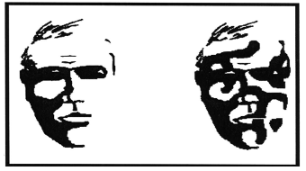
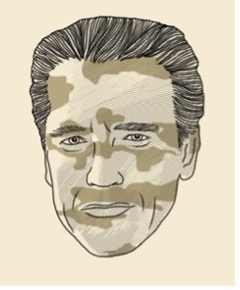
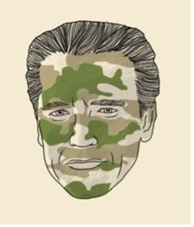
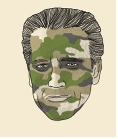
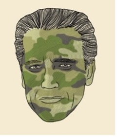

# Маскування

У розділі з тактичної підготовки ми багато згадуємо про необхідність маскування. На жаль, розвиток засобів аеро-розвідки відкриває ширші можливості не тільки для нас, але і для ворога. Тому вміння ставати максимально непомітним для ворога, забезпечує виживання.

Маскування вже давно є невід’ємною частиною бойової діяльності всіх родів військ. Воно організовується та здійснюється, щоби ввести ворога в оману щодо складу та розташування своїх сил. 
Мета — досягти раптовості дій, підвищити живучість і збереження боєздатності своїх підрозділів.

Маскувати треба майже все, що хоч якось може допомогти ворогу визначити обсяг, склад, положення та задум подальших дій наших підрозділів:

* особовий склад; 
* техніку й озброєння підрозділів; 
* фортифікаційні споруди; 
* позиції; 
* пункти управління; 
* загородження; 
* переправи; 
* аеродроми; 
* запаси матеріальних засобів тощо. 

Способи маскування:

* імітація,
* демонстративні дії, 
* дезінформація, 
* приховування. 

**Імітація** — створення фальшивих позицій і районів розташування військ,  обладнання фальшивих споруджень, застосування макетів техніки та інших інженерних засобів для введення в оману розвідку противника.

**Демонстративні дії** — навмисний показ несправжньої діяльності дійсних підрозділів під час їхнього пересування, зосередження, ведення бойових дій і виконання інших заходів на хибних напрямках.
Дезінформація — доведення до противника неправдивих відомостей різними способами.

**Приховування** — усунення характерних демаскуючих ознак військ та об'єктів, маскування здійснюється постійно.

**Де маскувальні ознаки** - це фактори, за якими противник може вирахувати вас, використовуючи засоби розвідки:

* форма та розмір об'єкта;
* яскравість і колір поверхні;
* тіні від бойової та спеціальної техніки й споруджень на навколишню поверхню;
* відблиски скла та металу;
* відбиті радіохвилі, інфрачервоне та інші випромінювання;
* рух, сліди машин, звуки, пил, викопаний ґрунт, витоптані місця, сліди від руху машин, свіжі вирубки рослинності;
* радіопереговори й інші ознаки діяльності військ.

Сенс маскування полягає в тому, щоби своєчасно виявити де маскувальні ознаки й усунути їх або максимально приховати.

### Усунути де маскувальні ознаки допоможе:

* маскувальні властивості місцевості, місцевих предметів, темного часу доби й  інших умов обмеженої видимості при розміщенні та переміщенні підрозділів; 
* табельні засоби маскування та місцеві матеріали;
* маскувальне фарбування під фон навколишньої місцевості; 
* застосування радіо-поглинаючих матеріалів, аерозолів (димів) та інших матеріалів для зменшення оптичної, акустичної, теплової та радіолокаційної помітності озброєння і техніки; 
* правила радіообміну; 
* виконання вимог маскувальної дисципліни.

## Засоби маскування

Візуально особовий склад може бути виявлений на такій відстані:

Перше, що треба максимально використовувати при розташуванні й діяльності підрозділів — маскувальні властивості місцевості.

### До маскувальних властивостей місцевості відносять:

* природні маски (крони, групи дерев і кущів, будівлі); 
* нерівності рельєфу або місцеві предмети (насипи, схили, будівлі, огорожі тощо);
* видові властивості місцевості: кольори обмундирування та спорядження мають максимально зливатися з ділянкою місцевості або предметом, на тлі яких вони розташовані (стовбури дерев, каміння, огорожі тощо);
* плямисті ділянки. 

Щоби зробити менш помітними шляхи руху, траншеї, ходи сполучення, лінії зв’язку, їх треба прокладати вздовж ровів, дамб, загороджень і між контрастних плям на місцевості. 

Щоби відкрито розташовані військова техніка й  озброєння були менш помітними, особливо в зимовий час, їх необхідно розташовувати на наявних або спеціально підготовлених контрастних до фону темних плямах. 
  
  
  
> Використання темних плям при розташуванні техніки на відкритій місцевості: а) неправильно; б) правильно

Також для зменшення помітності техніки й озброєння треба спотворювати або приховувати падаючі від них тіні.

Для цього техніку розташовують так, щоб її тінь перекручувалася або зливалася з тінню від місцевого предмета. При цьому необхідно враховувати переміщення тіні впродовж дня. 

При розташуванні техніки й озброєння в рідких насадженнях можна стягати крони дерев, ущільнювати крони закріпленням на гілках зрізаної рослинності.

Для маскування на позиціях, у районах розташування й на марші до предметів спорядження, поверхонь техніки прикріплюють живу та свіжозрізану рослинність.

Використовують гілки хвойних, листяних дерев і чагарників, пучки трави. У суху спекотну погоду зрізана рослинність швидко в’яне, втрачає свої маскувальні властивості, через 2-3 години її треба замінювати на свіжу.

## Табельні засоби маскування

Переважно місцевість має гарні маскувальні можливості. 
Однак, додатково до них використовують табельні засоби маскування. Розгляньмо їх. 

* Засоби індивідуального маскування особового складу: маскувальний комбінезон, маскувальний костюм.
* Маскувальні комплекти та маски, що застосовуються для маскування озброєння, техніки та споруджень від оптичних засобів розвідки. 
* радіолокаційні кутові відбивачі;
* каталітичні підігрівачі;
* світломаскувальні пристрої;
* покриття, що поглинають або відбивають радіохвилі;
* спеціальні машини й обладнання.

Табельні маскувальні комплекти, виконані із синтетичних і бавовняних матеріалів у двох варіантах: для маскування на тлі рослинності й на тлі снігу.

Вони призначені для маскування бойової техніки та споруд від повітряної та наземної візуально-оптичної та фотографічної розвідки на рослинних фонах і на фонах оголених ґрунтів. Зазвичай вони бувають 3-х типів за розміром покриттів: 3х6, 6х6, 12х18 метрів.
У додаткових матеріалах ви можете більше дізнатися про табельні засоби маскування.

### Маскувальне фарбування 

Використовується додатково, щоби зменшити помітність техніки й об’єктів або змінити їхній вигляд, надати їм колір і малюнок прилеглої місцевості. 

Основні різновиди маскувального фарбування: захисні, імітуючи, деформуючі.

**Захисне фарбування** — фарбування в один колір, найбільш наближений до кольору переважаючого фону місцевості (рослинність — зелений колір, сніг — білий, пустельний та напівпустельний фон — жовто-землистий (пісковий), темно-коричневий або сіро-пісковий кольори).

**Імітуючи фарбування** — фарбування в декілька кольорів, яке відтворює малюнок прилеглого або зруйнованого об’єкта. Для великих об’єктів і масок великої площі здійснюється за раніше складеною схемою фарбування та виконується головно інженерно-маскувальними підрозділами.

**Деформуюче фарбування** — фарбування плямами різної форми та розмірів, що схожі за кольором та яскравістю з основними плямами фону місцевості. Застосовується для маскування рухомих об’єктів: бойових, спеціальних, транспортних машин та озброєння під час дій, а також для фарбування маскувальних покриттів, комбінезонів, військового спорядження та обмундирування.

Цей різновид маскування передбачає триколірне (весною, влітку та восени) і двоколірне (взимку) фарбування. Основний колір при триколірному фарбуванні займає приблизно 50% поверхні об’єкта, а два інших — по 25%. Зимове двоколірне фарбування складається з плям білого та темного (коричневого, сірого або зеленого) кольору. Площа білої фарби займає до 75% поверхні об’єкта.

За досвідом армій іноземних країн у частинах та підрозділах ЗС України почали використовувати піксельне деформуюче фарбування бойової техніки та військової форми, основною метою якого є маскування від сучасних оптичних засобів розвідки противника з цифровою обробкою розвіданої інформації.  

Такий вид маскувального фарбування добре зарекомендував себе ще в умовах бойових дій у ході проведення ООС (АТО) та використовується тепер.

**Аерозольне маскування** — це створення короткочасні маскуючи аерозольні завіси під час бойових дій. Воно може здійснюватися окремими бійцями й підрозділами, у комплексі з іншими заходами та самостійно.

### Мета маскування

* ввести противника в оману щодо військ та напрямку їхніх дій; 
* прикрити малорозмірні військові об`єкти й підрозділи від прицільного вогню та розвідки противника.

**Вирішення завдань маскуванням аерозолями:**

* евакуація поранених, вбитих і екіпажів розрахунків із пошкодженої техніки;
* приховування робіт по розчистці й розмінуванню завалів;
* маскування посадочних майданчиків гелікоптерів і виявлення напрямку вітру при посадці гелікоптера на непідготовлену ділянку місцевості;
* маскування колон, що здійснюють переміщення.

### До аерозольних засобів належать:

1. табельні засоби підрозділів військ (шашки, ручні димові гранати, патрони);
1. штатні засоби об’єктів броньованої техніки (апаратура й системи); 
1. боєприпаси артилерії та авіації (міни, снаряди).  

### Димові шашки 

Призначені, щоби ставити аерозольні завіси для прикриття підрозділів у бойових порядках, під час форсування водних перешкод.

Існують такі види шашок: 

* малі димові шашки ДМ-11;  
* уніфіковані димові шашки УДШ;
* великі димові шашки БДШ-5.

### Ручні димові гранати

Призначені, щоби ставити димові завіси в ближньому бою бійцями та дрібними підрозділами, а також для маскування виходу екіпажів із різних об’єктів військової техніки. 

* Ручні димові гранати РДГ — картонний циліндр, заповнений димовою сумішшю. 
* Гранати чорного диму РДГ-2Ч можуть використовуватися також для імітації горіння бронетехніки.  

### Запалювально-димовий патрон 

Належить до легких індивідуальних засобів ближнього бою, одноразового використання.

Може використовуватися, щоби: 

* засліпити противника для висування атакуючих підрозділів, на протилежному березі під час форсування водних перешкод, в укріплених будівлях, оборонних та інших інженерних спорудах для забезпечення дій штурмових загонів під час бою;
* дати цілевказівки своїм гелікоптерам вогневої підтримки та позначення досягнутого рубіжу; 
* ліквідувати розриви в аерозольній завісі, створеній за допомогою інших засобів;
* замаскувати особовий склад, бойову техніку й окремі об’єкти своїх військ на місцевості з урахуванням пожежної безпеки патрона.

### Термо-димова апаратура бронетанкової техніки, система 902 

Призначення:

* груповий аерозольний захист бойових порядків підрозділів від прицільного вогню противника під час висування, розгортання й руху в атаку; 
* прикриття виходу з-під вогню ворога; 
* ведення маневру з обхвату й обходу ворога;
* забезпечення швидкого відриву від ворога; 
* евакуація пошкодженої техніки під вогнем ворога. 

## Маскування обличчя, тіла й особистого обладнання. 

### Основні принципи. 

Володіння навичками маскування вкрай важливо не тільки для підрозділу загалом, а й для кожного окремо взятого бійця. Дуже часто завдяки вмінню стати непомітним на полі бою вдається вижити й залишитися неушкодженим – і допомагає в цьому володіння мистецтвом камуфляжу. 

**Камуфляж** — це уміння ховатися на фоні оточуючого середовища, основні складники:

* **укриття** — будь-які перешкоди, здатні заховати бійця від ворожого вогню (дерева, каміння, стіни, канави чи воронки тощо). 
> Що значить зайняти укриття? Заховатися за перешкодою, щоб уникнути ворожого вогню.

* **маскування** — уміння зливатися з безпосереднім оточенням, це захист лише від ворожого спостереження, але не захист від вогню.
> Що значить замаскуватися? Злитися з місцевістю, щоб уникнути виявлення ворожими спостерігачами.

Важливі характеристики при маскуванні:

* **Колір**: украй важливим є найбільш поширений у конкретній місцевості колір.
* **Блиск**: зазвичай блищать масні, гладкі поверхні, ті, що відбивають світло.
* **Тінь**: часто видає форми, які мозок впізнає навіть підсвідомо. 
* **Розмір**: декілька предметів, близьких за розміром, краще піддаються маскуванню разом.
* **Форма**:  у природі практично немає правильних геометричних фігур і  прямих ліній.
* **Силует**: об’єкт можна впізнати, коли він виділяється на світлому фоні (або виявиться підсвіченим із тилу). 

Світла шкіра обличчя та рук вирізняється із загальної гами кольорів, тому дуже добре проглядається навіть неозброєним оком на великих відстанях. Блиск шкіри незалежно від її природного кольору, спричиняє на певних ділянках обличчя (особливо на чолі та носі) шкірне сало. Структура світлотіні, яка миттєво видає людське обличчя, формують різкі риси обличчя, такі як: очі, ділянка під носом, губи та щелепа.

Вам колись доводилося дивитися на розмиту чорно-білу фотографію?
Навіть якщо ти не можеш впізнати людину, ти можеш визначити місцеположення обличчя. Ті риси, які його видають, це всього лише тіні на обличчі. Люди автоматично звертають увагу на подібні тіні навіть на неживих предметах, таких як хмара або поверхня Місяця:

Саме тому **тіні на обличчі необхідно приховати і спотворити**. 
 
Відповідь: розпізнати легше — на лівому, там де збережена структура світлотіні обличчя. На правому фото це зробити вже складніше. Для досягнення такого ефекту використовують світлий тональний крем або тональний олівець для більшості «глибоких» рис обличчя. 
Однак у жодному разі не варто «заміняти» тіні повністю: інакше це буде та ж сукупність тіней, але в «негативі». 

### Маскування обличчя: бойовий грим

Для маскування шкіри використовують грим, який наносять спеціальними фарбами та тонуючи ми засобами.

Якщо спеціальних засобів немає, використовуйте підручні, наприклад, деревне вугілля, вологу глину тощо.

Основні правила нанесення гриму:

* Малюнок і його колір повинен зливатися з навколишніми рослинністю та тінню: 
    * світлі й темно-зелені кольори, під колір гілок та трави, використовуйте влітку в лісі (розфарбуйте ділянки шиї, кисті рук і руки), 
    * білий і сірий кольори - використовуйте на засніженій місцевості,
    * пісочний і світло-коричневий - у випаленому спекою степу або пустелі); 
* Кольори робіть не надто яскраві, щоби вони не були помітні на загальному тлі як неприродні плями;
* Варіюйте різновиди малюнків на обличчі від несиметричних смуг через усе обличчя до великих плям;
* Найкраще використовувати комбінацію і смуг, і плям;
* Накладайте бойовий маскувальний грим на обличчя в парі: накладаючи грим самому собі, легко залишити незагримованими важливі ділянки,  наприклад, задню поверхню вух та шиї.

### Алгоритм нанесення гриму

* Розпочинайте з місць навколо очей, але не одразу під ними.
Переміщуйтесь до скронь, місць, де починає рости волосся на голові, потім — під ніс та нижню губу. Оскільки це затінені місця, необхідно використовувати світлі фарби.

* Частину обличчя між носом та щоками розфарбуйте симетрично.
Нанесіть фарбу на обидві частини підборіддя або поруч із кутиками губ. У центрі лоба використайте помірні кольори — зелений, зеленувато-жовтий тощо.

* У безпосередній близькості біля очей, навколо щік і на підборідді  використайте чорний колір.

* За допомогою пальців затушуйте усі розфарбовані місця на обличчі так, щоб один колір плавно переходив в інший.

### Маскування обличчя: маски

Крім маскування обличчя вони захищають очі від осколків і уламків, які утворюються внаслідок детонації вибухівки та інших вибухових пристроїв; різноманітних загроз штучного та природного походження, зокрема від ультрафіолетового випромінювання.

Також використовуються спеціальні маски та балаклави з захисного волокна, оливкового, синього, чорного або камуфльованого. 

### Маскування тіла: що і як маскуємо 

**Руки.** Як і обличчя, це теж помітні світлі плями на тілі. Маскуйте їх за допомогою нанесення фарби, використання рукавичок, клейких стрічок.

**Волосся.** Ще одна з рис, за якими людину легко виявити на пересіченій місцевості. Скористайтеся капелюхом або фарбою належного кольору. 

**Тіло** маскується під довколишню природу за допомогою маскувального костюма. 

Однак, жоден маскувальний костюм не робить людину невидимою, додатково треба використовувати переваги природного маскування й укриття. До костюму пришиваються невеликі петлі для вставки в них свіжозрізаної природної рослинності: гілок, трави та інших рослин, бажано тих, які довго не в'януть.

### Маскування особистої зброї

Особисту зброю треба особливо ретельно маскувати, тому що її правильні геометричні деталі неприродньо виглядають на тлі природи й демаскують бійця.

Камуфлювати зброю необхідно обережно, щоби не вплинути на її роботу, чистоту огляду й не допустити, щоб елементи камуфляжу торкалися групи затвора.

### Маскування фарбами

Найчастіше стрілецьку зброю маскують за допомогою фарб в аерозольних балончиках. Перевага цього способу в легкості використання та високій термостійкості балонів (до 110°С): вони підходять для маскування зброї, з якої планується вести  вогонь високої інтенсивності.

Звичайно фарбу наносять уже на місцевості з урахуванням її особливостей.

### Чохли, обмотка 

Залежно від типу місцевості та пори року можна використовувати чохол із тканини або обмотку нерухомих частин зброї спеціальною еластичною термостійкою камуфльованою стрічкою з бавовняної тканини багаторазового використання. 

Еластична стрічка клеїть сама до себе, тому не залишає слідів на зброї.

### Сітки або мішковина

Іноді стрілецьку зброю додатково обшивають обривками маскувальної сітки або шматками мішковини, розрізаними на тонкі смуги й забарвленими під колір місцевості.

Мішковина добре підходить, бо не шелестить від вітру й під час руху через кущі в лісистій місцевості.

> Важливо: текстильні засоби маскування (стрічка, мішковина) здебільшого використовуються для маскування снайперської зброї, з якої вогонь ведеться епізодично. Однак у будь-якому разі не варто використовувати синтетичні матеріали: вони плавляться на розжареному від стрільби металі!

### Маскування взимку 

Узимку особисту зброю обмотують білою стрічкою або звичайним медичним білим бинтом. Його потрібно намотувати у два шари. Ствол треба обмотувати щільно по всій довжині й обов’язково маскувати всі металеві й дерев’яні деталі.

Деякі види снайперської зброї також мають спеціальне покриття проти відблисків у колірних гамах під тип місцевості.

Спорядження — розгрузка, підсумки, казанок — усе це також треба замаскувати. Можна скористатися стрічкою, пластиковою рослинністю, відрізками камуфляжної сітки або камуфльованого брезенту.

## Маскування позицій і техніки

Маскування позицій і техніки необхідне для захисту від спостереження неозброєним оком, але здебільшого - від засобів аеро-розвідки противника.

Перш за все використовують маскувальні особливості місцевості, умови з обмеженою видимістю, застосовують зрізану рослинність, дотримуються вимог маскувальної дисципліни.

Також можуть додаватися табельні засоби маскування: маски-перекриття, горизонтальні, вертикальні, похилі й деформуючі маски.

### Маскувальні сітки

Універсальний і найбільш відомий спосіб замаскувати техніку й  озброєння — використання маскувальної сітки. Вперше її використали під час Першої світової війни для прикриття артилерійських батареї і штабів від авіації та  розвідки противника, згодом маскувати стали позиції піхоти і навіть цілі укріп-райони. 

Головна вимога — повна ідентичність сітки з навколишньою місцевістю. 

Переваги:

* проста конструкція; 
* немає обмежень для використання:  можна прикрити окрему машину, знаряддя, вогневу позицію відділення, взводу, роти; замаскувати лісову дорогу, польовий аеродром, польовий госпіталь чи склад боєприпасів; 
* може працювати в русі: автомобілі та інша бойова техніка, рухаючись по польових дорогах та особливо в лісі, чудово ховаються під цим камуфляжом від авіації. 

Недоліки:

* ефективно працює тільки на певній відстані, від візуального спостереження розвідки противника рідко рятує;
* не захищає від тепловізора або радіолокації; 
* це тільки один з елементів маскування, що є допоміжним, і діє в комплексі з іншими заходами.

Останнім часом почали з'являтися сітки, що захищають також від радіолокації та тепло-визорів. Вони застосовуються для прикриття шахт, стратегічних ракет, штабів та інших важливих об'єктів, але масово ще не використовуються.

Світломаскування (як персональне, так і для об’єктів, техніки) вкрай важливе у темну пору доби, а взимку це більша її половина!
Польовий костюм чи маскувальна сітка, що вдень зливалися з ландшафтом і добре маскували, вночі можуть стати причиною артудару, руйнування, поранення. 

Те, що вдень здається повноцінним камуфляжем, вночі може бути білою, або люмінесцентною білою плямою у приборах нічного бачення ворога. Причиною можуть бути матеріали, що використовувалися для маскувальних цілей. 

У військових стандартах НАТО є таке поняття, як NIR (near infra red). Простими словами — матеріал не повинен демаскувати в інфрачервоному світловому спектрі, у  яких «працюють» усі прибори нічного бачення незалежно від «покоління».

У військовій справі немає «дрібниць». У всьому світі військові MIL-Spec матеріали та комплектуючі коштують дорого. 
Отже, при плетінні маскувальних сіток, а також виробленні спорядження й одягу НЕ можна:

* використовувати незрозумілі матеріали, якими би привабливими по малюнку та ціні вони не були;
* використовувати поліестерові  тканини (тканини цього складу можуть демаскувати в інфрачервоному діапазоні), якими би маскувальними вони не здавалися в денний час. 

### Які матеріали слід використовувати для сіток

Для плетіння сіток краще використовувати натуральні тканини: бавовну, вовну, льон, коноплю (вони мають значно меншу похибку по NIR при нормальному фарбуванні). Або відходи від нейлонових (поліамідних) тканин, що використовують для пошиття спорядження (підсумків, бронежилетів тощо).  Їх обов’язково треба брати в перевірених виробників, що знаються у своїй справі. 

Маскування:

* маскування здійснюється, щоби ввести противника в оману;
* маскувати треба майже все: позиції, техніку й озброєння підрозділів, зброю, особовий склад тощо;
* один із способів маскування — приховування, це усунення характерних демаскувальних ознак військ та об'єктів;
* засоби, що використовуються: маскувальні властивості місцевості, табельні засоби, маскувальне фарбування, радіо-поглинаючі матеріали, аерозолі (дими), дотримання правил радіообміну та маскувальної дисципліни;
