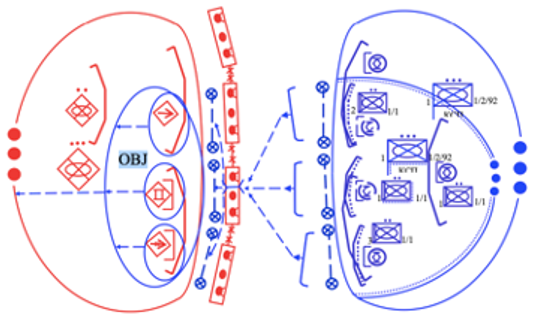
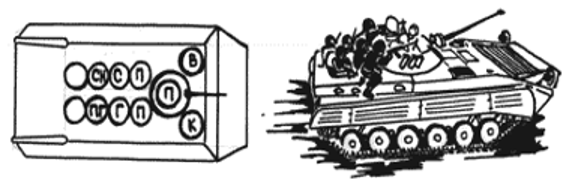

# Наступ
Наступ і оборона взаємопов`язані: на окремих етапах оборонного бою можливі контратаки а під час ведення наступу можуть вестися оборонні дії — вимушено або за тактичним замислом.
Однак саме наступ є тим видом бою, за допомогою якого можна досягти повного розгрому ворога та здобути перемогу. 

## Мета наступу:

- розгром військ ворога;
- захоплення територій або найбільш важливих ділянок місцевості;
- залишення ворога без необхідних ресурсів;
- деморалізація ворожого війська та придушення його волі до подальшого опору; 
- проведення розвідки. 

Ця задача вирішується з застосуванням високоточної зброї, вогню артилерії та  мінометів, удари авіації на всю глибину розташування ворожих військ.

## Успіх в наступі: 

- раптово: тобто несподівано для противника;
- з максимальним напруженням сил, сконцентровано;
- у високому темпі (без зупинок, удень та вночі, у будь-яку погоду);
- у тісній взаємодії підрозділів усіх родів військ.

Наступаючи знищуємо ворога всіма можливими способами:

- атака;
- стрімке просування підрозділів у глибину бойового порядку ворога;
- знищення та полонення живої ворожої сили; 
- захоплення озброєння, військової техніки, різних об'єктів, намічених районів місцевості. 

**Для успіху в наступі потрібно мати трьох-кратну перевагу в силах і засобах**, це дасть підрозділам спроможність прорвати оборону противника на всю глибину. 
На ділянці прориву перевага має бути шести-кратна на користь тих, хто наступає.

## Дії та послідовність наступу: 

1.	Підрозділи, що діють у наступі, знищують противника в опорних пунктах, захоплюють важливій рубіж й об’єкти в глибині його оборони. 
1.	Після знищення ворога в районах оборони першого ешелону стрімко продовжують наступ на БМ. 
1.	Вперед для ведення розвідки на своєму напрямку висилаються розвідувальні дозори.
1.	Коли рубіж або окремі об’єкти в глибині оборони ворога захоплені, підрозділи закріплюються, переходять до оборони й негайно обладнують позиції та готують вогонь для відбиття можливих атак ворога. 
1.	Стики й відкриті фланги забезпечуються вогнем артилерії, маневром резерву. 
1.	За потреби на загрозливому напрямку виставляється бойова охорона.

Наступ на ворога, який: 

- обороняється;
- наступає (шляхом ведення зустрічного бою);
- відходить (переслідуванням).

## Способи наступу:

1.	З ходу: переважно здійснюється на ворога, що не встиг приготуватися, поспішно перейшов до оборони.
1.	З положення безпосереднього зіткнення з ворогом: на ворога, що займає підготовлену оборону. 

### 1. Наступ із ходу 
Це спосіб, коли підрозділи під прикриттям ударів авіації й вогню артилерії висуваються з районів зосередження, віддалених на 30-80 км від противника, послідовно розгортаються в перед-бойовий та бойовий порядок і безупинно переходять в атаку.

**Наступ із ходу застосовується:**

- ворог зайняв оборону поспішно, уступає в чисельності й боєготовності; 
- при наступі, має достатньо високоточну зброю (або несподівану для противника) та володіє перевагою в повітрі.

Наступ із ходу здійснюється з вихідного району. Висуватися до переднього краю оборони противника треба максимально швидко. 

**Для організованої атаки, призначаються:**

- маршрут висування: як іти;
- вихідний пункт: звідки йти;
- пункти розгортання: до яких меж;
- рубіж переходу в атаку: де саме починати переходити в атаку;
- для атаки підрозділів у пішому порядку: рубіж спішування (тобто смуга місцевості, на якій піхота буде спішуватися з БМ). 

### 2. Наступ  із положення безпосереднього зіткнення з противником 

Це спосіб, коли війська наступають одразу з той межи, яку займають. Такий наступ здійснюється в заздалегідь створеному бойовому порядку з положення оборони після того, як підрозділи перегрупуються або зміняться.

**Коли застосовується:**

- перед цим велась оборона; 
- наступ із ходу не вдався; 
- в ході зближення з'ясувалося, що потрібен прорив передчасно підготовлену, укріплену оборону ворога; 
- є труднощі у постачанні військ.

Підрозділи завчасно й приховано займають вихідне положення та після вогневого ураження ворога ударами авіацією та вогню артилерії переходять в атаку.

**Наступ починається з вихідного положення для наступу, яке складається з:**

- ділянки траншеї;
- прилеглих до неї ходів сполучення;
- вогневих позицій БМ і доданих вогневих засобів.
 
 
 
**Атака** — це стрімкий рух підрозділів без зупинки одночасно з концентрованим вогнем усіх вогневих засобів, який здійснюється, щоби знищити противника й оволодіти певним районом (межею, об’єктом).

Використовуючи вогонь артилерії й удари авіації, танкові підрозділи атакують противника та ведуть по ньому вогонь із ходу. Услід за танками механізовані підрозділи атакують  у пішому порядку, на БМ або десантом на танках і знищують, перш за все, цілі, що заважають просуванню бронетехніки.  

**Бойове завдання** взводу в наступальному бою ставиться щодо:

- об’єкту атаки;
- напрямку продовження наступу. 

Іноді, коли перед наступом ворог не розвіданий, взводу може бути вказаний тільки напрямок наступу.

**Об'єкт дій** — ворог, тобто жива сила в окопах або в інших фортифікаційних спорудах, а також танки, гармати, ПТРК, кулемети й інші ворожі вогневі засоби, які розташовані в першій траншеї перед фронтом наступу взводу.

**Напрямок** вказується разом із порядком переміщення в ході бою та можливими завданнями, до виконання яких взводу треба бути готовим.
Коли взвод заволодіє об’єктом атаки, він продовжує наступ у зазначеному напрямку, під час якого йому ставиться нове бойове завдання (об’єкт атаки).

Перед атакою механізованих і танкових підрозділів зазвичай проводиться вогнева підготовка атаки, а в ході наступу – вогнева підтримка військ, що наступають.

Атака в пішому порядку застосовується для того, щоби прорвати підготовлену оборону противника, укріплені райони, коли є значна кількість протитанкових засобів, а також на важкодоступній для бронетехніки місцевості й може проводитися одночасно або послідовно.

### Дії воїнів.
Перед наступом солдат повинен: 

1. розуміти:
    - своє завдання та завдання взводу; 
    - цілі нападу;
    - порядок відкриття вогню (коли і як);
1. знати:
    - номер (розпізнавальний знак) броні-техніки, з яким буде діяти відділення; 
    - порядок взаємодії з ними та іншими бойовими засобами; 
    - місце й порядок спішування, місце у відділенні при атаці в пішому порядку; 
1. перевірити: 
    - справність зброї та підготувати її до бою; 
    - наявність боєприпасів і при необхідності поповнити їх; 
    - наявність і справність засобів індивідуального захисту, підігнати спорядження.
1. запам'ятати встановлені командиром сигнали.

### Дії бійців: наступ із ходу
- розташовується у вказаному командиром місці; 
- готує свою зброю та бойову техніку до бою; 
- знаходиться постійно в бойовій готовності до відбиття можливого нападу повітряного або наземного ворога.

Залежно від завдання, характеру місцевості та інших умов боєць у складі свого відділення може діяти на БМ, у пішому порядку або десантом на бронетехніки.

Для посадки в БМ боєць у складі відділення шикується біля машини у встановленому для нього місці за командою (сигналом) «До машини».
За командою (сигналом) «На місця» боєць, використовуючи колеса, гусениці та підніжки, швидко займає своє місце в бойовій машині.

### Атака на БМ із ходу

Механік-водій за вказівкою командира виводить БМ на свій напрямок і  разом із навідником-оператором з’ясовує об’єкт атаки, напрямок продовження наступу та місце проходу в загородженнях.
З початком атаки механік-водій веде машину за танком на відстані 100-200м.
 

Мінне поле долають із використанням тралу, що знаходиться на танку, якщо його немає – по проробленому проходу в порядку, вказаному командиром взводу в тісній взаємодії з бронетехнікою.

Після подолання загороджень механік-водій виводить бойову машину на передній край оборони противника та без зупинки продовжує вести її в глибину оборони, витримуючи напрямок наступу. Навідник-оператор у  ході висування й  атаки із зброї, встановленої на машині, знищує вогневі засоби, першу чергу перш за все протитанкові, автоматники та кулеметники знищують вогневі засоби та живу силу противника зі стрілецької зброї через бійниці.

> Це важливо: при веденні вогню через бійниці автоматник та кулеметник мають дотримуватись напрямку стрільби 45° – 60°.

### Атака в пішому порядку
За командою командира відділення «Відділення, приготуватися до спішування» механік-водій збільшує швидкість руху бойової машини, наздоганяє танк, бійці дістають зброю з бійниць, ставлять її на запобіжник і готуються до спішування.
Висадка (спішування) солдата з бойової машини проводиться через задні двері.
Коли бойова машина виходить на рубіж спішування, механік-водій за командою командира відділення «До машини» зменшує швидкість або, використовуючи складки місцевості та укриття, робить коротку зупинку. 

**Дії бійця:**

1.	За командою командира відділення вискакує з бойової машини;
1.	Займає своє місце в цепу з інтервалом між бійцями 6-8 м (8-12 кроків), а при діях у складі бойової групи (двійки чи трійки) з інтервалом 5 м; 
1.	Відкриває вогонь на ходу; 
1.	Бігом або прискореним кроком у складі відділення продовжує рух до переднього краю;
1.	Слідуючи за танком, своїм вогнем знищує вогневі засоби противника, перш за все протитанкові; 
1.	Своєчасно вказує танку найбільш небезпечні цілі, що заважають просуванню відділення.

> Це важливо: атака повинна бути стрімкою.

### Мінне поле:
При підході до мінного поля за командою командира: «Відділення, за мною, у колону по одному, у прохід, швидко — РУШ» кулеметник першим висувається до проходу, вогнем прикриває рух відділення, а решта бійців перешиковується в колону та стрімким кидком услід за броні-технікою по його коліях або проробленому проходу долає мінне поле.
Подолавши мінне поле, воїни за командою командира «Відділення - до бою (ланцюгом, клином або двійки та трійки, уперед» ведучи вогонь по ворогу на ходу, стрімко висуваються до об’єкту атаки.
Наблизившись до траншеї ворога, боєць за командою командира «Гранати до бою – вогонь» кидає гранату в траншею, очікує вибух та ривком, пригнувшись, вривається на передній край оборони, знищує ворога вогнем упритул і  без зупинки продовжує атаку в указаному напрямку.

### Бій у траншеї або ході сполучення

- Просування повинно бути швидким; 
- киньте гранату та зробіть одну-дві черги з гвинтівки, перед тим як увійти в траншею або в хід сполучення; 
- викиньте нагору багнетом або кішкою дротяні загородження у вигляді «їжаків», «рогаток» та інші, поставлені противником в траншеї та застосовуйте гранати;
- уважно дивіться, просуваючись траншеєю, чи немає в ній мін-сюрпризів та інших вибухових пристроїв, не чапайте покинуту зброю та інші предмети вони можуть бути заміновані; 
- знешкодьте мінно-вибухові загородження, якщо знайшли їх;
- встановлюйте ясно видимий попереджувальні знаки, якщо знешкодити їх не можливо;
- щоби знищити ворога, використовуйте гранати та вогонь впритул та холодну зброю.

Наступаючи в глибину оборони ворога, воїни у складі відділення (взводу), використовуючи складки місцевості, швидко виходять на фланг або в тил ворога атакою та знищує його.

Бронетехніку або хоча б одного свого воїна або сусіднього відділення якому вдається успішно просунутися вперед його треба негайно підтримати іншими бійцям відділень.

Наступ у глибину ведеться десантом на бронетехніці, ворог у виявлених опорних пунктах знищується швидкою атакою у фланг і тил.

## 2. Наступ із положення безпосереднього зіткнення з ворогом

Цей вид наступу здійснюється на ворога, що займає підготовлену оборону. Наступати потрібно з вихідного положення — з траншеї (окопу), яку боєць займає приховано у вказаний командиром час.

**Воїн повинен:**

- знати, де проходить передній край оборони ворога; 
- знати, звідки можна очікувати раптових дій ворога; 
- вести спостереження за ним;
- обладнати вихідне положення для наступу. 

**Дії бійців**

- До переходу в атаку: боєць за командою командира веде по противнику вогонь, перед атакою поповнює запас набоїв і ручних гранат до встановленої норми, перезаряджає зброю.
- При підході бронетехніки до позиції відділення, за командою командира «готуйсь», боєць має зарядити зброю, зняти її із запобіжника, підготувати до дії ручні гранати (вставити запали), приєднати багнет-ніж.
- Як тільки бронетехніка просунеться в перед, за командою боєць швидко вибирається з траншеї та одночасно з іншими рухається вперед бігом або прискореним кроком за атакуючу на цьому напрямку бронетехнікою.
- Бронетехніка веде вогонь по ворогу, забезпечує подолання воїнами мінно-вибухових загороджень, БМ готові до руху вслід за відділенням на вигідний рубіж.
- Подолання мінно-вибухових загороджень та атака переднього краю оборони здійснюється так, як і при наступі з ходу в пішому порядку.
- Під час атаки боєць спостерігає за місцевістю в напрямку атаки та на флангах. Це дасть можливість своєчасно виявити та знищити ворога, який буде чинити опір намагатися зупинити просування бронетехніки та відсікти атакуючих бійців. На такі дії треба відразу ж відкривати вогонь та знищувати вогневі засоби та ворожу живу силу.
- Відбиваючи контратаку ворога, що має перевагу по силі, бійці займають позиції на вказаному трубежеві та вогнем із місця знищують контр-атакуючого ворога продовжуючи наступ.
Як тільки  ворог виявить відхід, переслідуємо його та знищуємо. Щоб не дати йому можливості відійти та зайняти оборону на нової позиції, переслідування ведеться стрімко вдень і вночі. 

## Особові умови наступу.

### 1. Населений пункт (укріплений район)

Населений пункт може швидко перетворитися в сильно укріплену оборонну ділянку, яка дає ворогу значну перевагу перед підрозділами, що наступають.
Проведення наступального бою, залежить від розмірів населеного пункту, планування та забудови, а також від того, яку оборону вибудував ворог та які види зброї застосовує.  

**Наступ у населеному пункті ускладнює:**

- бетонні та кам’яні споруди, підземні комунікації, багатоповерхові будівлі:  що дають можливість ворогу створити багатоярусну систему вогню;
- велика кількість перешкод і важко-прохідних ділянок;
- можливість виникнення великих руйнувань, завалів і пожеж; 
- наявність неевакуйованого цивільного населення.

Наступальний бій у населеному пункті складатися з окремих місцевих боїв вуличних сутичок.

**Наступ в місті**
 
Підрозділом або групою в пішому порядку просувайтесь по обидва боки вулиці вздовж стін, дистанція 6-7 метрів один від одного.
Кулеметники, що залишилися позаду, підтримують і прикривають підрозділ вогнем, стріляючи на поразку або ведучи вогонь короткими чергами, по всіх місцях, звідки помічений вогонь ворога або рух.

**Правила** 

- Переміщуватися треба швидкими короткими перебіжками від укриття до укриття вздовж стін, кущів, завалів та інших предметів, обминаючи відкриті місця.
- Переміщення повинні бути плановими, а не хаотичними. Для впевненої орієнтації потрібно при зупинках в укритті оглядатися.
- Завжди контролюємо, з якого боку свої, з якого — чужі. 
- На відкритих ділянках не затримуйтеся більше ніж три секунди.
- Постійний огляд вікон, балконів, горищ, розвалин, підвалів — з них може вестися вогонь.
- Використовуйте укриття, яким може бути бетонний бордюр, згоріла машина, канава тощо. При щільному вогні, для зниження ризику й підвищення скритності переміщення потрібно виконувати, переповзаючи по пластунськи або на колінах. 
- Запам'ятовуйте дорогу при просуванні незнайомим населеним пунктом. 
- Тримайте необхідну дистанцію на якій вам можуть надати вогневу підтримку. Не відривайтесь далеко від групи: противник може відсікти та знищити.

> **Важливо:**
Під взаємним прикриттям повинні відбуватися будь-які пересування. Прикриття також здійснюється через  різні причини: надання допомоги, перезарядка тощо. Повинні підтримуватися голосовим контактом. Якщо є необхідність вийти з активного бою, повідомите про це напарника (пустий, 300, проблема).
Не стріляйте одразу по всьому, що ворушиться та раптово з'являється. Ви можете потрапити у своїх, адже в умовах щільної забудови й нерівномірності просування різних груп і окремих бійців ситуація змінюється дуже швидко.
Від прицільного вогню ворога рятує задимлення. Однак побачивши дим, ворог розуміє і приблизно орієнтується, де саме бійці запалили шашку для прихованої атаки або відступу. Тож він буде рясно обстрілювати той район. Тому диміти треба сильно щоб накрило велику площу, коли дійсно інакше не можна та швидко забиратися з того району або йти в наступ.

**Лівосторонній рух**

Сутність його в тому, що людині, у якої права рука робоча, зручніше та  швидше вдаються дії, які пов’язані з поворотом ліворуч.
Стріляючи гвинтівкою із правого плеча, потрібно використовувати захисні укриття (камінь, стовп, кут будинку тощо). Захист у такому разі також повинен знаходитися ліворуч від вас, закриваючи корпус і більшу частину голови.

Ведучи вогневий бій, намагайтеся зробити так, щоби захист супротивника був праворуч від нього, а ваш — ліворуч від вас. Для цього потрібно постійно (якщо дозволяє ситуація) «закручувати» поле бою, переміщаючись ліворуч від себе.
Такий метод працює коли ми обходимо будівлю лише праворуч і атакуємо з торця, проти годинникової стрілки.

Якщо кут будівлі, розташований праворуч, то стріляти доводиться з лівого плеча, такий спосіб потребує спецпідготовку, не кожен ворог має такий вишкіл. Тому ненавченому ворогу це незручно та неефективно. Ваша гвинтівка при цьому буде праворуч від вас, і ви будете мати перевагу.

Ви повинні володіти навичками, вести вогонь з лівого плеча. Це дає вам можливість прикривати тил своєї групи і створювати ворогу великі незручності.

**Штурм**

1. **Підготовка**

    Перед штурмом великої будівлі спочатку необхідно зайняти позиції навпроти, якщо є можливість, то й навколо, виявити вогневі точки й визначити найбільш оптимальні маршрути руху штурмовиків.
Виконуємо правило тиші радіозв’язку при підготовці штурмових дій. При готовності до штурму зв’язок має чітко працювати у всіх підрозділах — без цього не є можливою реакція при зміні обстановки. 
    
    Якщо на підступах є низкі сусідні будівлі, вогонь із яких блокує всі дії штурмуючих, їх також треба захопити. Добре, якщо вдасться загнати ворога в багатоповерховий будинок, що знаходиться сходами до вас. Тоді він не зможе вільно переміщатися між поверхами: стане мішенню, як тільки з'явиться на сходовій клітці.
Небезпечними є всі багатоповерхові блокові будівлі, що височіють над іншими будівлями навколо, розташовані поруч із широкою вулицею або іншим відкритим простором. Необхідно прагнути зайняти їх упродовж світлового дня.

1. **Захоплення об’єкта**

    Захоплюючи будь-який об'єкт, при вогневій підтримці групи прикриття підходимо до нього. В день рухаємся з боку сонця: воно завадить ворогу вести прицільний вогонь. 

    На підході до приміщення, максимально знищуємо ворога — за допомогою снайперів, кулеметників, гранатометників. Коли штурмовики просуваються вгору, снайпери та гранатометники переводять вогонь на верхні поверхи.
    
    Прорив всередину будівлі виконуємо швидко, використовуючи ручні гранати. Кидаючи подати команду «Осколки» для попередження побратимів. якщо гранату кидає ворог, подається команда «Граната».
Проникати в будівлю краще через створення проломів вибухівкою: вікна та двері  часто заміновані або знаходяться під прицілом. 
Коли необхідно пройти у дверний отвір, дійте послідовно. Зачіпляємо кішкою двері тягнемо на себе або даємо по ним чергу, потім ударом ноги відкриваємо її, кидаємо гранату уходячи в сторону. Після вибуху швидко заходимо в приміщення.
    
    При зачинених дверях треба зробить 3-5 пострілів на відстані у замок. Відстань необхідна щоб уникнути вибуху і рикошету.
Ті, хто атакує, стоять обабіч дверей. Після відстрілу замка двері відчиняються на себе кішкою, від себе ударом ноги збоку, одночасно у відчинені навстіж двері закидається граната.
    
    Перші бійці, які увірвалися в приміщення, різко відходять у бік від входу і ведуть вогонь по всіх затемнених і небезпечних місцях.
На верхні поверхи будівлі прориватися необхідно, притискаючись спиною до стін,  по одному, на відстані сходового прольоту, закидаючи ворога гранатами.
    
    Темні підвали та горища відпрацьовуймо тільки з освітлювальними приладами. Джерело світла необхідно утримувати на витягнутій руці, протилежній тій, по який бік знаходиться зброя: противник, засліплений ліхтарем, буде стріляти на світло та потрапляти убік. 
Уважно ставтеся до джерел шуму й не реагуйте передбачувано: противник може відвернути вашу увагу, кинувши в потрібну йому сторону камінь, палицю, інший предмет. Нарешті шумом може заманити в пастку. 

1. **Поводження зі зброєю**

    Зброю (гвинтівку, автомат, пістолет ) необхідно тримати в помаранчевій зоні або біля стегна. 
    
    При небезпеці зброя повинна бути направлена в той бік, куди спрямований ваш погляд, а у вузьких місцях – опущена. Витягнута вперед зброя легко вибивається палицею, ногою тощо. На близькій дистанції можна буде вразити супротивника не цілячись, стріляючи від живота, стегна, викрутом, на скид.
    
1. **Дії у захопленому приміщенні**

    -	Зачистив приміщення, командир підрозділу подає команду «Чисто», а потім «Виходимо» або «Укріп». Звільнене приміщення позначається спеціальним знаком.
    - У приміщенні, залишеному ворогом, можуть бути гранатні «розтяжки». Двері приміщень намагайтеся не відчиняти рукою (якщо є можливість, використовуйте для цього палицю або мотузку з кішкою 10 метрів). Трупи, зброя, побутова техніка, шафи тощо можуть бути заміновані. Замінованими можуть бути навіть штори на вікнах (тоді вибух відбувається при відчиненні вікон).
    - Під час руху дерев’яними сходами або з іншого неміцного матеріалу будьте готові до того, що ворог спробує прострелити їх знизу.
    - Захоплений будинок стає головним положенням для наступу. Тому потрібно зайняти кругову оборону, щоб відбити ворожу контратаку. 
    - Після припинення вогню ворог може здогадуватися що будинок захоплений, тому бажано імітувати продовження бою, використовуючи трофейну зброю, поки проводиться реорганізація, евакуація поранених. 
    - Нижні поверхи, сходи блокуються. Увагу надаємо підвалам та підземним переходам.
    - Підрозділ розподіляє позиції на різних поверхах і секторах обстрілу. Командир планує подальший наступ.

    > **Важливо:** Не робіть швидкий прорив у ворожій обороні. Захопивши декілька будівель, ви можете опинитися під вогнем із трьох сторін або навіть бути відрізаним від основних сил.
Буде дотепно замінувати будівлю так, щоби під час вибуху вона могла бути зруйнованою дощенту та відступити пропануючи її ворогу.

### 2. Ліс

**Причини складності наступну в лісі:** 

- закрита місцевість із великими заболоченими ділянками; 
- обмежена кількість доріг, ще менше — для руху підрозділів і техніки; 
- можливість тривалого застою отруйних речовин,
- загроза лісових пожеж, 
- створення ворогом різних загороджень, завалів тощо.

У лісі складно маневрувати великими підрозділами, орієнтуватися, спостерігати та коректувати вогонь, підтримувати взаємодію, застосовувати техніку. 

**Переваги:**

- можливість скритного підходу й розгортанню військ для наступу, 
- дозволяє використовувати обхвати й обходи для нанесення несподіваних ударів у фланг і тил противнику.

**Особливості наступу**

- У лісі з близької відстані підрозділ веде активні, самостійні дії.
- Наступ ведеться вздовж доріг і просік, також проводяться обходи та обхвати. 
- Організації наступу та бойові завдання підрозділу, ставляться на меншу, ніж у звичайних умовах, не заглиблюючись та не розтягуючи фронт. 
- Якщо передній край оборони ворога проходить поблизу околиці лісу, то наступ починається атакою та захопленням його виступів. Ворога атакують на більш вузькому фронті та з близької відстані після вогневого авіаційного удару та артилерії. 
- Галявини та вирубки обходимо, тому що вони зазвичай підходять для засідок та вогневих мішків.
- При наступі БМ маскуймо в лісі, не допускаємо скупчення підрозділів на стежках і відкритих ділянках місцевості, тому що вони, як правило, пристріляні артилерією та можуть уражатися авіацією противника.

**При бойових діях в лісі потрібно бути готовим до:**

- Ведення шквального вогню; 
- швидкого просування вздовж доріг та просік; 
- безперервного спостереження та розвідки;
- умілого та слушного застосування гранат (гілки дерев та кущі).

Вперед та на фланги висилається піший дозор, ведеться розвідка та посилаються спостерігачі. У лісі застосовуємо засліплюючи димові завіси.
