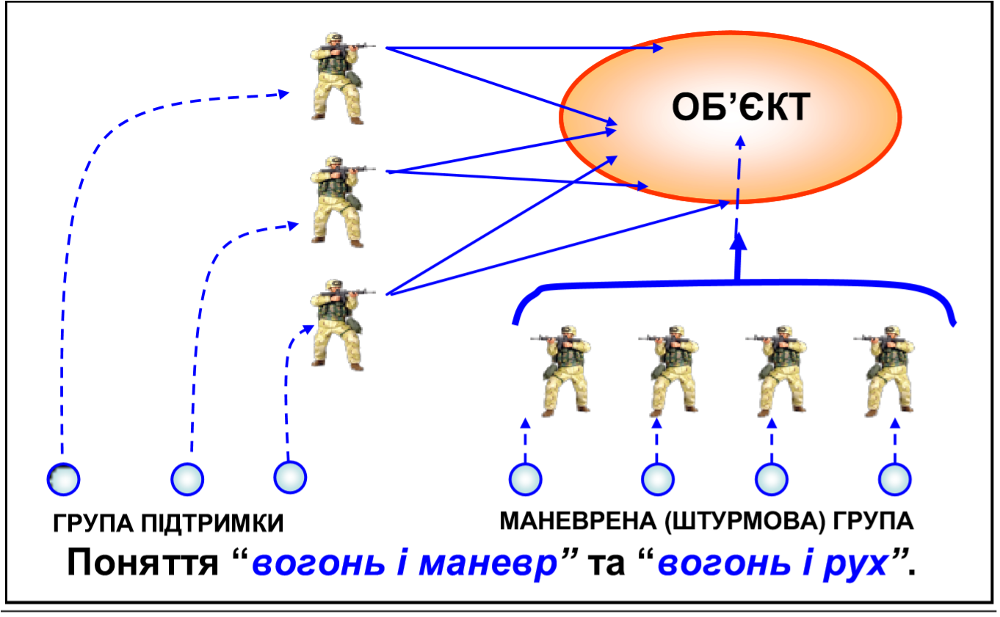
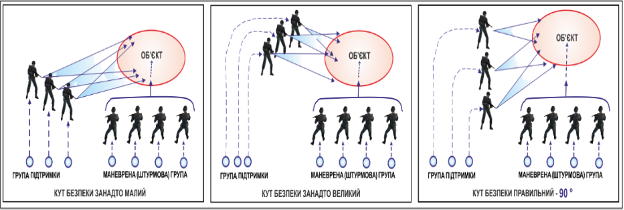
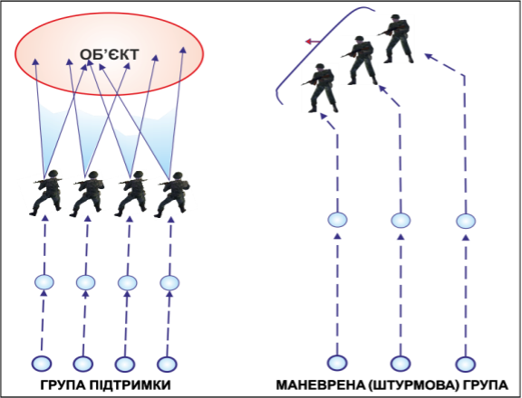
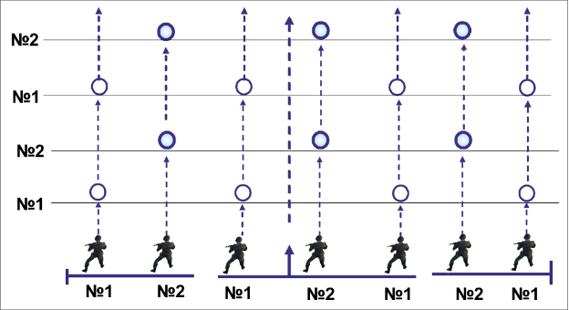
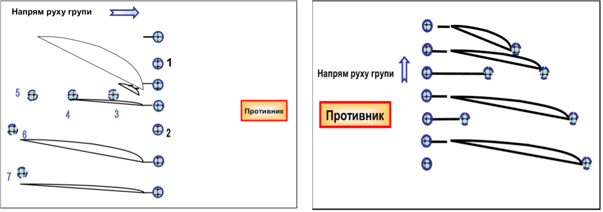
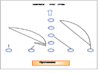
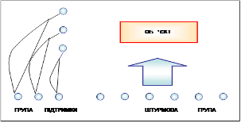
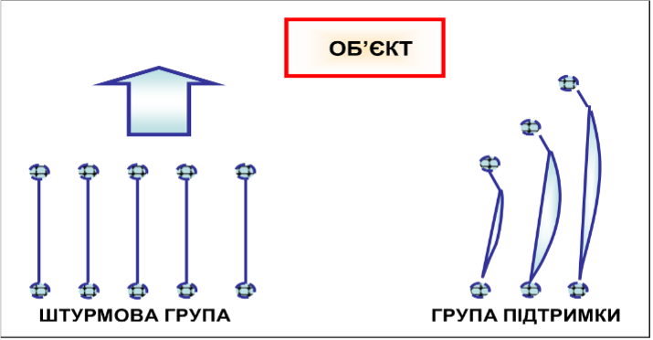
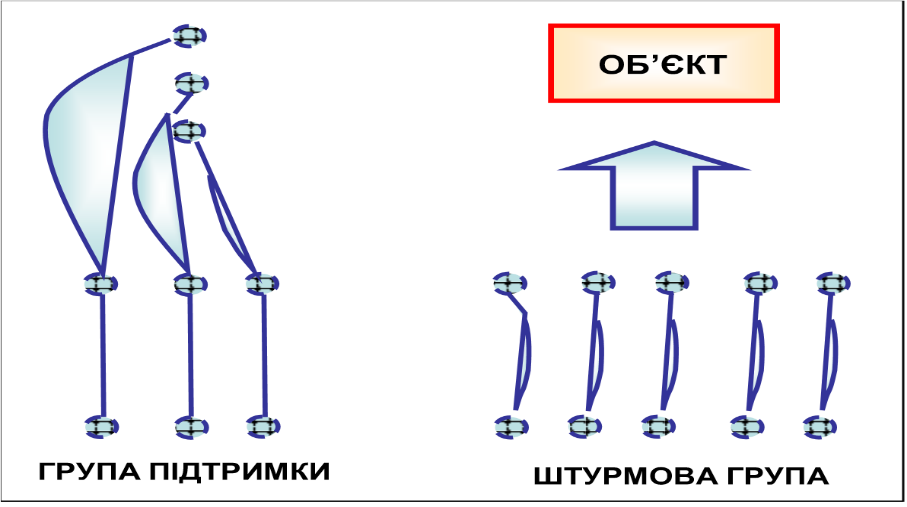

# Наступальний бій.

Наступальний бій ‒ це єдиний вид бою, який веде до повного знищення противника і оволодіння певними територіями та об’єктами. 

Особовому складу доведеться діяти у складній обстановці, яка часто змінюється, ізольовано від сусідів, з подоланням великої кількості завалів, що утворилися в результаті руйнувань будівель, пожеж і барикад, під фланговим, перехресним і багатоярусним вогнем ворога. У цьому випадку озброєння тактичної групи швидкого реагування-кулемети, автомати, ручні гранати, реактивні кумулятивні гранати, гранатомети, важки кулемети ДШКМ, відіграватимуть важливу роль у знищенні противника, що обороняється.

Як свідчить досвід участі підрозділів ЗС України в військових операціях, вивчення основних прийомів та способів дій воїна під час ведення наступу в сучасному загальновійськовому бою набуває ще більшої актуальності. Тому навчання бійців діям у наступальному бою ‒ обов’язок командирів підрозділу «ГАРТ».

Отримані теоретичні знання на групових заняттях будуть практично відпрацьовані під час тактико-стройових занять на польовому виході.
Відповідно до вимог Бойового статуту рух воїнів проводиться короткими перебіжками від укриття до укриття.

Між бійцями і групами під час руху постійно повинна зберігатися дистанція п’ять-десять метрів. Навіть при відсутності вогню противника бійцям слід дотримуватися обережності і не затримуватися на відкритих ділянках довше трьох секунд. Огляд потенційно небезпечних напрямків лісо-полоси, вікон, горищ, проломів, кущів, пригорків повинен вестися безперервно.

Прикриття груп здійснюється кулеметниками, снайперами і гранатометниками. Причому кулеметники ведуть вогонь по підозрілих місцях, в яких може перебувати ворог.

Основні елементи бойових порядків груп  визначені положеннями підрозділу «ГАРТ», проте, як свідчить досвід ведення збройних конфліктів останніх років, у тому числі і досвід застосування підрозділів Збройних Сил України, умови обстановки вимагають від командирів ведення творчого пошуку нових, ефективніших, способів застосування в бою наявних сил і засобів.

Зростання ролі тактичних груп швидкого реагування у боротьбі з нечисленними мобільними групами ворога зумовило доцільність створення в складі підрозділів позаштатних бойових груп ‒ двійок і трійок. Первинний підрозділ швидкого реагування «ГАРТ», до складу якого можуть входити до трьох бойових груп.

Розподіл на бойові групи дозволяє створити гнучкіший і розосереджений бойовий порядок, підвищити ефективність вогневого ураження ворога і живучість підрозділу, забезпечує взаємну підтримку та прикриття вогнем на полі бою під час здійснення маневру.

Бойовий порядок підрозділу «ГАРТ», яке наступає в пішому порядку, складається з бойової лінії, або клину з інтервалом між солдатами 5 – 10м   (8-15 кроків) та бойової машини (обов’язково засіб зв’язку), що діє за бойовою лінією відділення на відстані до 300 м, на її фланзі або безпосередньо в бойовій лінії. 

Для зручності ведення вогню і кращого використання місцевості воїни в бойовій лінії можуть висуватися вперед не далі 15-20м або зміщатися вбік на 3м, не порушуючи загального фронту наступу і не заважаючи діям товаришив, незаходячі в сектор вогню.

Для ведення бою в траншеях, ходах сполучення, у місті, лісі і горах, під час виконання бойових завдань у глибині оборони ворога, а також для кращої взаємодії у підрозділу «ГАРТ» завчасно перед наступом можуть створюватися бойові групи **двійки та трійки**.

При цьому інтервал між бойовими групами (двійками та трійками) може бути 10–15 м, а між воїнами 6–8 м. Під час ведення наступу на місцевості, що забезпечує вогневу підтримку між бойовими групами, вони переміщаються по черзі під прикриттям вогню тактичних груп, які вже висунулися на вказаний командиром підрозділу «ГАРТ» рубіж. Після зайняття призначеної точки бойова група готується для ведення вогню і прикриває висування групи (двійки, трійки), яка залишилася. Бойова машина оснащена тяжким кулеметом та АГС-17 діє за групами на відстані до 200-300 м, у проміжках бойових порядків або на одному з його флангів. З метою підвищення ефективності виконання завдань у наступі підрозділу «ГАРТ» може діяти також тактичними групами, які за своїм призначенням можуть бути маневреною і вогневою. 

## Маневрена група

Маневрена група призначається для оволодіння об’єктом атаки, знищення противника в траншеї, здійснення маневру для виходу у фланг і тил противнику, закріплення досягнутої цілі і виконання інших завдань. У деяких випадках вона буде проробляти проходи у замінованих  і невибухових загородженнях, виконуючи функції групи розгородження.

## Вогнева група.

Вона призначена для прикриття дій маневреної групи, знищення живої сили і вогневих засобів противника на об’єкті атаки і на його флангах, заборони підходу ворога до об’єкта, який штурмується, позбавлення ворога можливості надання допомоги своїм вогнем тим, хто обороняється, й атаки його на вказаному об’єкті спільно з маневреною групою.

При наступі  тактичними групами підрозділ «ГАРТ» може діяти:

* в лінію;
* уступом вправо (вліво); — клином.

У всіх випадках інтервал між групами може бути 15 –25 м, дистанція – 30–50 м, а бійці в групі діють спільно або на відстані 6–8 м між собою. 

Бойова машина може діяти за тактичними групами на відстані до 300 м, у проміжках між ними, на одному з флангів відділення або входити до складу однієї з груп.

Пересування здійснюється прискореним кроком або бігом, перебіжками та переповзанням.

Подолання мінно-вибухових та інших загороджень здійснюється послідовно у складі бойових тактичних груп: **маневрена група**  долає загородження та після подолання займає укриття та наносить ураження противнику, **вогнева група** прикриває дії маневреної групи, в потім долає загородження під прикриттям маневреної групи. 

Атака полягає в стрімкому і безупинному русі підрозділу «ГАРТ» у бойовому порядку на максимально можливій швидкості в поєднанні з інтенсивним вогнем із бойових машин, а в міру зближення з ворогом – і з інших видів зброї, з метою знищення його живої сили, вогневих засобів і оволодіння вказаним об’єктом. Атака в пішому порядку застосовується при прориві підготовленої оборони противника, укріплених районів, коли є значна кількість протитанкових засобів, а також на важкодоступній для діючого батальйону місцевості та може проводитися одночасно або послідовно.

**Одночасна атака** (фронтальна) проводиться підрозділом «ГАРТ» при наступі у бойовій лінії, бойовими двійками, трійками або тактичними групами, особовий склад яких діє безпосередньо за бойовою лінією бойових машин на відстані, яка гарантує його безпеку від розривів снарядів своєї артилерії та підтримку просування свого батальйону вогнем стрілецької зброї.

Бойова машина у цьому випадку, використовуючи складки місцевості, ривками від цілі до цілі (від укриття до укриття) просуваються за своєю групою на відстані, яка забезпечує надійну підтримку вогнем свого особового складу, що атакує, а бойова машина зі стабілізованим озброєнням – безпосередньо в бойовій лінії підрозділу «ГАРТ» або у складі групи вогневого забезпечення (маневреної).

**Послідовна атака** проводиться в такому порядку:

* група вогневого забезпечення своїм вогнем забезпечує дії маневреної групи, знищуючи живу силу і вогневі засоби ворога на об’єкті атаки відділення, на флангах і в найближчій глибині.
* **Маневрена група** під прикриттям вогню всього підрозділу, тяжких кулеметів, мінометів, бойових машин, аерозолів (димів) атакує ворога, оволодіває вказаною ділянкою, закріплюється і забезпечує атаку групи вогневого забезпечення. З виходом групи вогневого забезпечення на рубіж маневреної командир уточнює завдання і продовжує наступати вглиб.

## Способи дій бойових груп на полі бою:

* інтервал між воїнами бойової групи по фронту – 6-8 кроків; 
* кожний стрілець має 2-3 вогневі позиції- робить декілька коротких черг з однієї позиції, потім змінює її; 
* кожному бійцю бойової групи призначаються сектори стрільби – основний і додатковий, які між стрільцями перекриваються не менше ніж на 15 тисячних, створюючи зону суцільного вогню; 
* висування до межи переходу в атаку і переміщення в бою здійснюються на візуальному віддаленні та далечіні, що забезпечують взаємну підтримку вогнем;
* переміщення на полі бою здійснюються послідовно, спочатку перший стрілець переміщається перебіжками під вогневим прикриттям старшого і другого стрільця на відстань 50‒100 м. 

Довжина перебіжки між зупинками для перепочинку залежить від місцевості та вогню противника й у середньому повинна бути 20‒40 кроків. Після зайняття зазначеної межи стрілець обладнує перед собою бруствер і готується для ведення вогню; після переміщення першого стрільця (під його і старшого стрільця вогневим прикриттям) на полі бою переміщається другий стрілець, а потім старший стрілець, переміщення повинно бути безсистемним; старший групи через кожні 50‒100 м уточнює бойове завдання стрільцям або ставить нове.

На кожну бойову групу у відділенні необхідно мати кішку, шнур і вміти використовувати для розмінування мін на розтяжках, а також установлених на ґрунті без заглиблення і маскування; ефективно застосовувати багнети для пророблення проходів у дротяних загородженнях противника, виведення з ладу лінії зв’язку й у рукопашному бою.

Особливостями дій бійця на полі бою під час виконання бойового завдання проти дрібних груп противника є те, що воїни зобов’язані прикривати один одного вогнем, і насамперед того, хто просувається першим. 

Завдання інших у групі – перебуваючи в укритті, вести спостереження за місцевістю і переміщенням свого товариша на глибину видимості й дальності стрільби; негайно відкрити вогонь не пізніше 1‒3 с у разі виявлення противника та знищити його, не даючи йому вести прицільний вогонь по бійцю, який просувається вперед. 

Під час виконання завдання головний обов’язок кожного воїна – постійне і безупинне спостереження на відстані до 150 м, бути в постійній готовності до відповідних дій у випадку відкриття вогню ворогом. 

Після відкриття вогню по виявленому ворогу необхідно постійно змінювати вогневу позицію: зробити коротку чергу, відповзти вбік, перекотитися на 3‒5 м, зробити ще коротку чергу, а потім перебіжку. 
Не можна забувати про можливість встановлення мін, розтяжок й інших інженерних боєприпасів на напрямку дій групи. Перед початком дій не можна поспішати, необхідно уважно роздивитися, вивчити місцевість на відстані 20‒50 м, визначити свій маршрут просування, а також місце, куди наказано прибути, з обов’язковим урахуванням можливості прикриття від вогню ворога.

У бойовій групі заздалегідь повинні бути обговорені засоби і порядок спільних дій, а також порядок взаємодії в бою. Після зайняття чергового укриття негайно здійснюється спостереження за полем бою, необхідно бути в постійній готовності до вогневого прикриття переміщення інших бійців бойової групи. За можливості подальшого переміщення необхідно подати їм заздалегідь установлений сигнал на пересування до наступної межи, а надалі – умовними сигналами уточняти завдання і новий кидок. Але в будь-якому випадку під час виконання завдання одним бійцем інші його прикривають. Це – закон ближнього бою.

Не можна залишати товаришів на полі бою, а також без дозволу командира своє місце в бою; при пораненні вжити необхідні заходи та продовжувати виконання завдання. Якщо буде наказано відправлятися до медичного пункту, то взяти з собою особисту зброю. У разі неможливості висуватися до медичного пункту зайняти укриття зі зброєю та чекати санітарів.

Стежити за витратою боєприпасів вживати заходи до відновлення пошкодженого озброєння і військової техніки.

На гранатометника, кулеметника, в бою покласти: – візуально на дальності до 300 м, з використанням прицілу до 1000 м; вогневе прикриття бойових груп; охорону командира; знищення бойових машин ворога.

Бойова машина, яка підтримує групи, на полі бою просувається безпосередньо в бойовому порядку підрозділу, знищуючи протитанкові засоби, кулеметні розрахунки й інші вогневі засоби противника, руйнуючи інженерні спорудження. Бійці своїм вогнем у першу чергу знищують протитанкові засоби противника. Екіпаж бойової машини спочатку веде вогонь по першій траншеї противника, а з підходом до неї на відстань 200 ‒ 250 м веде вогонь у глибину оборони ворога.
Згідно з положенням програми «ГАРТ» наступ розглядається як основний вид бойових дій. Вважається, що тільки наступом можна забезпечити досягнення перемоги в бою.

Метою наступу є:

* розгром військ ворога;
* захоплення території або найбільш важливих ділянок місцевості;
* позбавлення ворога необхідних ресурсів, деморалізація його військ, придушення його волі до подальшого оперу;
* відволікання уваги ворога від інших районів бойових дій;
* ведення розвідки.  

На думку військових фахівців, наступ бойової тактичної групи складається основним чином із двох взаємопов’язаних та взаємообумовлених принципів:

1.	Вмілого використання засобів ураження по об’єктах противника.
2.	Дій підрозділів з метою досягнення максимального ефекту від застосування цих засобів.

Наступальні дії включають в себе чотири етапи:

1.	Зближення.
2.	Наступ.
3.	Розвиток успіху.
4.	Переслідування.

## Ведення вогню і пересування.

Зближення з ворогом є тактичною дією, що пов’язано з пошуком його військ і вступом з ними в бій.

Під час зближення необхідно керуватися наступними принципами:

* підхід до ворога повинен проводитися так, щоб бойове зіткнення з ним було здійснене якомога меншим складом сил, що допоможе уникнути невиправданих втрат на початку бою, коли ще багато невідомого у системі його оборони;
* важливо, щоб  війська, що пересуваються, здійснювали висування по прикритих чи прихованих маршрутах від одної межи до іншої, використовуючи захисні властивості місцевості з метою зниження ефективності вогню ворога. Групи, які пересуваються, повинні бути прикриті вогневими засобами, які уже розгорнути на позиціях і можуть вести вогонь по ворогу, що перешкоджає пересуванню військ; 
* групи повинні висуватися приховано і використовувати складки місцевості в готовності до зустрічі з ворогом.

Ці питання включають більш ширший спектр дій, ніж основи ведення вогню і пересування на полі бою. Разом з умінням діяти у складі патруля він створює основу для виживання воїна в бою. Іншими словами, боєць повинен уміти висунутися до об’єкта і після його досягнення, вміти знищити його. Без доведення до досконалості цих основних принципів індивідуальної бойової майстерності неможливе вивчення інших прийомів і способів дій.

Дуже важливо зрозуміти концепцію поєднання вогню і маневру.

**Вогонь і маневр** є основою будь-яких тактичних дій, при якому призначається група вогневої підтримки, що займає вказані позиції та прикриває висунення штурмової групи. Її завдання полягає в пригніченні або знищенні ворога, який може перешкодити висуненню штурмової групи, завданням якого є безпосереднє знищення ворога, який обороняється.

**Вогонь і рух** полягає у висуненні групи до цілі під прикриттям безперервного фронтального вогню. Дуже важливо, що дії в цьому випадку не можуть бути розділені на дві стадії, а саме ведення вогню і пересування. Вони здійснюються одночасно. У результаті існування двох непостійних чинників, зокрема місцевості і противника, розроблено декілька його способів.

Ці способи використовуються підрозділом «ГАРТ». При веденні бойових дій кожен боєць повинен дотримуватись цього принципу щоб вижити. 

Переваги принципу вогню і руху: 

* **він знижує зайві втрати**. Одна частина штурмової групи здійснює перебігання, в той час, як інша частина не дає противникові підняти голову веденням зосередженого вогню і, таким чином, пригнічує вогонь противника;
* **він є основою для усіх тактичних теорій**. Будь-які способи пересувань при веденні бойових дій засновані на цьому принципі. 
Сприяння принципу вогню і руху вдосконалює практичні навички; 
* **польовий вишкіл**. Внаслідок напруженості вогневого бою і для того, щоб вижити, боєць повинен ефективно використовувати укриття, маршрути і перешкоди; 
* **поводження зі зброєю**. Виживання солдата на полі бою залежить від взаємної підтримки (двійка, трійка) і без професійного володіння зброєю ця підтримка не буде досить ефективною, що знижує шанси на виживання. Уміння влучно стріляти, швидко і чітко змінювати магазин, усувати затримки це обов’язок кожного воїна; 
* **взаємодія**. Для ефективності вогню і пересування потрібна тісна взаємодія, між бійцями двійки та злагідне розуміння підрозділу. Два бійця самі по собі не можуть виграти бій. Вони повинні діяти як частина підрозділу для досягнення загального успіху;
* **контроль за веденням вогню**. Ефективність придушення ворога вогнем групи підтримки дозволяє штурмової групі зближуватися з ним. По-друге, це економить боєприпаси і, по-третє, з огляду на те, що штурм ведеться з декількох напрямків, боєць повинен вести прицільний вогонь по ворогу і не уразити своїх товаришів; 
* **управління**. Оскільки декілька дій відбуваються одночасно в різних місцях, командир підрозділу повинен уміло керувати підлеглими. У той же час, кожен боєць повинен інформувати командира і передавати його команди; 
* **керівництво**. Кожен командир повинен вміло керувати діями своїх підлеглих з метою розгрому противника. На відміну від старих методів ведення бойових дій, коли ключовими чинниками були груба сила та погана підготовка, сучасний бій вимагає компетентного командира, здатного приймати правильне рішення миттєво;
* **зближуватися з противником**. У кожного бійця є інстинкт самозбереження. Якщо життю воїна загрожує небезпека, він, у свою чергу, також буде діяти агресивно, щоб захистити себе. При цьому захист приведе до ураження ворога.

Він розвиває наступальний порив і сприяє підвищенню ефективності дій підрозділу. Успішне ведення вогню і пересування залежать від ефективності взаємодії кожного бійця. При опануванні цієї навички підрозділ стає дуже ефективним і ретельно налагодженим механізмом.
При захопленні позиції охорони або флангової позиції відділення в змозі знищити опір, не уповільнюючи загального просування вперед і зберігаючи темп наступу. Правильне поєднання вогню і маневру дозволяє підрозділу діяти самостійно і вести наступальні дії проти сил ворога, які переважають.
 
Вогонь і рух:

* **контроль** є обов’язком кожного. Отже, кожен боєць повинен самостійно обирати маршрут висування, щоб дати командирові більше часу на планування бою. Таким чином, взаємодія і дисципліна дуже важливі при виконанні цього принципу; 
* **швидкість** є дуже важливим принципом та фактором;
* для здійснення прицілювання по рухомій цілі необхідно приблизно 2-3 секунди. На місцевості це означає 5‒15м. Отже, для того, щоб вижити, кожен повинен перебігати від позиції до позиції якомога швидше, такі дій економлять  боєприпаси, оскільки для виходу до об’єкта необхідно менше часу, це деморалізує ворога, оскільки він не в змозі ефективно уповільнити просування, та зберігає темп наступу.
* 
Необхідно обмежити до мінімуму пересування по відкритій місцевості без вогневої підтримки. Якщо виникла необхідність рухатися по відкритій ділянці місцевості, доцільно застосовувати наступні способи дій: переповзання, збільшення щільності вогню групи підтримки, застосування димів. 

Напрямок атаки повинен складати кут, близький 90° до напрямку вогню групи прикриття. 

Помилка при виборі мінімального кута безпеки (кут між напрямком стрільби і напрямком наступу маневреної групи) приведе до того, що: 

1.	Швидкість сповільниться і темп наступу буде втрачений.
2.	Витрата боєприпасів зросте.
3.	Підвищиться уразливість всієї групи, що може привести до втрати ініціативи.

Способи зближення з противником

Висування перекатами

Група чисельністю 7 бійців (4 ‒ штурмова група і 3 ‒ група підтримки) атакує ціль з різних напрямків.

Цей спосіб застосовується у разі, коли: 

* є відповідні позиції для групи вогневої підтримки, при використанні яких ворог може бути подавлений точним вогнем; 
* є зручні шляхи підходу, якими штурмова група може наблизитися до ворога; 
* ворог має недостатню вогневу потужність. 

Послідовність дій:

* одна група забезпечує вогневу підтримку, в той час як інша здійснює пересування. Групи пересуваються на вигідні позиції, з яких вони зможуть почати виконання своїх власних завдань, а саме вогнева підтримка і атака противника відповідно; 
* командир групи управляє штурмовою групою, його заступник ‒ групою підтримки. Командир групи повинен прагнути тримати кулеметника на відстані, що забезпечує зв’язок голосом, поки той не досягне межи остаточної вогневої позиції. Якщо це неможливо, він повинен використовувати візуальні або радіосигнали. 
* якщо одна з груп вимушена рухатися по відкритій ділянці місцевості, інша повинна прикривати їх вогнем. Кут між двома напрямками атаки має бути якомога ближчим 90°. Якщо цей кут менше вказаної величини, штурмова група може збільшити його шляхом зміщення у відповідну сторону після виходу на вихідну позицію. Кут, в той же час, не повинен перевищувати 90°;
* атака повинна проводитися якнайшвидше, але не в збиток надійному управлінню; 
* для проведення фінального кидка з останньої вогневої позиції штурмова група може використовувати один з методів, описаних у наступних розділах

Група висувається до об’єкта з одного напрямку перебіганнями у складі двійок, тобто, один боєць виконує перебігання, інший прикриває його. 

Цей метод використовується, коли противник чинить запеклий опір; необхідна максимальна вогнева підтримка; ділянка місцевості не забезпечує достатньої кількості укриття. 
Послідовність дій: 

* боєць № 1 забезпечує підтримку бійця № 2, який виконує перебігання завдовжки 10 метрів або тривалістю 3 секунди;
* боєць № 2 займає укриття і відкриває вогонь; 
* боєць № 1 висувається на рубіж трохи попереду
* боєць № 2 займає укриття, відкриває вогонь і т. д.; 
* кулеметники висуваються у складі штурмової групи, в основному на флангах. 

## Дії при зустрічі з ворогом.

Дії при зустрічі з ворогом ‒ це прийоми, які використовуються групою під вогнем ворога, а також для відповідних дій при зміні обстановки. 

Послідовність дій:

1. при відкритті ворогом вогню необхідно виконати наступні дії:
    
    * якщо можливо, зробити три постріли у бік противника і голосом вказати напрямок на ворога;
    * швидко залягти, перекотитися (переповзти) за укриття. Не намагайтеся бігти до найближчого укриття, до якого 10-20 метрів, ви не добіжете; 
    * переповзанням або короткими перебіганнями витягнутися в лінію, у напрямку ворога. Перебігання мають бути не більше 10 метрів; 
    * визначити позицію ворога або вірогідне його розташування;
переконатися, що приціл зброї встановлений правильно;  ̶ відкрити вогонь по ворогу. 
2. бійці, що знаходяться позаду, висуваються вперед і займають позиції в бойовому порядку ‒ в лінію;
3. за допомогою провокаційного вогню, виявляються
позиції ворога;
4. розробляється цільові накази і ставляться вогневі
завдання; 
5.  командир приймає рішення і подає команду; 
6.  група відкриває щільний вогонь і подавляє противника; 
7.  група продовжує виконувати завдання

**Атака в один етап.** Цей спосіб полягає в тому, що одна група висувається на яку-небудь позицію до початку атаки. Це може бути як група підтримки, так і штурмова група.

                                
**Атака в два етапи.** Цей спосіб полягає в тому, що обидві групи висуваються на проміжні позиції до початку атаки, потім група підтримки під прикриттям штурмової групи виходить на вигідні позиції. Після цього штурмова група під прикриттям групи підтримки виходить в початкове положення і починає атаку.
                               

**Атака в три етапи.** Цей спосіб полягає в тому, що одна група здійснює два пересування до того, як штурмова група почне атаку.

