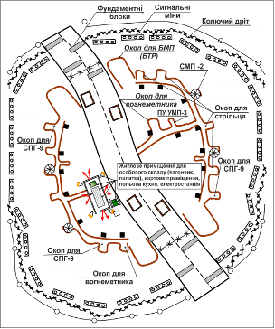
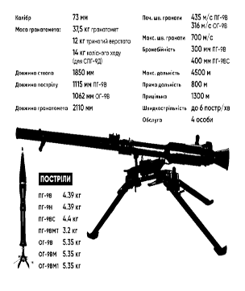
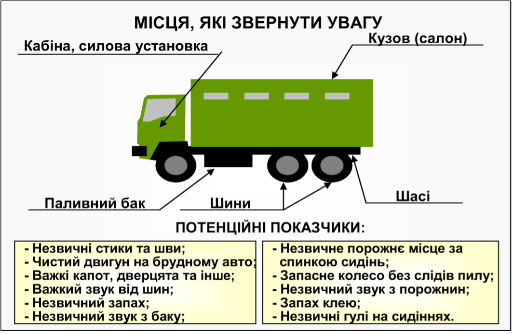
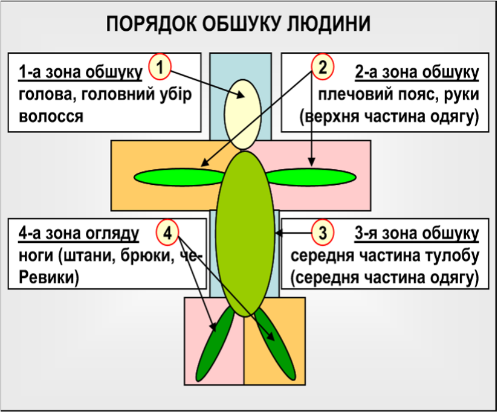

# Охорона та блокпости.

Досвід участі підрозділів ЗСУ свідчить, що зроблені певні висновки щодо розташування, інженерного обладнання та застосування підрозділів, які несуть чергування на блокпостах, стратегічних об’єктах.

Зменшення втрат особового складу, досягається за рахунок якісного інженерного обладнання блокпоста або об’єкта та покращення підготовки особового складу підрозділу до дій в складних умовах обстановки під постійним вогневим впливом ворога.

Це досягається в першу чергу набуттям командирами певних теоретичних знань та практичних навичок щодо організації служби на блокпостах та об’єктах, підтримки постійної бойової готовності й удосконалення прийомів і способів дій особового складу.

**Блокпост** – військовий наряд, як правило, у складі посиленого взводу, призначений для несення служби на розгалуженнях важливих доріг, мостів, в’їздах (виїздах) до міст та населених пунктів, станцій; здійснення контролю за рухом транспорту, людей, їх перевірки та огляду, а головне – зовнішньої ізоляції району дій незаконних збройних формувань, своєчасного виявлення їх пересування, шляхів можливого виходу бойовиків із районів їх зосередження, ізоляції і позбавленні доступу до джерел постачання; недопущення надходження поповнення, постачання боєприпасів і зброї та прориву через блокпост.

Об’єкт загороджувальний, укріплений контрольно пропускний пункт, з озброєною охороною на дорогах, мостах, здатний самостійно тримати кругову оборону.

Блокпост та охорона об’єкту ведеться та обладнується з метою: 

* демонструвати місцевому населенню району військову присутність; 
* перевіряти, оглядати весь рух людей, майна та транспортних засобів до і від контрольованої зони, а також у зоні відповідальності;
* запобігати контрабандному перевезенню зброї, боєприпасів та вибухових речовин, а також вільному пересуванню екстремістів, терористів, осіб, оголошених у розшук; блокування мостів, дороги і припинення або обмеження руху відповідно до визначеного порядку;
*  звітування про всю діяльність по команді.

Блокпости зазвичай встановлюються в районах напруженості під час проведення антитерористичних заходів. Вони бувають постійними або тимчасовими.

Блокпост переважно влаштовується за кутами будівель, на поворотах дороги, або за схилами пагорбів, щоб використовувати елемент несподіванки.

## Форма одягу та особисте спорядження особового складу на стратегічному об’єкту та блокпосту

Індивідуальне спорядження завжди повинно включати: відповідну форму одягу, особисту зброю, належну кількість боєприпасів, захисне спорядження (шолом, бронежилет) та індивідуальну медичну аптечку. 
Якщо у вас автомат, носити  його потрібно праворуч на довгому ремені, перекинутому на ліве плече через голову. Довжина ременя вибирається такою, щоб автомат можна було вільно прикласти до плеча з натягнутим ременем, на який припадає вага зброї.

Такий спосіб носіння зброї зручний тим, що руки вільні для різної дії. Зброя легко виноситься на лінію прицілювання і її важче відібрати силою.

### Озброєння

Блокпост має бути здатним захистити себе протягом 30 хвилин, необхідного для прибуття підкріплення. Крім особистої зброї бійця, на блокпосту повинен бути створений значний запас боєприпасів на випадок ведення оборони, включаючи гранати та сльозоточивий газ, сигнальні пістолети, освітлювальні ракети, трасуючі боєприпаси, дими, сигнальні, світові міни. Підступи до посту повинні бути розчищенні для створення широкого сектора обстрілу та спостереження. Біля об’єкту повинна бути вертолітна площадка, обладнання для приземлення і зльоту, особовий склад повинен бути навченим приймати гелікоптер як вдень, так і вночі. 

### Бойовий розподіл особового складу призначеного об’єкта, блокпоста.

Для несення служби особовий склад блокпосту розподіляється на чергові зміни з розрахунку: дві третини особового складу виконують обов’язки, одна третина ‒ відпочиває.

Для виконання завдань особовий склад, який призначений для несення служби на блокпосту, поділяється на наступні групи:

* управління;
* перевірки документів і огляду транспортних засобів;
* прикриття поділяється на підгрупу охорони та підтримки;
* застосування спеціальних засобів і управління мінно-вибуховими загородженнями;
* резервну групу відпочинку.

Для організації та несення служби на блокпосту, необхідно виділяти, як мінімум:

* Зміну огляду:
    *	шлагбаум № 1 (лівий) ‒ два бійця;
    * шлагбаум № 2 (правий) ‒ два бійця; 
    * зона огляду № 1 (ліва) ‒ троє бійців; 
    * зона огляду № 2 (права) ‒ троє бійців.
    
    **Разом: десять бійців.**
* Чергову (вогневу) зміну:
    * Навідник-оператор, механік-водій, командир БМП (БТР) – три бійця.
    * Стрільці ‒ п’ятеро бійців.
    
    **Разом: вісім бійців.**
* Зміна, що відпочиває, ‒ **вісім бійців**.
* Резерв ‒ **чотири бійця**.
* Всього ‒ **30 бійців**.

При такій організації служби об’єкт що зберігається здатний здійснювати огляд цілодобово. Зони огляду, шлагбаум, прилегла територія контролюються черговими вогневими засобами.

Навіть у разі некомплекту особового складу наряд, що здійснює перевірку, повинен складатися не менше ніж з трьох осіб: перший – перевіряє документи, другий (старший поста) ‒ для під страховки, третій – з автоматом (ручним кулеметом) ‒ напоготові.

Якщо є дві бойові машини, їх доцільно розмістити по обидва боки на відстані 25м один від одного. У разі відсутності бойової техніки повинна бути передбачена стрічка з шипами для екстреної зупинки автомобіля.

Зупиняти автомобілі повинні, принаймні, три бійця, інші забезпечують прикриття із заздалегідь підготовлених позицій.
Відстань між групами огляду та прикриття має бути достатньою для об’єктивної оцінки ситуації.

Право на відкриття вогню належить старшому групи прикриття. 
На ньому лежить відповідальність за безпеку групи огляду. Він повинен бути дуже обачним. Наприклад, машина, яка різко звернула на узбіччя, – це ще не причина для відкриття вогню.

Щоб сповільнити рух, в зоні перевірки встановлюються загородження з колючого дроту на відстані 5‒7 м один від одного. Це виключить можливість прориву машин уздовж дороги.

Крім особового складу, який використовується для огляду машин, не менше 4 військовослужбовців мають бути виставлені по обох кінцях полотна дороги. Їх завдання ‒ обмежити потік машин в зону перевірки і натягнути стрічку з шипами, якщо ворог спробують пробитися з боєм. На блокпостах має бути резервний транспортний засіб для переслідування автомобіля, який прорвався.

На об’єктах, блокпостах встановлюються:

* 1-2 буферні зони обмеження швидкості руху, які мають забезпечити примусове зменшення швидкості автомобіля до 5‒10 км/год;
* зона огляду, вантажів та окремих осіб: перевірки документів;
* огляду автотранспорту та багажу. Для перевірки вантажних автомобілів організовується окрема зона догляду вантажу;
* зона поглибленого огляд автотранспорту, багажу та окремих осіб;
* вогневі позиції (пости) для груп вогневого прикриття. У разі потреби можуть організовуватися приховані вогневі позиції (секрети) за межами блокпоста;
* КСП командира блокпоста, на якому встановлюються засоби зв’язку, розміщується необхідна документація тощо. Він повинен знаходитися на відстані 15 – 30 м. від дороги, що забезпечує вогневе прикриття під час огляду транспортних засобів; 
* місця прийому їжі та відпочинку особового складу вільної зміни блокпосту.
  

Під час обладнання об’єкту, блокпоста перевіряються усі підходи до нього, особлива увага звертається на вогневі позиції, які можуть бути використані для ведення снайперського вогню по об’єкту. Найбільш загрозливі напрямки можуть прикриватися сигнальними мінами і ракетами. На випадок збройного нападу блокпост належним чином обладнується в інженерному відношенні для ведення кругової оборони, а також для захисту від снайперського вогню противника. Найкращий захист забезпечують контейнери типу HESCO.

Перевірка цивільних осіб, які прибувають на блокпост, а також пасажирів автотранспорту здійснюється окремо. Для цього створюється окремий коридор та виділяється закрите місце для проведення персонального обшуку.

Для обмеження швидкості руху на блокпосту та уникнення  можливості його об’їзду на дорожньому полотні і на узбіччях встановлюються перешкоди.

Навколишня територія блокпоста повинна бути очищена від чагарників і сторонніх предметів. Прожектори не повинні освітлювати та засліплювати особовий склад блокпоста.

Для укриття особового складу на блокпосту обладнується бункерне сховище, а також місця для відпочинку, прийому їжі, умивання і відхоже місце.

Для техніки готується укриття. Як правило, для укриття техніки можуть використовуватись кам’яні стіни або окопи, контейнери HESCO.
По обидва боки від дороги при під’їзді до поста за 300 – 150 м встановлюються інформаційно-вказівні знаки, знаки обмеження швидкості руху і за 100 – 50 м ‒ знак зупинки.

Поруч з блокпостом обладнується майданчик огляду, якщо є можливість,  з оглядовою ямою чи естакадою. Майданчик обладнується таким чином, щоб цілком виключити можливість з’їзду з неї без дозволу старшого поста. Крім цього ‒ обладнується місце для утримання затриманих до прибуття представників поліції.

У нічний час ділянка дороги поблизу блокпоста має освітлюватися. Для зупинки автотранспорту в нічний час бійці забезпечуються ліхтариками.

На відстані 100 – 150 метрів від кордону блокпоста встановлюються щити з написом: „Ви в’їжджаєте в заборонену зону. Знизить швидкість до 5 км/год. Будь ласка, приготуйте Ваші документи”. Межі об’єкта позначаються табличками з написом „Стій! Стріляють! Заборонена зона!”. 

Навколо блокпоста повинні бути передбачені наступні перешкоди:

* колючий дріт або дротяна спіраль. Повинні захищати блокпост з усіх боків за винятком одного вузького проходу. Цей прохід повинен прикриватись кулеметом. Висота дротяного загородження не повинна перевищувати рівня спостереження. Колючий дріт або дротяну спіраль потрібно встановити на дорозі і навколо зовнішнього периметра блокпоста, щоб запобігти ворожим діям ззовні комплексу;
* для блокування руху повинен бути передбачений великий важкий, але в той же час такий, що швидко опускається шлагбаум (рухомий бар’єр);
* між лінією очікування машин і головною дорогою встановлюється загородження з колючого дроту;
* на кожному напрямку руху дороги розміщуються великі бетонні блоки;
* по периметру об’єкту повинні бути розташовані сигнальні ракети, що запускаються пристроями натяжної дії, або інші засоби попередження наближення противника;
* довкола блокпоста має бути знищена рослинність, засипані або залиті відпрацьованим маслом, мазутом ямки і впадини;
* для зупинки транспорту повинні бути передбачені настили з шипами або виступи дорожнього покриття, для обмеження швидкості руху;
* освітлення встановлюються так, щоб не засліплювати особовий склад блокпоста.

У міських умовах об’єкт повинен мати групу прикриття, розташовану на дахах споруд.

Вимоги, які висуваються до оборонних споруд на території блокпоста:

* позиція БМП (БТР) повинна бути організована тактично переважно вище дороги і на відстані приблизно 30‒60 м від неї;
* обладнання часткового перекриття позиції для БМП (БТР) дротяні сітки повинні знаходитися на відстані 15–20 м перед позицією БМП (БТР), щоб запобігти нападу гранатометників на БМП (БТР) з відстані враження.
 
Під час обладнання укріплення необхідно враховувати:

* укріплення повинне знаходитися на відстані не менше 15 ‒ 30 м від дороги. Ця відстань не повинна перевищувати відстань, на якій неготовий до раптового пострілу боєць, який оглядає транспортний засіб може перемовлятися з бійцем, який його прикриває;
* стіни укріплення повинні бути куленепробивними кулею калібру до 12,7 мм;
* амбразури повинні забезпечувати кругову оборону;
* вхід в укріплення повинен бути виконаний у вигляді кругового коридора, щоб захищати від ручних гранат;
* на всіх амбразурах і отворах повинні бути передбачені дротяні огорожі для захисту від ручних гранат, а особовий склад мав можливість спостерігати обстановку і вести вогонь.

## Документація.

* інструкції щодо несення служби на об’єкту;
* правила застосування сили;
* карта району спостереження з позначеними на ній районами особливої уваги;
* панорамні фотографії або схеми із позначенням характерних місцевих предметів та відстаней до них; 
* довідник з рисунками літаків, вертольотів, танків, БМП (БТР), що використовуються сторонами, які беруть участь у конфлікті, а також типове обмундирування і знаки розпізнавання;
* журнал реєстрації спостережень;
* план охорони та оборони блокпоста;
* зразки рапортів;
* графік чергування;
* перелік ступенів бойової готовності;
* переговорні і кодові таблиці;
* інструкції про порядок оповіщення і підйому за тривогою, затриманні порушників і їх конвоюванні, із застосування й обслуговування наявної техніки та обладнання; 
* керівництво зі зв’язку, в якому вказані позивні, частоти, та час доповідей;
* зразки перепусток;
* список та фото осіб, яких розшукують, і транспортних засобів.

Також на об’єкту повинно бути в наявності інше обладнання, запаси, а саме:

* додаткові запаси продовольства та питної води, що знаходяться в  укриттях;
* засоби надання першої медичної допомоги;
* ліки від малярії та іншої хвороби, що притаманні місцевості;
* запасні батареї;
* інструменти для простого ремонту;
* засоби пожежогасіння; 
* генератор для електропостачання;
* запас пального.

У встановлений час особовий склад блокпоста приступає до несення служби з перевірки транспортних засобів, перевезення вантажів і людей. Зони огляду і очікування повинні бути позначені білими смугами та дорожніми знаками.

Осіб та транспортні засоби, які долають територію об’єкту чи блокпосту, перевіряють для встановлення ідентичності документів і запобігання перенесення або провезення через блокпост заборонених засобів (предметів). Перевірку дозволяється проводити різними способами перевірка документів, обшук людей та техніки.
Особи, які перетинають блокпост, пред’являють документи, що засвідчують особу. Зразки документів, що дозволяють в’їзд у вказані зони, повинні знаходитися на блокпосту. При перевірці місцевого населення проводиться обов’язкова його реєстрація. При цьому в книгу реєстрації заносяться наступні дані: час, повне ім’я, маршрут руху.

При перевірці місцевого населення перш за все перевіряються підозрілі особи, які мають незвичайний одяг, ведуть себе неадекватно. Огляд людей здійснюється шляхом обшуку. Проведення особистого огляду група огляду повинна здійснювати прогладжуванням по одягу, а не поплескуванням. Окрема увага приділяється нижнім частинам тіла.

Обов’язковими для перевірки є головні убори, черевики, широкі штани, багаж. При проведенні обшуку доцільно використовувати металошукачі, які виявляють металеві предмети.

Жінки оглядаються тільки військовими жінками, у випадку, коли їх немає, – тільки технічними засобами в спеціально відведеному для цього приміщенні. Процедуру обшуку жінок і священнослужителів командир повинен обговорити з місцевою владою. Якщо в того, кого обшукують, знайдена зброя, боєприпаси, вибухові речовини, вони конфіскуються, а сама людина підлягає затриманню, допиту і передачі відповідним органам право порядку.

## Перевірка місцевого населення

Перевірка місцевого населення може проводитися різними способами. Перш за все перевіряються підозрілі особи, які мають одяг який звертає на себе увагу, та які ведуть себе підозріло. Особливу увагу приділяють автомобілям, в якому знаходиться одна людина. 

Типовою помилкою під час перевірки є підхід з лівого боку до осіб, у яких необхідно перевірити документи. Підозріла особа на вимогу того, хто перевіряє, нібито, витягаючи документи правою рукою з нагрудної кишені піджака, плаща, куртки, халата, де звичайне населення носить документи, може зробити постріл з пістолета через одяг.

Ніколи не стійте ліворуч від того, хто перевіряється, і не давайте йому повертатися до вас лівим боком. Знаходьтеся праворуч нього на відстані метр-півтора – ви будете мати можливість вчасно помітити його спробу дістати зброю з кишені і запобігти нападу прийомом рукопашного бою або іншим способом.

Швидкий поверхневий обшук зазвичай проводиться, коли:

* на блокпосту присутня велика кількість людей;
* як попередня дія перед детальним обшуком.

Процедура обшуку:

* той, кого обшукують, повинен стояти з широко розставленими ногами та розведеними руками;
* обшук повинен проводитись з голови до ніг;
* спеціальна увага повинна приділятися нижній частині спини і від черевиків до колін, пахви також повинно бути перевірено;
* не можна проводити обшук поплескуванням по людині, тільки прогладжуванням та стискуванням;
* особливо повинні ретельно перевірятися широкі одяг;
* обов’язковими для перевірки є головні убори, кишені,
взуття, багаж і т.д.;
* переносні поклажа або одяг, який знімається та має відношення до об’єкта обшуку, повинен бути окремо оглянутий ретельно, але з повагою.

Використання для обшуку метало-детектора дуже ефективне і повинно здійснюватися вздовж тіла, торкаючись одягу. 

Детальний обшук зазвичай проводиться:

* коли є підозра, що людина (транспортний засіб) має перевозить заборонені предмети;
* отримано наказ (розпорядження) провести детальний обшук саме цієї людини (транспортного засобу).

Процедура обшуку:

* бажано проводити обшук в присутності свідків, необхідно запропонувати звільнити всі кишені та пред’явити для огляду всі предмети та документи, які є в наявності;
* якщо є необхідність зняти одяг, об’єкт має зробити це добровільно або, якщо є необхідність, детальний обшук зі зняттям одягу проводиться в спеціальному приміщенні не на очах громадськості.

Обмеження:

* особа, що проводить обшук, має бути однієї статі з особою, що обшукується;
* деякими вимогами та інструкціями визначається, що обшук дітей до 14 років повинен проводитись жінками.

При перевірці транспортних засобів здійснюється паспортний контроль водія та пасажирів, документів на транспортний засіб водія, особлива увага приділяється автомобілям, в яких знаходиться одна людина. Транспортні засоби підлягають повному обшуку на предмет перевезення зброї та вибухових речовин. При значному русі можна перевіряти тільки кожний третій автомобіль, автомобілі тільки одного типу чи ті, які рухаються в одному напрямку.

Автомобілі для огляду допускаються на територію блокпоста по одному. Поки перший у черзі автомобіль оглядається, інші з вимкненими двигунами, очікують огляду на відстані не ближче 50 м, під спостереженням підгрупи прикриття блокпоста. За сигналом автомобіля, який перевіряється, або знаком руки військовослужбовця групи огляду, водій наступного транспортного засобу запускає двигун, повільно під’їжджає до зони огляду, пред’являє посвідчення особи та документи на транспортний засіб. Перш ніж відійти від автомобіля, водій повинен відчинити всі двері, капот і багажник.
Під час огляду автомобіля водій і пасажири знаходяться в зоні очікування, які розташовується не ближче 5 м від автомобіля, що перевіряється. Ця зона також знаходиться під спостереженням підгрупи охорони. 

При перевірці автомобіля, в якому знаходиться значна кількість людей, персонал блокпоста пропонує всім вийти з машини. Проводить огляд кожної людини і відводить їх у бік, не ближче 10 м від машини, після цього проводиться огляд транспортного засобу на наявність зброї та вибухових пристроїв.

Послідовність огляду транспортних засобів: 

* двигун, звертається увага на електричні дроти, за допомогою дзеркала оглядаються важкодоступні місця;
* пасажирський салон, обшукуються сонцезахисні щитки, спинки сидінь, під сидіннями і килимками, кишені у дверцятах, магнітофон, речова скринька, при цьому не торкаються перемикачів або інших підозрілих предметів, при виявленні останніх викликається фахівець;
* багажник перевіряється весь, у тому числі, місце кріплення запасного колеса, звертається увага на клунки, конверти, газети;
* шасі, оглядаються бампери, колісні ковпаки, застосовується інспекційне дзеркало для огляду під машиною; 
* для перевірки вантажу застосовують металеві стержні.

Перевірені транспортні засоби та водії реєструються у журналі реєстрації, де вказується: час, коли пройшов огляд транспортний засіб, прізвище водія, колір, марка машини, номерний знак, напрямок руху, пункт призначення та інше. У випадку, коли люди пересуваються без автомобілів, а наприклад, на гужовому транспорті, робиться спеціальна відмітка з зазначенням кількості худоби.

При виявленні зброї, боєприпасів, вибухових речовин й інших заборонених предметів командир об’єкту негайно здійснює доповідь черговому КСП підрозділу та діє у відповідно до його вказівок, у присутності водія і групи огляду вилучає заборонені предмети, складає акт із підписами присутніх та фотографує на фоні транспортного засобу затриманих осіб (таким чином, щоб було видно номерний знак транспортного засобу) та викладені заборонені предмети перед затриманими особами. Вилучене за актом передається командиру підрозділу, від якого виставлено блокпост, або відповідним органам і записується в журнал обліку затриманого автотранспорту і вилученої зброї, боєприпасів, вибухових речовин й інших заборонених предметів.

## Обшук транспорту.

Типи обшуку: початкова перевірка триває не більше  2 хв., попередній обшук триває не більше 10 хв, детальний обшук триває до 4 год.

Початкова перевірка проводиться для всіх автомобілів, які зупиняються на блокпосту.

На деяких типах блокпостів люди та транспортні засоби перевіряються вибірково відповідно до рішення старшого командира. Рішення, за яким автомобіль може бути зупинений, базується на наступному: випадковий вибір, викликана підозра, дані розвідки.

Головна мета початкової перевірки полягає у виборі автомобіля для детального обшуку. Особовий склад, який несе службу на блокпосту повинен знати про загрозу застосування противником транспортних засобів, начинених вибухівкою, та людей з вибухівкою прихованою на тілі.

### Обов’язки та порядок дій групи обшуку

Старший групи обшуку відповідає за: за дії підлеглих, перевірку водія та пасажирів та перевірку відповідних документів.
Бійці, який проводить обшук, зобов’язаний:  оглянути салон авто через вікно, поверхню авто, днище авто, силове відділення та багажник.

Первинний огляд включає в себе: перевірку документів, перевірку салону через скло, звірку номерів агрегатів, перевірку багажника, перевірку місця для рукавичок.

Детальний огляд. Протягом початкової перевірки у випадку, якщо хто-небудь з будь-яких причин привернув увагу своєю поведінкою, може бути проведений детальний обшук. Група обшуку складається з двох осіб.

УВАГА! Всі автомобілі, що очікують огляду, повинні бути зупинені на безпечній відстані від блокпосту і повинні постійно находитись під наглядом.

Водія і пасажирів просять показати їх посвідчення особи і вийти з автомобіля. Пасажири відводяться приблизно за 10 м (не менше 5 м) від автомобіля і перебувають там до закінчення огляду автомобіля під наглядом групи прикриття. Перед перевіркою водій відчиняє всі двері, капот і багажник.

При перевірці документів ті, хто перевіряється, повинні все робити тільки за командою особового складу блокпоста і нічого за власною ініціативою.

Документи для перевірки приймаються через опущене вікно, з машини ніхто не повинен виходити.

> Приклад. пістолет, обріз і т.д.  прикріплюють до дверцят машини зсередини. За командою: „Вийти з машини, відкривають дверці і стріляють приблизно на рівні живота закріпленим на дверці вогнепальним пристроєм.

Якщо є необхідність детального огляду, після команди: виходити з машини по одному з піднятими або витягнутими вперед руками ‒ група яка проводить огляд повинна виконувати правила безпеки.
Підозрюваного примушують сісти на землю, обшукують і далі його контролює той, хто страхує, після чого проводиться обшук наступного пасажира. 

Підозрюваним забороняється до обшуку сходитися разом (спілкуватися), у цьому випадку заборонений предмет, який шукають, може бути передано один одному. 

Пильність не можна втрачати ні на секунду. Стежте бічним зором за обстановкою, стежте за руками того, хто перевіряється, за всіма його рухами, як він дістає документи, як подає, як відкриває багажник для огляду, що знаходиться в багажнику, як реагують і поводяться пасажири. Оглядаючи багажник, знаходьтеся праворуч.
Особливу увагу необхідно приділяти автомобілям, в яких знаходиться одна людина. При перевірці автомобіля, в якому знаходиться багато людей, вимагайте  від водія вимикати двигун і всім виходити з машини, провести огляд кожної людини і відвести їх убік, не ближче 10 м від машини, після цього провести огляд транспортного засобу.
Склад групи, яка перевіряє одну одиницю автотранспорту, повинен бути не менше 3 чоловіки, з яких один перевіряє документи, другий підстраховує, третій з автоматом напоготові. Той, хто перевіряє, підходить до автотранспорту по ходу ліворуч.

Раптовість застосування вогнепальної зброї при цьому різко зменшується: у замкнутому просторі автомобільного салону непросто дістати пістолет, а тим більше автомат і підготувати його для стрільби. У такому випадку той, хто перевіряє, діє за обстановкою: стріляє сам або падає на землю, різко відкочується  назад, та подає цим сигнал для того, хто страхує, який під час перевірки документів знаходиться позаду і боку від машини і запобігає цим наїзду на нього машини заднім ходом. Автоматник знаходиться на безпечній від автомобіля відстані і при необхідності затримує вогнем результат події при спробі противника прорвати заслін.

Якщо пасажирам наказують залишити автомобіль, вони повинні стояти спиною до охоронця (бійця, який прикриває бійця що проводить обшук). Його зброя  ненаправлена на пасажирів і не виявляє ворожих намірів. У випадку виникнення підозри нападу боєць перезаряджає зброю як попередження.

### Порядок огляду транспортних засобів.

Автомобіль умовно ділиться на 5 зон обшуку: салон, ззовні, багажник, силове відділення, днище. 

**Огляд транспортного засобу:**

* **Відсік двигуна.** Звернути увагу на щось незвичайне: нові електричні дроти (можливе під’єднання бомби).
Потрібно використовувати дзеркало для огляду днища автомобіля і інших важкодоступних місць.
* **Пасажирський салон.** Сонцезахисні щитки салону, місце для рукавичок, кишені у дверях, під сидіннями (особливу увагу звертати на сидіння водія), між сидіннями (шукати електричні дроти, вимикачі), під заднім сидінням, під килимками (шукати електричні дроти), місце біля заднього вікна, двері. Перевірте звукоізоляцію в салоні.
* **Багажник.** Запасна шина і під нею, у тому числі місце кріплення запасного колеса. Весь багаж і пакунки. Звертайте увагу на такі предмети, як газети, конверти.
Ходова частина. Бампери, крила і ніші коліс, днище. Під час цього огляду потрібне дзеркало.
* **Перевірка вантажу.** Якщо можливо, вантажі перевіряються за допомогою тонких металевих штирів. Всі мішки, коробки, сумки розвантажуються і перевіряються. Якщо вантаж  ̶  пісок, цемент або гравій і т.д., огляд може зайняти дуже багато часу. Тому транспортний засіб супроводжується до місця, де вантаж може бути розвантажений і перевірений.

Якщо заборонені предмети не знайдено. Якщо вогнепальної зброї, вибухівки або підозрілих предметів не знайдено під час обшуку, подякуйте водію та пасажирам за співпрацю та допомогу, після чого безпечно виведіть автомобіль до транспортного потоку.

**Якщо знайдено заборонені предмети:**

* призупиняється обшук на місці перевірки та закривається доступ до блокпоста;
* подається команда водіям автомобілів, які очікують перевірки, від’їхати на відстань понад 300 м та зайняти позицію за будь-яким міцним укриттям;
* доповідається старшому групи прикриття та командиру блокпоста про випадок;
* викликати групу розмінування;
* затримати водія та всіх пасажирів авто до того часу, поки ситуація не буде вирішена;
* після прибуття відповідних спеціалістів та органів надати їм допомогу у випадку потреби;
* надати письмовий рапорт черговому КСП підрозділу.

### Варіант дій під час огляду транспортного засобу

Склад групи, яка перевіряє одну одиницю автотранспорту, повинен бути не менше 3 осіб: старший, той хто перевіряє документи, і машину, та той хто прикриває.

Місцеперебування старшого ‒ праворуч збоку у недосяжності дзеркал заднього виду  і в 4-5 метрах позаду машини, таким чином, він страхує себе від різкого наїзду заднім ходом і контролює праву сторону автомобіля. Він не втручається в процес перевірки документів. Його завдання ‒ за необхідності прикрити вогнем того, хто перевіряє. У момент перевірки зброя старшого групи напоготові.

Третій боєць (хто прикриває) – автоматник або кулеметник знаходиться на безпечній для себе відстані по заду автотранспорту, що перевіряється, і відкриває вогонь при спробі противника прорвати заслін, не чіпляючи того хто перевіряє документи.

Автоматник повинен знаходитися на такій відстані від основної групи, щоб він міг бачити і, бажано, чути все, що відбувається на посту, тому що вогонь він відкриває у випадку ускладнення обстановки без наказу, на власний розсуд. Він повинен знаходитися в секторі обстрілу старшого поста для вогневої підтримки з його боку і недопущення нападу ззаду.

Той, хто проводить огляд, для перевірки документів підходить до транспорту не зліва з боку водія, а праворуч, з боку пасажира.
Тут діє лівостороннє правило. Тим, хто знаходиться в машині, вкрай незручно в положенні сидячи правою рукою діставати пістолет з бічної, або з нагрудної кишені і стріляти, розвертаючись вправо. З довгоствольною зброєю (автоматом, обрізом) це буде зробити ще важче. Раптовість застосування ворогом зброї при цьому різко зменшується.

Той, хто проводить огляд, голосно подає команду: Залишатися на місцях. Не виходити. Двері не відкривати. Заглушити двигун! 
Відкритих дверей треба уникати і документи  оглядати з рук пасажирів або водія, для контролю тільки при опущеному боковому склі. Навіть якщо ті, що знаходяться в машині, відчинили двері нібито для надання документів, повному їх відкриванню треба перешкодити, щоб цими дверима не вдарили вас або в щілину непомітно не кинули гранату.

Той, хто проводить огляд, повинен бути спостережливим.
> Наприклад.
> Запитати водія: Де запасне колесо?. І якщо він почне кидатися у пошуках колеса, робіть відповідні висновки. Якщо той, хто перевіряє, помітив у машині щось підозріле і небезпечне (зброя), він діє за обстановкою –  подає умовний жест стріляти, або просто падає на землю, намагаючись відкотитись від машини назад. Падіння того, хто перевіряє, – сигнал до дії для інших.

Особи, що перевіряються, всі дії повинні робити тільки за вашою командою і нічого за власною ініціативою. Не дозволяйте їм самостійно виходити з машини і наближатися до вас.
При необхідності огляду багажника водієві пропонується вийти з машини і відкрити  багажник. 

Той, хто перевіряє, знаходиться обов’язково праворуч від водія на безпечній від фізичного нападу відстані — метр, півтора, сам у багажник не лізе, всі предмети, що знаходяться в багажнику, йому за командою показує водій. Потрібно уважно стежити за руками водія. 
Положення водія – виключно за машиною позаду багажника. Це робиться для того, щоб ті, хто знаходяться в машині, не могли завести двигун і різко поїхати.

Місцеперебування старшого поста, який контролює обстановку – в 4-5 м ззаду праворуч; він контролює водія і праву сторону автомобіля. ліву сторону контролює той, хто прикриває.

## Застосування сили.

Особовий склад, який задіяний для несення служби на об’єкту, має право застосовувати силу і відкривати вогонь у наступних випадках та ситуаціях: 

* в умовах оборони від збройного нападу; 
* коли безпека особового складу блокпоста та об’єкту під загрозою; 
* у випадках спроб арештувати, поранити або захопити особовий склад блокпоста або об’єкту; 
* при намаганнях зупинити або перешкодити виконувати свої обов’язки особовим складом, який виконує завдання; 
* при спробах викрасти або знищити техніку, обладнання особливої групи.

Характер служби на блокпосту вимагає тривалого перебування на об’єкті, коли необхідно мати вільні руки для подачі сигналів, перевірки документів, огляду машин,  обшуку людей і одночасно бути готовим до застосування зброї. Командир блокпоста повинен навчати особовий склад правильному носінню та застосуванню зброї. Вона повинна знаходитися в положенні, що забезпечує її швидке застосування, і в той же час люди, що перевіряються, не повинні мати можливості блокувати застосування зброї.

Якщо при наближенні до блокпоста чи об’єкта, що охороняється, транспортний засіб не зупиняється за наказом (сигналом, знаком), дозволяється застосування зброї для його зупинення.

### Порядок застосування сили: 

* командир блокпоста через мегафон або голосом чи знаком руки подає команду зупинитись, а особовий склад блокпоста готує зброю до застосування; 
* розгортається килим цвяхів, призначений для пошкодження шин; 
* персонал блокпоста займає позиції для оборони; 
* по засобах зв’язку викликається допомога тактичної групи швидкого реагування; 
* якщо автомобіль не зупиняється, робиться попереджувальний постріл у землю перед автомобілем, наступний постріл здійснюється по колесах, у двигун, фари (необхідно, якщо є можливість, уникати ураження людей).

Для затримання людей застосовується наступна процедура: 

* командир блокпосту через мегафон або голосом чи знаком руки подає команду зупинитись та попереджає що буде застосовано зброю, а особовий склад блокпоста готує зброю до застосування; 
* персонал блокпоста займає позиції для оборони; 
* по засобах зв’язку викликається допомога тактичної групи швидкого реагування;
* робиться попереджувальний постріл в повітря, потім у землю перед ними; 
* постріл по ногах.

Застосування зброї повинно припинитись, як тільки попередження виконано або ситуація нормалізувалась.
  

