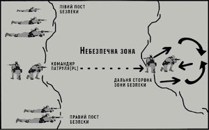

# Подолання зон небезпеки

Зони небезпеки — це місця, де найбільш імовірна робота снайпера або засідка.

Їх можна розділити на дві категорії: лінійні та відкриті.

## 1. Лінійні зони небезпеки (ЛЗН)

Зазвичай це стежки, дороги, береги річок і сухі русла, території вздовж парканів, стін, де у ворога є можливість захопити групу, організувавши засідку. Перетин зони небезпеки має бути заздалегідь передбачений у загальному плані проведення операції.
Використовуючи цей спосіб, група з 9-ти бійців іноді може перетнути зону небезпеки за 9-10 секунд.

### Як виконувати:

1.	група зупиняється після сигналу про наближення до небезпечної зони, 
2.	бійці скорочують інтервали та стають «плече до плеча»,
3.	командир визначає маршрут кидка так, щоби долати «лінію» вздовж далекого від ворога боку,
4.	передовий боєць під прикриттям іде вперед настільки, щоб оцінити ситуацію справа і зліва,
5.	якщо ворога не видно, він займає позицію, щоби його ліве плече, дивилося в напрямку подальшого руху групи,
6.	негайно після зупинки першого наступний боєць займає позицію поряд із ним і дає команду побратимові «пішов», 
7.	передовий щодуху перетинає небезпечну зону й займає позицію ліве плече вперед, контролюючи наступний відрізок кидка. 
Така схема працює і далі, кожен наступний боєць заміняє того, хто біг перед ним. При цьому методі головний захист — швидкість і прихованість. 
Важливо!  Передовий боєць контролює ситуацію з лівого флангу, а той, що замикає — на правому.

## 2. Відкриті зони небезпеки
Відкрита зона небезпеки — це зона, перетину якої варто уникати. 
Поля, луки, низини, береги водойм, випалені місця, злітні смуги — усі зони, що вільно проглядаються та прострілюються. Як що таки зони відмічені на карті — можна спланувати маршрут групи так, щоб їх уникнути. Однак інколи зробити це не можливо, доводиться йти прямо крізь них.

Долають такі зони за рахунок розбивки загону на підгрупи. 
  
### Послідовність дій така:

1.	передовий боєць зупиняє групу й сигналізує про наближення до небезпечної зони; 
2.	командир посилає розвідку;
3.	він особисто розміщує декількох бійців за 20-50 метрів на правому та лівому фланзі;
4.	правий і лівий пости безпеки спостерігають за флангами; 
5.	командир загону висилає третю команду через зону спланованим раніше маршрутом;
6.	ця підгрупа перетинатиме зону так, як це найкраще робити в такій ситуації – бігом, по-пластунськи чи якось інакше;
7.	зачаївшись на далекому боці, підгрупа зупиняється;
8.	якщо ворога не виявлено, вона тихо відходить для інформування командира про ситуацію;
9.	командир висилає решту загону, за винятком флангових команд, через зону по тому маршруту, яким пройшла віддалена група;
10. флангові команди перетинають її останніми.
Цей метод повільний, але гарантує безпеку на флангах і з далекого боку зони.

Як бачимо, у кожної з побудов бойового порядку є переваги й недоліки. Командир обирає їх, змінює та комбінує залежно від обставин та особливостей місцевості.

Три основи, важливі в процесі групового маневрування підрозділу:

1. **НЕ втрачайте контроль за зброєю:** пам’ятайте, що під час пересування та інтенсивного бою вашу зброю треба постійно спрямовувати в напрямку ворога, використовуйте помаранчеву зону щоб не поцілити у своїх.
2. **НЕ скупчуйтесь:** бійці, розуміючи небезпеку, скупчуються в проміжних пунктах для укриття, при цьому відкриваючи фланги й тил. Командир повинен визначити кожному бійцю сектор для наступу та слідкувати за виконанням вказівок. Кожен повинен знати своє місце в наступі та знати сусідів зліва і справа. 
3. **НЕ оглядайтесь надто часто:** звичка оглядатися через плече на товаришів допомагає передачі сигналів між членами підрозділу. Але при веденні вогню на придушення критично важливо спостерігати за ворогом, а це важко робити, якщо бійці постійно оглядаються на інших.

## Основні фактори пересування на полі бою:

* вміння пересуватися на полі бою збільшує шанси залишитися неушкодженим;
* як саме пересуватися - залежить від рельєфу місцевості, інтенсивності ворожого вогню та бойового завдання;
* способи пересування: прискореним кроком або бігом, перебігання, переповзання;
* порядки пересування (бойові порядки) — у двійках, трійках, колона, клин, ромб тощо; 
* для подолання небезпечних зон існують окремі бойові порядки.