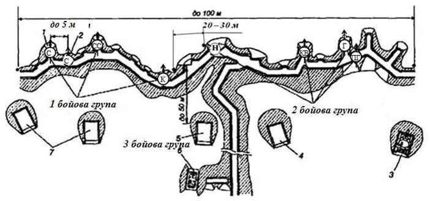
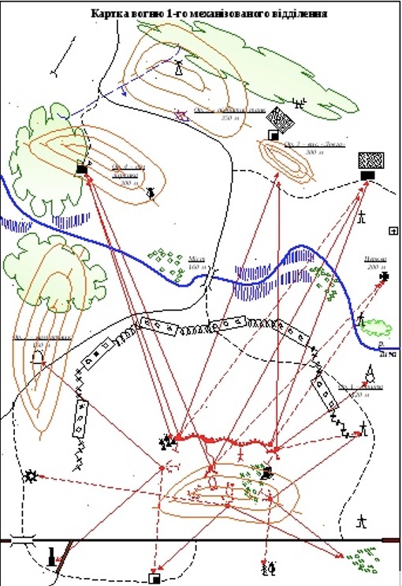
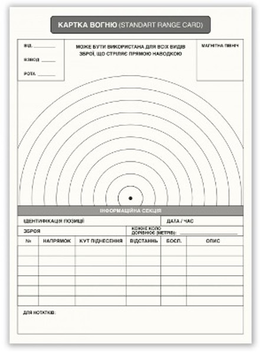

# Система вогню взводу

Ефективність вогню була би дуже низькою, якби він вівся хаотично, на власний розсуд кожної бойової одиниці чи підрозділу. Він повинен бути впорядкованим і узгодженим. Іншими словами, кожен повинен цілити не куди заманеться, а куди треба. Для цього потрібна система вогню.

**Система вогню** — організоване за єдиним планом поєднання вогню всіх видів зброї для ураження противника. 

## Складова системи вогню 

Система вогню взводу складається з протитанкових гранатометів і кулеметів, снайперів, входить до системи вогню роти (батальйону) та включає в себе:

* зони протитанкового вогню, протитанкових засобів і багатошарового вогню вогневих засобів взводу перед переднім краєм, у проміжках, на флангах і в глибині оборони;
* ділянки зосередженого вогню взводу;
* підготовлений маневр вогнем.

Взводу і відділенням вказуються: смуга вогню, додатковий сектор обстрілу, одна-дві ділянки зосередженого вогню.

**Смуга вогню** повинна бути ширшою за фронт оборони та так перекриватися смугами вогню сусідніх підрозділів, щоб уся місцевість перед переднім краєм була прикрита вогнем підрозділу. 
Сектори обстрілу сусідніх підрозділів на стиках повинні взаємно перекриватися на дальності 500–600 м, це створює зону суцільного багатошарового вогню.

**Зосереджений вогонь** взводу готується перед найбільш небезпечними підступами, де противник може потай зосередитися та раптово перейти в атаку. Якщо перед фронтом оборони взводу є два прихованих підступи, то взвод готує зосереджений вогонь по обох ділянках, а вогонь буде вести тільки по одній із них, з подальшим переносом вогню на іншу ділянку, якщо того вимагатиме обстановка.

Зосереджений вогонь з автоматів і ручних кулеметів ведеться на відстані 400 — 600 м, з кулеметів ПК та ПКТ — до 1000 м, КПВТ — до 2000 м. Щільність вогню на ділянці зосередженого вогню повинна бути в 1,5 — 2 рази більшою за звичайну щільність перед опорним пунктом. 
Маневр вогнем — це швидкий перенос вогню з однієї цілі на іншу для послідовного або одночасного ураження декількох цілей.
До складу взводу входить 3 відділення. Стрільці, кулеметник і гранатометник відділення в бойовій лінії розміщуються рівномірно в складі бойових груп. 

Відстань між бійцями в разі рівномірного розміщення може бути до 14-16 м, між бойовими групами — до 20-30 м, а між собою в групі — до 5 м. 
 
 
 
Командир відділення на бойовій позиції перебуває в такому місці, звідки зручніше керувати підлеглими, спостерігати за місцевістю та сигналами командира взводу. 

### Як зрозуміти, що система вогню готова до бою?

БМ та інші вогневі засоби зайняли вогневі позиції, дані для стрільби підготовлені, боєприпаси наявні.

**Вогнева позиція** — це ділянка місцевості, зайнята чи підготовлена для розміщення на ній вогневого засобу (кулемета, міномета тощо), щоб здійснювати максимальний вогневий вплив на супротивника. 
Вогнева позиція може облаштовуватися при всіх видах бою - як в обороні, так і в наступі, вона включає в себе: 

* місця для зброї, боєприпасів, автомобіль;
* укриття для особистого складу; 
* окопи для самооборони, спостережного посту та ін.

Вимоги вогневої позиції:

* зоровий зв'язок із командиром і побратимами;
* прихований від супротивника спосіб сполучення з тилом;
* огляд і можливість вести вогонь у різних напрямках та максимальних дистанціях;
* зручність для встановлення та зняття озброєння;
* відмінне маскування в будь-який час доби;
* максимальний захист від впливу супротивника.

## Типи вогневих позицій

Вогневі позиції можуть бути основними та запасними: 

* Основні вогневі позиції займають, щоби виконати основні вогневі завдання підрозділу на визначений період бою. 
* Запасні вогневі позиції призначені для здійснення маневру або на випадок вимушеного залишення основних вогневих позицій. Вони дозволяють входити в бій із ворогом із різних позицій і рухатися до інших позицій на випадок задимленого вогню.

Також може обладнуватися **тимчасова вогнева позиція** — для розміщення чергового вогневого засобу. 

Бойова позиція відділення в обороні повинна мати добрий обстріл перед своїм фронтом та у проміжках між відділеннями, що знаходяться попереду, а також у тилу опорного пункту взводу.

Кожному розрахунку трійці, двійці та окремим вогневим засобам вказується:

* місце в бойовому порядку групи та ступінь обладнання вогневих позицій,
* основний та додатковий сектори стрільби,
* зону ураження противника – основну ділянку зосередженого вогню,
* додаткові ділянки зосередженого вогню,
* запасні вогневі позиції та ступінь їх обладнання.

Кожен стрілець повинен обладнати 2-3 вогневі позиції та сектори стрільби — основний і додатковий. Сектори стрільби повинні перекриватися не менше ніж на 10-15 градусів (170-250 тисячних), створюючи зону суцільного вогню. Сектор обстрілу для автоматника в обороні – до 40 градусів.

## Картка вогню

Командир відділення (або старший бойової групи) узгоджує та координує зусилля вогневих засобів: 

* визначає та коригує необхідний приціл для ураження  противника, 
* здійснює цілевказівку,
* ставить вогневе завдання, 
* зосереджує або розосереджує вогонь,
* вогонь переноситься з однієї цілі на іншу.

Для цього використовується такий бойовий графічний документ, як картка вогню, мета якої — використати наявний боєзапас максимально ефективно та доцільно.

При наявності нового бійця або відокремлена група з кількох бійців, змушена діяти самостійно від товаришів, без можливості зв’язку. За таких обставин група чи відділення можуть втратити контроль над обороною, бути знищеними. Однак якщо є картка вогню, кожен розуміє план бою та свої дії в ньому.
 
Картка вогню містить дані:

* прив'язку до місцевості (за трьома орієнтирами); 
* положення цих орієнтирів на місцевості 
* роздільні лінії між своїми підрозділами і сусідами, стрілку Північ-Південь, що відповідає сторонам горизонту на місцевості;
* відомості про ворога, якщо є дані розвідки — про положення основних вогневих засобів ворога (танків, БМП, БТР, гранатометів, кулеметів, мінометів);
* вірогідні напрямки появи противника, якщо даних про противника немає;
* позиції підлеглих військ: командних опорних пунктів, пунктів управління, траншей і ходів сполучення, вогневих позицій (основних і запасних) для танків, БМ, гранатометів, кулеметів, мінометів, відділень, взводів;
* траншеї підрозділів, вогневі точки, окопи, бліндажі, ходи сполучення - тієї форми, як вони обладнані на місцевості;
* сектори вогню (основні і запасні) для перерахованих сил.

Кожному бійцю треба вміти не лише розібратися в кресленні та скласти картку вогню самостійно. 

### Картка вогню відділення.

Картку вогню відділення складають тільки в обороні. Під час цього командир користуючись зором, збирає належну інформації.
В наявності часу оборони загальна послідовність складання картки є такою:

1.	Обличчям до ворога і тримаючи перед собою аркуш паралельно до його переднього краю, орієнтуємося за сторонами горизонту й креслимо на краю паперу стрілку «північ — південь»;
2.	Унизу аркуша позначаємо своє місце розташування;
3.	Наносимо на картку орієнтири. Першими  наносимо найпомітніший (найвіддаленіший) із них. Це і буде основний напрямок, використовуючи його наносимо позначення інших орієнтирів. А відстань буде масштабом у нанесенні як другорядних орієнтирів, так і місцевих предметів і цілей;
4.	Нумеруємо й підписуємо орієнтири, визначаємо дальність до них;
5.	Розмічаємо положення ворога на місцевості;
6.	Позначаємо позицію відділення відносно до місцевих предметів;
7.	Наносимо смугу вогню по глибині на дальність дійсного вогню, включаючи бойову машину. Позначаємо додатковий сектор обстрілу. Сектор обстрілу кулемета наносимо в межах смуги вогню, а додатковий сектор може виходити і за її межі;
8.	Позначаємо основні й запасні вогневі позиції бойової машини, гранатометів і протитанкових керованих комплексів, основні та додаткові сектори обстрілу з кожної позиції;
9. Позначаємо позиції сусідів і межі їхніх смуг вогню на флангах відділення;
10. Позначаємо ділянки зосередженого вогню взводу та місця в них, куди стрілятиме відділення;
11. Наносимо загородження поблизу своїх позицій.

Після цього остаточно оформлюємо картку, поставивши підпис, дату і час складання.  

**Кожен окремий вогневий засіб являється складником системи вогню, також має картку вогню, на ній**:

 
* схематично зображуються основні орієнтири на вказаній місцевості;
* позначаються відстані між ними;
* вказується відстань від позицій бійця (основних, запасних) до основних орієнтирів із боку противника; 
* відзначаються межі орієнтирів зліва та справа, у яких боєць буде вести вогонь, тобто сектор обстрілу.

Можна використовувати готові бланки картки вогню, зроблені з матеріалу, що не промокає. Вони є багаторазовими, написане можна стерти спиртовою серветкою або іншим спиртовмісним розчином:

 
Система вогню, допомагає впорядкувати вогонь усіх видів зброї, щоби досягти максимального ураження ворога. 

## Прихована позиція (ПП)

Буває, що часу та ресурсів на обладнання повноцінної бази немає. Однак підрозділу треба організувати відпочинок. Як що підрозділ має виконати марш, який не можна здійснити за день. Малий підрозділ, для якого не можливо організувати повноцінну базу. 

У такому разі організовують **приховану позицію**. 

Призначення прихованої позиції — находитися скритно від противника під час розвідки або відпочинку.

### Організація прихованої позиції.

Правила облаштування прихованої позиції:

* ПП облаштовується на відстані 300 метрів від позицій ворога або має між ними та собою принаймні одну природну перешкоду. Це гарантує, що противник не наскочить зненацька на схованку патруля. 
* ПП має гарантувати кругове спостереження та вогневе ураження ворога. 
* ПП використовують не більше шести годин і ніколи не використовують двічі. 
* Ніхто не заходить у ПП і не виходить із неї, окрім дозорних, та без окремого дозволу командира.
* Залишають ПП тоді, коли весь склад патруля готовий до виходу.

Два методи облаштування ПП. 

### 1. Метод «близнюки»
Підходить у лісистій та сильно пересіченій місцевості, де спостерігачі не можуть нормально контролювати можливі шляхи підходу й  відступу. 

Облаштування: 

1. Командир патруля позначає на карті приблизну область, де він хоче створити ПП. 
2. Бійці сходу займають цю зону, ретельно обстежують потенційні місця, поки не знайдуть місцину, незручну для прихованого підходу ворога.
3. Командир подає сигнал про те, що місце розташування ПП знайдено. 
4. Бійці займають пози в ПП так, аби триматися за принципом «плече до плеча». 
5. Після цього присідають на коліно та розподіляють зони огляду направо й наліво в «шаховому порядку», очікуючи наступної команди.
6. Усі бійці групи скидають тяжку поклажу. Частина з них готує місце відпочинку, інші здійснюють спостереження. Змінюючи один одного. 
7. Визначається дозор і кількість бійців.

Мінні загородження не виставляють, дозорні забезпечуються достатньою кількістю ручних гранат, які передають наступному дозору.  Якщо ж противник виявить приховану позицію, гранати дадуть патрулю можливість відійти та дати основній групі час підготуватися до оборони або організованого відходу.

Радіообладнання передають так само — від зміни до зміни, так само, як і прилади нічного бачення та тепло-визори.

### 2. Метод «Пластуни»

Підходить на відкритій місцевості, де переховуватися потрібно лежачи, бо сидяча поза є відкритою для ворожого спостереження та ставить під загрозу весь патруль. Багато що в цьому методі є таким же, як у методі «близнюки», єдина відмінність — бійці залягають стопами один до одного (в позиції по пластунськи)

Пара бійців, які виконують дозорні функції, буде знаходитися не плече до плеча, а на протилежних сторонах позиції. Оскільки місцевість проглядається, треба розташуватися якнайдалі від противника, потрібно маскування щоб злитися з ландшафтом. 
Це важливо: прихована позиція дає певний рівень безпеки малим групам, однак для численних загонів вона не підходить. Якщо загін великий, необхідно облаштувати для нього передову базу за всіма правилами:  з мінним загородженням, передовим, боковим і тиловим дозорами, вогневими позиціями тощо.