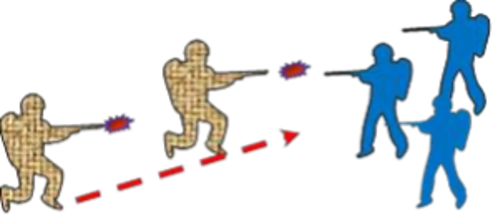

# Тактичні дії різних бойових ситуації 
## 1. Раптовий вогонь супротивника

###Дії бійців:

1. Негайно займають найближчі укриття та відкривають вогонь по противнику у відповідь;
1. Підтримують зв'язок із сусідами зліва та справа та з командиром групи;
1. Повідомляють йому про позиції ворога.

###Дії командирів:

1. Виявляти і вести прицільний вогонь по наявних або ймовірних вогневих точках і позиціях ворога;
1. Доповідають обстановку командиру підрозділу;
1. Керувати вогнем, використовуючи команди управління:
    *	привернення уваги особистого складу; 
    *	спрямування на ціль;
    *	опис цілі;
    *	дистанція до цілі;
    *	спосіб ведення вогню (одиночний чи безперервний); 
    *	команда на відкриття вогню;
1. Перевіряють стан своїх підлеглих; 
1. Підтримують зв'язок із командиром відділення (взводу);
1. Керують бійцями.

###Дії командира підрозділу:

1. Визначати, можливість виходу підрозділу із зони ураження;
1. Визначати, можливість підрозділу  відкрити вогонь під обстрілом на придушення ворога;
1. Оцінює обстановку:
    *	розташування вогневих позицій ворога та його загороджень;
    *	наявність та сили ворога ; 
    *	вразливі фланги;
    *	приховані підступи до позиції ворога;
1. Визначає подальші варіанти вогню, маневрів, атак, проривів, захватів та зачистки будівлі чи траншеї тощо.
1. Доповідає обстановку командиру взводу (роти) та починає діяти. 

###Загальні правила під раптовим вогнем

* Рухайтеся від прикриття до прикриття: не давайте ворогу прицілитися, переміщайтеся ліворуч; 
* Намагайтеся залишати сонце за спиною; 
* Якщо немає змоги активно рухатися, відразу ж падайте й відповзайте (перекочуйтесь) за будь-яке укриття, одночасно готуючись до бою;
* Якщо вас декілька, не скупчуйтесь, маневруйте, прикриваючи один одного вогнем;
* Якщо під раптовим вогнем боєць, що рухався поруч, поранений, не допомагайте йому  негайно, ризикуєте стати 200.
* Щоб захиститися від ручної гранати, яка впала поруч, потрібно впасти на спину головою від гранати. Лице прикрити зброєю, рот відкрити. Хто побачив гранату, дає сигнал: «Граната праворуч (ліворуч, позаду)».

## 2. Контакт з ворожою групою  на близькій дистанції.

 
 
Дії:

* назад бігти не можна — розстріляють у  спину;
* негайно відкривайте вогонь у бік ворога;
* одночасно переміщуйтесь уперед до супротивника;
* намагайтесь опинитися праворуч від нього;
* наблизившись до ворога, на ходу розстрілюйте його;
* стріляйте по корпусу, або під бронежилет: рикошет краще, ніж не потрапити зовсім;
* дійте якнайшвидше: у перші секунди не шкодуйте патронів;
* поки стріляєте, периферійним зором знайдіть місце, де можна буде сховатися та перезарядити зброю.

Дії в складі підрозділу залежать від ситуації. Залежно від рішення, яке ухвалює командир, підрозділ або приймає бій, або виходить з нього.

## 3. Протидія снайперу

Велика небезпека на полі бою є снайпери.

Протидії снайперу: 

* не перебувайте на відкритому просторі, якщо можливо;
* дотримуйтесь маскування;
* утримайтеся від зайвих рухів: переміщення демаскує; 
* якщо переміщуєтесь, постійно змінюйте ритм руху: рухливі цілі важче вразити, якщо вони переміщуються ривками;
* не робіть передбачувані дії: не ходіть до туалету або палити в той самий час, до одного й того ж місця кожен день;
* не втрачайте обережності вночі: із сучасними приладами нічного бачення темрява не забезпечує прикриття;
* зробіть приманку, відволікайте увагу снайпера, встановіть звідки веде огонь та знищите його. 
* не намагайтеся виносити пораненого снайпером солдата на собі, евакуюйте його за допомогою бронетехніки, витягуйте за допомогою «кішок» або заздалегідь підготовлених гаків на мотузці, закиданням петлі на ногу пораненого. 

## 4. Мінометний обстріл

Правила безпеки:

* прислухайтеся до звуків мін, що летять;
* негайно падайте й утискайтеся в землю або займіть укриття; 
* не підводьтесь, не намагайтеся втекти із зони обстрілу:  є ймовірність поранення мінними осколками; 
* дочекайтеся, поки не прозвучить, 8-10 розривів, потім почекайте три хвилини, після чого швидко міняйте позицію або йдіть в укриття; 
* надайте допомогу тим, хто її потребує, після обстрілу і в укритті;
* використовуйте штучні та природні укриття й складки місцевості — в них можна сховатися в перервах між серіями пострілів;
* не знімайте бронежилет і каску.

> Важливо: при виборі укриття майте на увазі, що кущі, окремі дерева, електроопори тощо викликають вибух міни в повітрі. Площа ураження збільшується, а осколки можуть не передбачувано змінювати траєкторію руху.

## 5. Артилерійський обстріл.

Основний захист від вогневого ураження — інженерне обладнання позиції підрозділу.

Правила безпеки: 
* розосередьтеся;
* перебратися до окопу і залягти якомога глибше;
* у перервах між прильотами снарядів ведіть спостереження, підіймаючи голову над бруствером на рівень очей - ворог може атакувати в перерві;
* прикривайте вуха долонями, а рот тримайте відкритим, щоби зберегти барабанні перетинки або керуйтеся тактичними навушниками.

## 6. Повітряний напад.

Дії у населеному пункті під час повітряного удару: 

* якщо ви на відкритій ділянці, ляжте горілиць і не дивіться вгору.
* переповзайте в укриття, якщо воно поруч.
* не біжіть: різкий рух обов’язково приверне увагу пілота.
* пам’ятайте, що вертоліт спочатку робить зворотні рухи, потім відкриває вогонь.

Дії на відкритій місцевості під час повітряного удару:  

* намагайтеся зайняти укриття в ямі від вибуху або за товстим стовбуром дерева.
* не збирайтеся в групу — розосередьтеся.
* якщо вам доводиться бігти або їхати, робіть це під кутом, не прямо по курсу літака або гелікоптера.