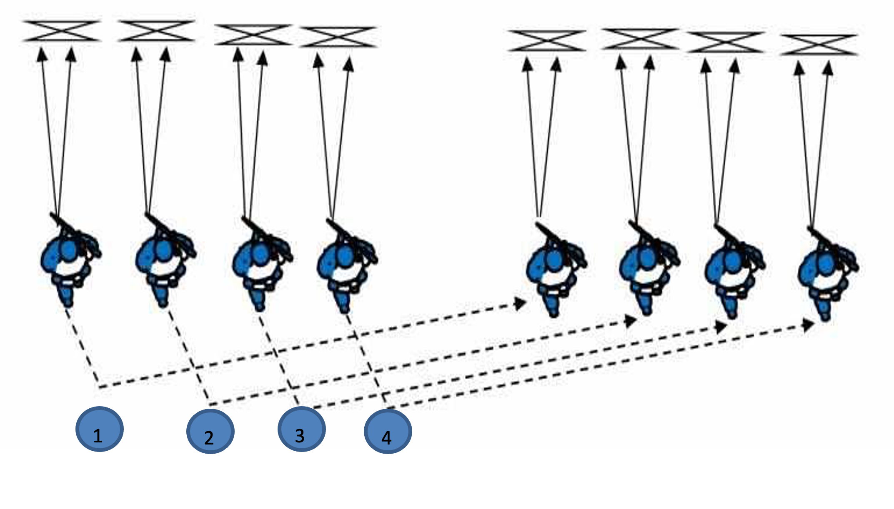

# Мобільна група швидкого реагування «ГАРТ»

Спеціальний військовий наряд на транспортному засобі в складі від п'яти до сімох бійців, призначений для вжиття невідкладних заходів при ускладненні оперативної обстановки поблизу стратегічного об’єкту, що охороняється, посилення його охорони, попередження та припинення правопорушень біля нього.

## Тактичний підрозділ швидкого реагування «ГАРТ»

Спеціальний військовий підрозділ складається з трьох груп швидкого реагування, трьох БМ в складі двадцяти одного бійця, призначений для затримання або знищення ДРГ ворога поблизу стратегічного об’єкту, що охороняється, посилення його охорони, попередження та припинення правопорушень біля нього.

У ході охорони стратегічних об’єктів різного призначення можуть виникати непередбачувані, небезпечні ситуації, у тому числі пов’язані з несанкціонованим проникненням сторонніх осіб. У цьому випадку запобігти протиправним діям і навести порядок повинна група швидкого реагування.

## Пересування групи швидкого реагування «ГАРТ» в ході виконання завдань.

### Накат наступ (двійка).

За сигналом командира бойової пари **«До бою!»** бійці зміщуються з місця локації, за ситуацією вліво або право, трохи вперед чи назад, протягом секунди, займають положення (стоячи фронтально, з коліна, лежачи а бо присід) для стрільби, виносять зброю у червону зону та  по команді **«Вогонь»** відкривають вогонь по ворогу та визначають свої сектори. За сигналом командира двійки **«Вперед»**:

* другий боєць відповідає **«Іду»**; 
* піднімається та пересувається у напрямку ворога 10 метрів «Зиґзаґом» протягом 3 секунд, опускає зброю у помаранчеву зону;
* займає положення для стрільби виносить зброю у червону зону;
* подає сигнал **«Крию»**; 
* відкриває (прицільний, загороджуючи, шквальний) вогонь по противнику;
* старший бойової пари дає сигнал **«Іду»**; 
* піднімається та пересувається у напрямку ворога на рівень напарника «зиґзаґом»;
* займає положення для стрільби, подає сигнал **«Крию»**;
* відкриває вогонь по противнику;
* алгоритм дій повторюється.

Як що ворога не знищено, а відстань 15 метрів, двійка переходить в динамічний наступ хаотично веде прицільний вогонь, під натиском знищує ворога. 
 
### Перекат наступ (двійка).

За сигналом командира бойової пари **«До бою»** бійці зміщуються з місця локації, за ситуацією вліво або право, трохи вперед чи назад, протягом секунди, займають положення (стоячи фронтально, з коліна, лежачи а бо присід) для стрільби, виносять зброю у червону зону та  по команді **«Вогонь»** відкривають вогонь по ворогу та визначають свої сектори. За сигналом командира двійки **«Вперед»**:

* другий боєць відповідає **«Іду»**;
* піднімається та пересувається у напрямку ворога 10-15 метрів «Зиґзаґом» протягом 3 секунд, опускає зброю у помаранчеву зону;
* займає положення для стрільби виносить зброю у червону зону;
* подає сигнал **«Крию»**;
* відкриває (прицільний, загороджуючи, шквальний) вогонь по противнику;
* старший бойової пари дає сигнал **«Іду»**; 
* піднімається та пересувається «зиґзаґом» у напрямку ворога попереду вогневої позиції напарника;
* займає положення для стрільби, подає сигнал **«Крию»**;
* відкриває вогонь по противнику. 
* Алгоритм дій повторюється. 
  
### Накат відступ(двійка).

За сигналом командира бойової пари **«До бою»** бійці зміщуються з місця локації, за ситуацією вліво або право, трохи вперед чи назад, протягом секунди, займають положення (стоячи фронтально, з коліна, лежачи а бо присід) для стрільби, виносять зброю у червону зону та  по команді **«Вогонь»** відкривають вогонь по ворогу та визначають свої сектори. За сигналом командира двійки **«Відступ»**:

* другий боєць відповідає «Іду»;
* піднімається та пересувається у зворотному від противника напрямку 10 метрів «Зиґзаґом» протягом 3 секунд, зброя знаходиться на передпліччі, червона зона (ведеться короткий вогонь коли ворог наздоганяє і відстань 25-30 метрів);
* розвертається;
* займає положення для стрільби;
* подає сигнал **«Крию»**;
* відкриває (прицільний, загороджуючи, шквальний) вогонь по ворогу;
* командир дає сигнал «Іду»; 
* піднімається та пересувається у зворотному від ворога напрямку на рівень напарника «Зиґзаґом» протягом 3 секунд, зброя находиться на передпліччі, червона зона (ведеться короткий вогонь коли ворог наздоганяє і відстань 25-30 метрів);
* розвертається;
* займає положення для стрільби виносить зброю у червону зону;
* подає сигнал **«Крию»**;
* відкриває вогонь по ворогу.  
 
### Перекат відступ (двійка).

За сигналом командира бойової пари **«До бою»** бійці зміщуються з місця локації, за ситуацією вліво або право, трохи вперед чи назад, протягом секунди, займають положення (стоячи фронтально, з коліна, лежачи а бо присід) для стрільби, виносять зброю у червону зону та  по команді **«Вогонь»** відкривають вогонь по ворогу та визначають свої сектори. За сигналом командира двійки **«Відступ»**:

* другий боєць відповідає «Іду»;
* піднімається та пересувається у зворотному від противника напрямку 10-15 метрів «Зиґзаґом» протягом 3 секунд, зброя знаходиться на передпліччі, червона зона (ведеться короткий вогонь коли ворог наздоганяє і відстань 25-30 метрів);
* розвертається;
* займає положення для стрільби;
* подає сигнал **«Крию»**;
* відкриває (прицільний, загороджуючи, шквальний) вогонь по ворогу;
* командир дає сигнал **«Іду»**; 
* піднімається та пересувається «Зиґзаґом» у зворотному від ворога напрямку, позаду вогневої позиції напарника протягом 3 секунд, зброя знаходиться на передпліччі, червона зона (ведеться короткий вогонь коли ворог наздоганяє і відстань 25-30 метрів);
* розвертається;
* займає положення для стрільби;
* подає сигнал **«Крию»**;
* відкриває вогонь по ворогу.  
 
### Накат наступ (трійка).

За сигналом командира бойової трійки **«До бою!»** бійці зміщуються з місця локації, за ситуацією вліво або право, трохи вперед чи назад, протягом секунди, займають положення (стоячи фронтально, з коліна, лежачи а бо присід) для стрільби, виносять зброю у червону зону та  по команді **«Вогонь»** відкривають вогонь по ворогу та визначають свої сектори. За сигналом командира трійки **«Вперед»**: 

* перший та третій бійці відповідають **«Іду»**;
* піднімаються, опускають зброю у помаранчеву зону та пересуваються у напрямку ворога 10 метрів «Зиґзаґом» протягом 3 секунд;
* займають положення для стрільби виносять зброю у червону зону;
* подають сигнал **«Крию»**;
* відкривають вогонь по ворогу;

* командир бойової трійки дає сигнал **«Іду»**; 
* піднімається опускає зброю у помаранчеву зону та пересуваються у напрямку ворога на рівень напарників «зиґзаґом»;
* займає положення для стрільби, подає сигнал **«Крию»**;
* відкриває вогонь по противнику.
* Алгоритм дій повторюється. 
  
  
### Накат відступ (трійка).

За сигналом командира бойової трійки **«До бою!»** бійці зміщуються з місця локації, за ситуацією вліво або право, трохи вперед чи назад, протягом секунди, займають положення (стоячи фронтально, з коліна, лежачи а бо присід) для стрільби, виносять зброю у червону зону та  по команді **«Вогонь»** відкривають вогонь по ворогу та визначають свої сектори. За сигналом командира трійки **«Відступ»**: 

* перший та третій бійці відповідають **«Іду»**;
* піднімаються, зброя находиться на передпліччі, червона зона (ведеться короткий вогонь коли ворог наздоганяє і відстань 25-30 метрів) та пересуваються у зворотному від противника напрямку 10-15 метрів «Зиґзаґом» протягом 3 секунд;
* займають положення для стрільби;
* подають сигнал **«Крию»**;
* відкривають вогонь по ворогу;

* командир бойової трійки дає сигнал **«Іду»**; 
* піднімається, зброя находиться на передпліччі, червона зона та пересувається у зворотному від ворога напрямку на рівень напарників «зиґзаґом»;
* займає положення для стрільби, подає сигнал **«Крию»**;
* відкриває вогонь по ворогу.
* Алгоритм дій повторюється. 
 
### Перекат відступ (трійка).

За сигналом командира бойової трійки **«До бою!»** бійці зміщуються з місця локації, за ситуацією вліво або право, трохи вперед чи назад, протягом секунди, займають положення (стоячи фронтально, з коліна, лежачи а бо присід) для стрільби, виносять зброю у червону зону та  по команді **«Вогонь»** відкривають вогонь по ворогу та визначають свої сектори. За сигналом командира трійки **«Відступ»**:

* перший та третій бійці відповідають **«Іду»**;
* піднімаються, зброя находиться на передпліччі, червона зона (ведеться короткий вогонь коли ворог наздоганяє і відстань 25-30 метрів) та пересуваються у зворотному від противника напрямку 10-15 метрів «Зиґзаґом» протягом 3 секунд;
* займають положення для стрільби;
* подають сигнал **«Крию»**;
* відкривають вогонь по ворогу;

* командир бойової трійки дає сигнал **«Іду»**; 
* піднімається, зброя находиться на передпліччі, червона зона та пересувається у зворотному від ворога напрямку позаду вогневих позицій напарників  «зиґзаґом»;
* займає положення для стрільби, подає сигнал **«Крию»**;
* відкриває вогонь по ворогу.

Така бойова схема може застосовуватися не тільки при контакті з ворогом а при **відступі з позиції**. Тоді вогонь не відкривається.

За сигналом командира бойової трійки **«До бою»** військовослужбовці займають положення для стрільби та тривають сектори під прицілом.

За сигналом старшого бойової трійки **«Відступ»**:

* перший та третій військовослужбовці відповідають **«Іду»**;
* піднімаються, опускають зброю у помаранчеву зону та пересуваються у зворотному від ворога напрямку 10-15 метрів;
* займають положення для вогню;
* подають сигнал **«Тримаю»**;
* контролюють свої сектори; 
* командир бойової трійки дає сигнал **«Іду»**; 
* піднімається, опускає зброю у помаранчеву зону та пересувається у зворотному від противника напрямку;
* займає положення для стрільби позаду вогневих позицій напарників;
* подає сигнал **«Тримаю»**
* контролює сектор ведення вогню. 
* Алгоритм дій повторюється.
 
## Способи здійснення маневру ліворуч (праворуч) під час бою стратегічної групи «ГАРТ».

Для здійснення маневру ліворуч праворуч або під час бою використовується спосіб четвірки по схемі «ГАРТ».

Склад четвірки, бойового розрахунку групи «ГАРТ»:
Командир, кулеметник, гранатометник, стрілець.

### Маневр ліворуч (праворуч).

Група в складі чотирьох бійців займає вогневі позиції веде вогонь по своїх напрямках. 

За командою командира групи **«Справа наліво, по одному — Пішов!»**:

* крайній правий боєць піднімається;
* легко ляскає по плечу лівою рукою напарника;
* пересувається за вогневими позиціями на лівий фланг, тримаючи при цьому автомат в помаранчевій зоні.

Перебігаючи повз крайнього лівофлангового бійця: 

* легко ляскає його по плечу лівою рукою;
* займає вогневу позицію ліворуч від нього;
* дає сигнал **«Пішов!»** та відкриває вогонь.

Інші бійці групи послідовно пересуваються вправо, повторюючи алгоритм дій першого воїна. 
 
### Пересування штурмової групи «ГАРТ» в лісосмугі. 

Група просувається трійками або четвірками з урахуванням прямої видимості (10-15 м.) (в залежності від погодних та природніх умов). Першим просувається сапер, який перевіряє маршрут на наявність мінно-вибухових загороджень, за ним 1-2 стрілка і наступним кулеметник, який в разі відходу прикриває групу. Коли група просунулася далі, одразу на її місце просувається наступна в такому ж складі і за нею ще одна. Таким чином просування відбувається 3-ма хвилями по 15-25 осіб.

До безпосереднього контакту із силами противника група просувається на максимально близьку відстань для забезпечення просування вперед інших груп для підкріплення. Коли відбувається вогневий контакт з передовими позиціями ворога перша група веде стрілецький бій, використовує гранати, в той же час інші групи підтримують наступ важким озброєнням ДШКМ, РПГ, АГС. В той час, коли перша група веде бій, до неї просувається 2-га група на підкріплення і вже згодом 3-я. Якщо штурмова група не має успіху в просуванні, то група підкріплення займає вигідні позиції і окопується, групі вистачає 30 хв., щоб окопатися на новій позиції, таким чином наступна хвиля підтримки прибуває на готові вогневі позиції.

Склад штурмової групи змінюється у відповідності до конкретного завдання.

В ході оцінки завдання командиром вивчається місцевість, рельєф, наявні дороги, підземні комунікації та споруди, об’єкт атаки та маршрути висування до нього. Вивчення також може проводитись з використанням квадрокоптерів.