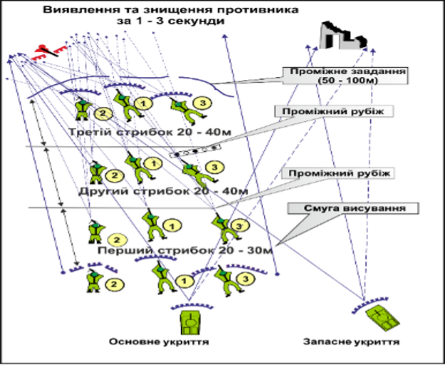
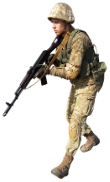
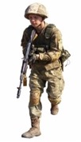
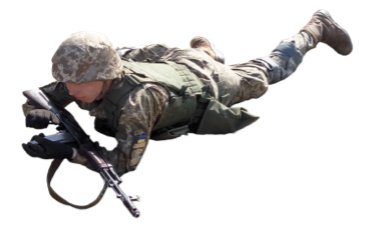

# Тактична підготовка мобільного підрозділу «ГАРТ», груп швидкого  реагування.

В бойовій обстановці групи швидкого реагування необхідно знаходитися протягом певного часу в будь-якому районі з метою підготовки до майбутніх бойових дій. Таке розміщення групи у вихідному районі, очікування та відпочинку визначається як розташування на місці.

Кожний військовий повинний знати порядок і правила розташування на місці та мати відповідні практичні навички.
Місце розташування групи та бойової техніки відділення повинно забезпечувати:

* прихованість від спостереження наземними органами розвідки противника та його безпілотними літальними апаратами (БПЛА). Для цього використовуються природні складки місцевості, рослинний покров, наявні споруди;
* максимально можливій захист від різноманітних засобів ураження – високоточних, запалювальних артилерійських та авіаційних боєприпасів. Такий захист досягається маскуванням техніки, встановленням різного типу масок і екранів, підготовкою різного роду теплових та радіолокаційних «пасток»;
* ефективно застосовувати озброєння та бойову техніку для відбиття нападу наземного і повітряного противника. В місці розташування групи готовляться вогневі позиції. До кожного воїна доводиться порядок дій при нападі; вчасно та якісно обслуговувати озброєння та бойову техніку.

При розташуванні бійці повинні мати можливість підгонки спорядження, прийому їжі та відпочинку.

Для кожного воїна групи в місці розташування існують правила:

* не залишати самовільно місця розташування групи;
* знати сигнали оповіщення та управління, місце збору, своє місце за бойовим розрахунком при нападі противника тощо;
* перебуваючи на позиції, маршруті, спостерігача, секрету, патруля тощо виконувати свої обов’язки чітко без сумління;
* не залишати без нагляду озброєння та боєприпаси;
* без дозволу командира не здійснювати жодних переміщень та дій, що демаскує місце розташування відділення;
* не залишати жодного предмету який дасть можливість виявити ваш загін.

Воїн повинен вміти влаштовувати тимчасові укриття для відпочинку з використанням як табельного майна, так і підручних, місцевих матеріалів.

## Способи пересування.

Група швидкого реагування виконує завдання на різноманітних дистанціях від противника. Це може бути дальність кидка гранати, відстань до найближчого укриття від вогню або максимально можлива дальність ефективної стрільби зброї. Це визначає основну задачу ‒ необхідність зближення з ворогом для ведення ефективного вогню.
Також це означає, що група діє в зоні досяжності противника.

Способи, якими можна перешкоджати або обмежувати вогонь противника:

* Укриття від вогню за непробиваною перешкодою.
* Маскування, дими, засліплення, ніч тощо.
* Зменшення часу на ведення вогню, швидке пресування, снайперський вогонь, мінометні обстріли.
* Заплутувати, відволікають ворога. 
* Подавляти вогнем.

Подавляти ворога вогнем так, щоб він був вимушений сховатись в укриття і не вести вогонь. Це потрібно використовувати для переміщення і маневру своєї групи.

Тому найбільш доцільним варіантом його бойового застосування  є розподіл на бойові розрахунки з метою зближення з противником при використанні методу шквального вогню для подальшого знищення ворога.

Особливу увагу у підготовці до дій у складі бойових груп необхідно звернути на:

* **навчання командирів** прийняттю сміливих, ініціативних, нестандартних рішень, вибору найбільш доцільного варіанта побудови бойового порядку, організації самостійних дій, стійкого управління в складних умовах бою;
* **навчання воїнів** різноманітним способам і прийомам пересування на полі бою із безперервним веденням розвідки противника (як у пішому порядку, так і під час дій на бойовій техніці), подоланню інженерних загороджень та природних перешкод, умілому веденню вогню, прикриттю один одного у ході виконання бойового завдання, діям у складі  ‒ **двійка та трійка**;
* формування у бійців **фізичної підготовки і психологічної готовності** до виконання завдань в бойових умовах.

Основні елементи бойових порядків груп швидкого реагування визначені положеннями бойової системи «ГАРТ», як свідчить досвід ведення збройних конфліктів, умови обстановки вимагають від командирів нових пошуків, більш ефективних, способів застосування у бою наявних сил і засобів.

Зростання ролі дрібних підрозділів у боротьбі з мобільними групами противника обумовило доцільність створення у групах швидкого реагування у складі бойових розрахунків ‒ **двійка та трійка**.
Тактична група швидкого реагування, до складу якої можуть входити до трьох бойових груп.

Розподіл тактичної групи швидкого реагування на бойові розрахунки дозволяє:

* створити більш гнучкий та розосереджений бойовий порядок;
* підвищити ефективність вогневого ураження противника і живучість бойової групи;
* забезпечити взаємну підтримку і прикриття вогнем на полі бою під час здійснення маневру.

У разі посилення  вогневими засобами до складу бойових груп можуть додатково входити: гранатометник, снайпер, стрілець, сапер, водій.

Із урахуванням вказаних факторів елементами бойового порядку бойової групи можуть бути: перша (двійка); друга (двійка); третя (трійка).

* 1й разрахунок: гранатометник - стрілець та помічник гранатометника - стрілець;
* 2й разрахунок: снайпер, другий номер снайпера - стрілець;
* 3й разрахунок: водій ‒ стрілець, кулеметник, другий номер кулеметника – стрілець, або сапер – стрілець.

Для найкращої взаємодії, взаємоконтролю і взаємодопомоги, а також для полегшення управління Тактичною групою швидкого реагування у цілому групи розбиваються на двійки або трійки. Бійцям у парах або трійках  слід діяти у тісному контакті один з одним, постійно знаходитися в межах прямої видимості і підтримувати звуковий зв’язок. Необхідно регулярно контролювати своїх товаришів відповідаючи кожен за кожного.

Щоб такі розрахунки діяли ефективно і мали високий рівень взаєморозуміння, необхідно формувати їх заздалегідь, ще в процесі підготовки.

Також важлива взаємодія між розрахунками. При здійсненні під час штурму будь яких пересувань  для забезпечення безпеки необхідно організувати взаємне прикриття. Одна група прикриває, друга здійснює маневр і навпаки.

Рух розрахунків проводиться короткими перебіжками від укриття до укриття. Між бійцями і групами при русі постійно повинна зберігатися дистанція 6‒10м. Навіть при відсутності вогню противника бійцям слід дотримуватися обережності і не затримуватися на відкритих ділянках довше чим три секунди. Огляд потенційно небезпечних напрямків повинен вестися безперервно.
Основне прикриття тактичної групи необхідно здійснювати кулеметниками, снайперами і гранатометниками. Причому кулеметники можуть вести вогонь по підозрілих місцях, в яких може перебувати противник. Снайпери і гранатометники стріляють по виявлених позиціях противника. Перша передова група закріплюються на зайнятих позиціях і забезпечують підхід групи прикриття, яка підтягується на нові позиції.

Дії тактичної групи швидкого реагування в бою у складі трьох груп застосовується, як правило, під час наступу в глибині, на швидко зайняту оборону противника, під час ведення бою при переслідуванні невеликих груп противника і в інших сприятливих умовах обстановки. 
Старші бойових груп визначають відповідні завдання кожному бійцю під час висування до переднього краю противника, визначені завдання, через кожні 50‒100м, можуть доповнюватися або ставитися наново.

Завдання та місце воїнів у складі бойової групи:

* інтервали між бійцями бойової групи можуть бути 6-10 кроків;
* кожний воїн, з урахуванням умов місцевості, на напрямку дій групи міняє дві — три вогневих позиції, після декількох коротких черг;
* кожному бійцю бойової групи призначаються сектори стрільби ‒ основний і додатковий, вони повинні перекриватися між бійцями, які діють поруч, не менше ніж на 10‒15 градусів (170‒250 тисячних), створюючи зону суцільного вогню;
* висунення на рубіж переходу в атаку здійснюється на дистанціях, які забезпечують візуальне спостереження за діями один одного і взаємну підтримку вогнем;
* атака противника здійснюється, як правило, під прикриттям димів після максимального можливого руху з ним (як з фронту, так і з виходом в один з флангів або тил).

Спочатку стрілець під вогневим прикриттям кулеметника і старшого стрільця застосовуючи різні прийоми і способи пересування на полі бою ‒ прискореним кроком, бігом, перебіганнями або переповзанням — двома-трьома стрибками повинен вийти на рубіж 50‒100 метрів, при цьому довжина між зупинками для відпочинку залежить від умов місцевості і інтенсивності вогню противника і, в середньому складає 15‒30 кроків не більш трьох секунд (для запам'ятовування варіант: **"501, 502, 503"**)

Після зайняття вказаного міста, стрілець обладнує перед собою бруствер і готується до ведення вогню з метою прикриття пересування іншої  бойової групи.

Залежно від умов обстановки і прийнятого командиром взводу рішення, послідовність переміщення інших воїнів у бойових групах, і бойових груп в цілому, може бути різноманітним. Командир відділення і кулеметник висуваються, як правило, останніми.

Переміщення повинне здійснюватися з використанням умовних сигналів (жестів) і команд.

Перед початком дій не можна поспішати, необхідно уважно роздивитися, вивчити місцевість на відстані 25‒50 м і визначити свій маршрут просування, а також місце, куди наказано прибути, з обов’язковим урахуванням можливості прикриття від вогню противника.
У бойовій групі заздалегідь повинні бути обговорені засоби й порядок спільних дій, а також порядок взаємодії в бою. Після зайняття чергового укриття негайно здійснюється спостереження за полем бою, необхідно бути в постійній готовності до вогневого прикриття переміщення інших військовослужбовців бойової групи. За можливості подальшого переміщення необхідно подати їм заздалегідь установлений сигнал на пересування до наступного міста, а надалі – умовними сигналами уточняти завдання і новий кидок. Але в будь-якому випадку під час виконання завдання одним військовослужбовцем інші його прикривають.

Не можна залишати без дозволу командира своє місце в бою. Потрібно стежити за витратою боєприпасів і заправкою бойової машини пальним. 25% боєкомплекту та пального, повинні бути недоторканні – це „НЗˮ, який не входить у розрахунок під час виконання завдання. Слід швидко вживати заходів до відновлення пошкодженого озброєння і військової техніки.

Під час знищення окремих дрібних груп у глибині оборони або в тилу противника, особливо на сильно перетнутій, важкодоступній місцевості, у горах, і населених пунктах, за рішенням командира бойові групи можуть виконувати різні за характером завдання.
Так, одній із бойових груп може бути відведена роль маневреної групи, а двом іншим ‒ роль вогневих груп.

Завдання маневреної групи полягає в тому, щоб, використовуючи складки місцевості зближуватися з ворогом на якомога меншу відстань, зайняти вигідне положення для атаки і у взаємодії з вогневими групами знищити його.

Таким чином, успіх виконання підрозділом бойового завдання значною мірою залежить від рівня підготовки особового складу і узгоджених дій позаштатних вогневих груп між собою і засобами посилення.

## Пересування на полі бою.

Залежно від характеру місцевості, умов, обстановки і вогневих дій противника, перебуваючи у пішому строю, бійці можуть пересуватися: кроком, перебіганням, переповзанням .

1.	**Прискорений крок або біг** застосовується для подолання ділянок місцевості, недоступної для спостереження і вогню противника. Темп прискореної ходьби ‒ у середньому 130‒140 кроків за 1 хв, довжина кроку ‒ 50‒60 см. Щоб подовжити крок, треба швидше і сильніше розгинати ту ногу, що позаду, і більше виносити другу ногу стегном уперед. Оскільки тривале пересування прискореним кроком дуже стомлює, при швидкісному пересуванні доцільно чергувати ходьбу і біг. У такий спосіб солдат рухається і під час атаки, тримаючи зброю в положенні готовності до негайного відкриття вогню.

    **Ходьба пригинаючись** застосовується для прихованого пересування місцевістю з невисокими укриттями. Потрібно зігнути ноги в колінах, податися корпусом уперед, дивитися перед собою і рухатися нешироким кроком. Усі рухи виконуються вільно, без напруження.

    **Рух угору** здійснюється скороченим кроком з нахилом корпусу вперед. При значній крутизні сходження краще рухатися поперемінно то правим, то лівим боком до схилу на трохи зігнутих ногах, упираючись ребрами підошов у виступи гори. На схили можна також сходити прямо, тримаючись руками за гілки, кущі, густу траву тощо; ноги ставити на всю ступню «ялинкою», з розведеними вбік носками.
    
    **Вниз по схилу** треба сходити вільним кроком, ногу ставити на п’яту, корпус відхиляти назад. Із крутого схилу можна спускатися боком, приставними кроками, тримаючись за нерівності схилу.
    
    **Пересування по грузькому і слизькому ґрунту** здійснюється короткими кроками, ноги потрібно переставляти швидко, щоб вони не встигли глибоко загрузнути або зісковзнути з опори. Ногу слід ставити на всю ступню, намагаючись вибирати для опори твердіші ділянки: борозни, виступи, корені.

    **Повільним бігом** долають довгі дистанції. Корпус під час бігу нахилено вперед трохи більше, ніж при ходьбі. Темп бігу ‒ 150‒160 кроків за 1 хв, довжина кроку ‒70‒90 см.

    **Біг у середньому темпі** здійснюється вільним маршовим кроком. Корпус у цьому випадку тримають трохи нахиленим уперед. Енергійно відштовхуються тією ногою що позаду зігнувши її в коліні, виносять стегном уперед-вгору і ставлять на всю ступню. Гомілка при цьому не виноситься дуже вперед, а ступня ставиться на землю далеко від проекції центра ваги тіла. Темп бігу ‒ 165‒180 кроків за 1 хв, довжина кроку ‒ 85‒90 см.

    **Швидкісним бігом** перебігають з укриття до бойових і транспортних машин, розбігаються перед подоланням перешкод. Корпус нахиляється вперед значно більше, ніж під час бігу в середньому темпі, а відштовхування ногою і рух рукою ‒ ще енергійніші. Збільшення довжини кроку забезпечується за рахунок відштовхування ногою, що позаду, і швидкого перенесення її стегном уперед. Нога після відштовхування виноситься вперед зігнутою в коліні та м’яко ставиться на передню частину стопи з наступною опорою на всю ступню. Темп бігу ‒ 180‒200 кроків за 1 хв, довжина кроку ‒ 120‒150 см.

2. **Перебігання** застосовується для швидкого зближення з противником на відкритій місцевості. Довжина перебігання залежить від рельєфу та інтенсивності вогню противника і в середньому має бути 20‒40 кроків. Чим більше відкрита місцевість і сильніший вогонь, тим коротшим має бути перебігання.

    **Перебігання з положення лежачи** необхідно спочатку винести зброю в оранжеву зону, за попереджувальною командою визначити шлях руху і можливе укриття, потім за виконавчою командою стрімко перебігти у визначене місце. На місці зупинки лягти на землю, відповзти трохи вбік і, досягнувши наміченого місця, приготуватися до ведення вогню.

3. **Переповзання** застосовується для непомітного наближення до противника і прихованого подолання ділянок місцевості, що мають незначні укриття, нерівності рельєфу і перебувають під спостереженням або обстрілом противника.

    Залежно від обстановки, рельєфу місцевості та інтенсивності вогню противника боэць може переповзати:
    
    * **по-пластунськи**: лягти на землю, правою рукою взяти зброю за ремінь на стволи біля мушки і покласти її на передпліччя правої руки; підтягти праву (або ліву) ногу і водночас просунути ліву (праву) руку якомога далі; відштовхуючись зігнутою ногою, пересунутися вперед, підтягнути другу ногу, висунути другу руку і продовжувати рухатися так само, притискуючи до себе зброю;
    * **пів-павук**: стати на коліна і, спираючись на передпліччя або кисті рук, підняти зігнуту праву (ліву) ногу до грудей, водночас ліву (праву) руку просунути вперед; просунути тіло вперед до повного випрямлення правої (лівої) ноги, водночас підтягнувши другу зігнуту ногу, і, просуваючи вперед другу руку, продовжувати рух; зброю тримати: при опорі на передпліччя ‒ так само, як і при переповзанні по-пластунськи; при опорі на кисті рук ‒ у правій руці;
    * **на боці**: лягти на лівий бік, підтягнути вперед ліву ногу і зігнути в коліні, спертися на передпліччя лівої руки, каблуком правої ноги зробити упор в землю якомога ближче до себе; розгинаючи праву ногу, просунути тіло вперед; не змінюючи положення,  продовжувати рух; зброю тримати правою рукою, поклавши її на стегно лівої ноги.

Підготовка воїнів в підрозділі «ГАРТ» здійснюється за вимогами методичного посібника «ГАРТ»;  Тактичної групи швидкого реагування «ГАРТ».

Вимоги методичного посібника «ГАРТ» з підготовки воїнів стосовно пересування:

1. **порядок пересування:** це розташування елементів групи і бійців щодо один до одного під час пересування. Вибір порядку пересування групи здійснюється після аналізу факторів.
    
    Під час пересування командир знаходиться там, звідки він може ефективно управляти своєю групою. Це дозволяє командиру групи управляти особистим прикладом: Виконуй як я. Всі солдати групи повинні мати можливість бачити командира.
    
    **Способи пересування** ‒ це обраний порядок пересування на місцевості. Є три основних способи пересування:

    * просте пересування;
    * обережне пересування;
    * перекатами.

    Вибір того чи іншого способу пересування здійснюється з урахуванням можливої зустрічі з ворогом і необхідної швидкості пересування. Факторами, що враховуються при виборі дієвого способу, це:
    
    * управління;
    * розосередження;
    * швидкість;
    * охороно-забезпечення.

    Способи пересувань не  постійні. Вони залежать від дистанції між солдатами, групами, які змінюються залежно від отриманого завдання, характеру дій противника, властивостей місцевості, умов видимості та інших факторів. Солдати повинні мати можливість бачити свого командира групи. Командир групи бачити свого командира тактичної групи.
    
    Командири управляють пересуванням за допомогою сигналів жестами, і тільки в разі необхідності використовуючи радіостанцію.

    **Вимоги до пересування:**
    
    * група пересувається по визначеному маршруту, прибуває в певний пункт у встановлений в бойовому наказі час і у повному складі;
    * група використовує порядок і способи пересування, визначені командиром на основі факторів: завдання – задача та мета, противник – ймовірний склад, можливості та характер його дій, умови місцевості і погоди – стан доріг, проходимось, видимість, війська – склад, озброєння та можливості своїх підрозділів, час готовності та наявність часу на підготовку до дій, цивільне населення — пересування через населені пункти, наявність населення (біженців)-, необхідне маскування- METT-TC;
    * командири повинні бути орієнтовані в обстановці (в межах 300 м від групи) і пересуватись за запланованим маршрутом доти, поки фактори METT-TC не зажадають його зміни;
    * під час пересування у підрозділі організовується кругове спостереження і охорона та підтримується 100% бойова готовність;
при зупинках у групі організовується кругова оборона і підтримується як мінімум 70% бойової готовності;
    * при зустрічі з противником, контакту, зіткненням з ним здійснюється частиною сил та засобів;
    * під час пересування використовуються різні способи управління і контролю кількості людей, пункти збору, регулювання кордонів і т.д.

2. **Основні принципи:** 

    * **орієнтування на місті**. Підготовка нічого не варта, якщо ціль операції не виявлена своєчасно, або якщо ціль не була виявлена через те, що змінила положення під час пересування, на кожну групу плануйте до використання як мінімум два компаси і відповідального бійця, якій веде підрахунок кроків. 
    Пам’ятайте: боєць, призначений в дозор, не повинен займатися орієнтуванням або підрахунком кроків. його єдина задача ‒ охорона підрозділу з фронту; 
    * **уникайте виявлення**, групи пересуваються потай, використовуючи з максимальною ефективністю приховані ділянки і маскувальні властивості місцевості. Якщо є можливість, пересувайтеся в умовах обмеженої видимості з метою максимального використання технологічних переваг, що надаються приладами нічного бачення, і знижують здатності противника щодо виявлення групи. Використовуйте вразливі місця противника і намагайтеся поєднувати пересування з іншими діями, які відвернуть увагу противника;
    * **забезпечуйте постійну охорону**. Патруль повинен постійно використовувати як активні, так і пасивні заходи охорони і безпеки. Ставити бійцям завдання щодо охорони на маршруті пересування, на небезпечних ділянках, у патрульних базах, в районі цілі призначеної операції;
    * **плануйте використання вогневої підтримки**. Плануйте вогневу підтримку гранатометами, мінометами, артилерією, бойовими вертольотами, навіть тоді, коли ви вважаєте, що під час пересування вона не знадобиться;
    * **вибір одного з трьох способів пересування визначається діями противника**. Коли зустріч з ним малоймовірна-просте пересування; коли вона можлива-обережне пересування; коли вона очікується-обережне перекатами. Тактична група, зазвичай, пересувається способом обережного пересування; на відкритій місцевості використовуйте розосереджений порядок. Коли зустріч з противником імовірна, одна група розташовується попереду, під прикриттям іншої групи;
    * **групи повинні підтримувати між собою зоровий зв’язок**, але відстань між ними має бути така, щоб при виникненні контакту з противником під вогонь не потрапила уся група патрулю. Група може, при необхідності, розгорнути свій порядок пересування для забезпечення кращих умов спостереження на флангах. Незважаючи на широкі проміжки, бійці повинні витримувати інтервали і дистанції при пересуванні клином і слідувати за командиром групи. Пересування в колону використовується лише в особливих випадках;
    * **головна група повинна забезпечити охорону з фронту**, одночасно несучи відповідальність за орієнтування і вибір маршруту. При тривалому пересуванні, командир тактичної групи швидкого реагування може змінювати призначені групи та завдання. Група, що замикає підрозділ «ГАРТ» відповідає за охорону з тилу, виконуючи завдання тильного дозору.

    При зміні обстановки ‒ змінюйте способи пересування;
усі командири патруля, крім командирів груп, пересуваються всередині бойового порядку, звідки вони можуть найкращим чином здійснювати керівництво патрулем.

3. **Способи пересувань**: **просте пересування** використовується, коли зустріч з ворогом малоймовірна, **обережне пересування** використовується, коли зустріч з ворогом можлива, **обережне перекатами** використовується, коли зустріч з ворогом очікувана або при подоланні небезпечних ділянок.
    
    Просте пересування. При такому способі відстань між бійцями становить близько 5-8 м і близько 15 м між групами. Це забезпечує: більший контроль, ніж обережне пересування, але менший, ніж обережне пересування перекатами, мінімальне розосередження, максимальну швидкість пересування, мінімальну безпеку.
Обережне пересування це основа бойової групи. Відстань між бійцями становить близько 6-10 м, між розрахунками 15 м, між групами ‒ близько 30 м. При пересуванні підрозділу «ГАРТ» дозорна група повинна знаходитися досить далеко попереду основних сил тактичної групи швидкого реагування для виявлення або зв’язування боєм ворога до того, як ворог знайде або відкриє вогонь по основних силах, не більш 50-100м, щоб бути підтриманим вогнем стрілецької зброї своїх бойових груп.
    
    При пересуванні колоною спосіб обережного пересування використовується тільки дозорною групою підрозділу «ГАРТ», проте, якщо необхідно більше розосередження, такий спосіб використовується всіма групами швидкого реагування.
    
    При використанні інших способів пересування, спосіб обережного пересування використовується всім підрозділом «ГАРТ», доти, поки його не скасує командир.
    
    Обережне пересування забезпечує: вигідні умови управління, необхідне розосередження, високу швидкість пересування, необхідну охорону з фронту.
    
    При обережному пересуванні перекатами відстань між бійцями залишається приблизно 8-15 м. Відстань між групами змінюється залежно від обстановки.
    
    Тактична група швидкого реагування ділиться на групу прикриття і маневрену групу, яка здійснює перекат, у той час як група прикриття зайняла позицію, що дозволяє прикрити вогнем пересування першої групи. Відстань кожного перекату не повинна перевищувати ефективної дальності стрільби озброєння групи прикриття. Відстань перекату залежить від місцевості, умов видимості та управління. 

